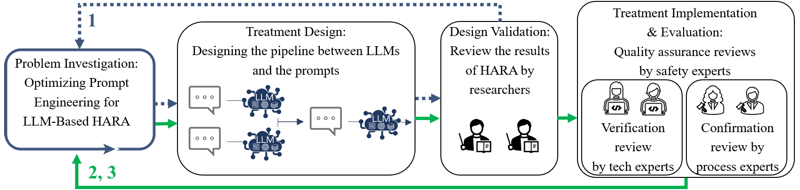
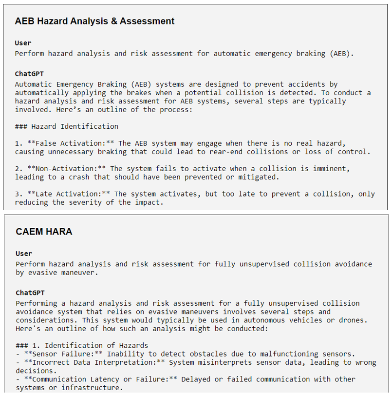
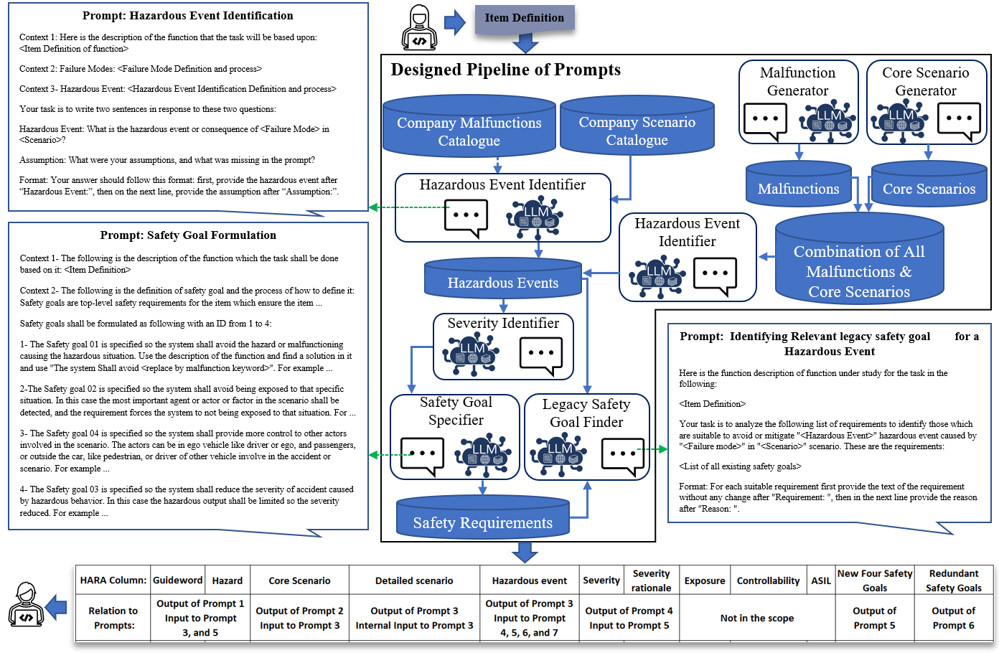
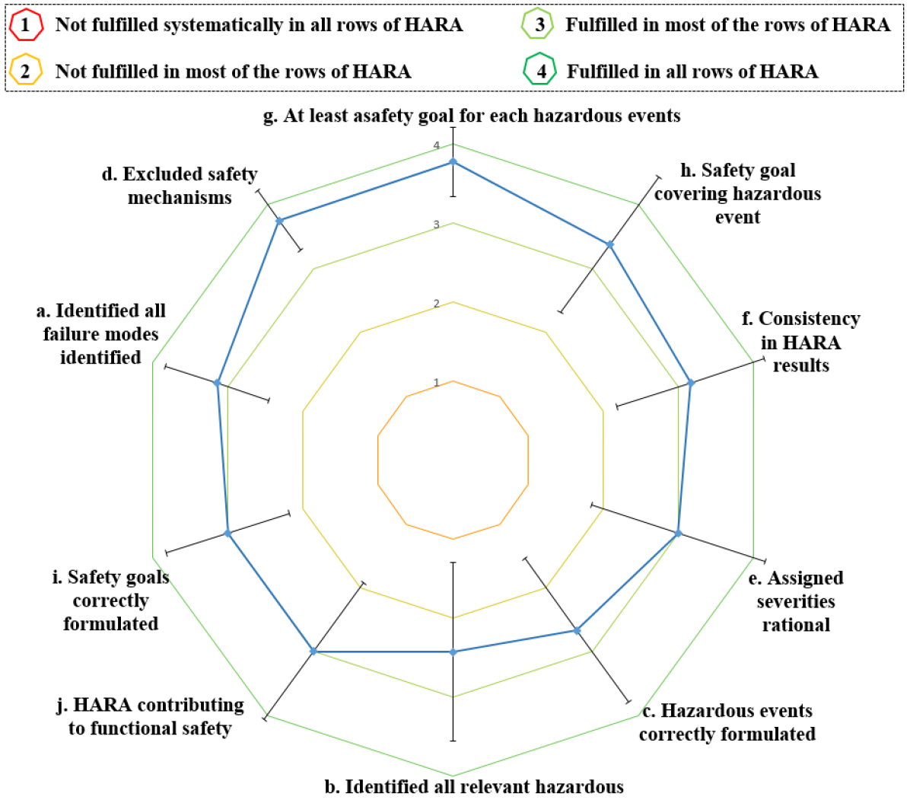

# 在利用大型语言模型开发自动驾驶技术时，制定和满足相应的安全工程要求至关重要。这项工作致力于探讨此类需求，并深入研究如何在大规模语言模型驱动的自动驾驶系统中确保其安全性。

发布时间：2024年03月24日

`LLM应用` `需求管理`

> Engineering Safety Requirements for Autonomous Driving with Large Language Models

> 面对汽车领域频繁变更的需求工件，SafetyOps 面临严峻挑战。而具有卓越自然语言理解和生成能力的大型语言模型（LLMs）可在每次更新后自动优化与拆解需求，扮演重要角色。本次研究提出了一款原型工具，它结合了提示与LLMs，能够接收项目定义，并以安全需求形式输出解决方案，同时还能对需求数据集进行审查，找出其中重复或冲突的部分。我们首先明确了执行 HARA 所需的关键特性，并据此制定了评估 LLM 是否满足这些标准的测试。通过多次迭代的设计科学研究，并邀请来自不同公司的专家进行定量与定性综合评价，最终在一家案例企业中成功部署该原型系统，并由相关团队对其效能进行了评估。

> Changes and updates in the requirement artifacts, which can be frequent in the automotive domain, are a challenge for SafetyOps. Large Language Models (LLMs), with their impressive natural language understanding and generating capabilities, can play a key role in automatically refining and decomposing requirements after each update. In this study, we propose a prototype of a pipeline of prompts and LLMs that receives an item definition and outputs solutions in the form of safety requirements. This pipeline also performs a review of the requirement dataset and identifies redundant or contradictory requirements. We first identified the necessary characteristics for performing HARA and then defined tests to assess an LLM's capability in meeting these criteria. We used design science with multiple iterations and let experts from different companies evaluate each cycle quantitatively and qualitatively. Finally, the prototype was implemented at a case company and the responsible team evaluated its efficiency.

[Arxiv](https://arxiv.org/abs/2403.16289)