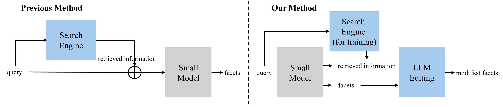

# 利用 LLM 编辑技术提升特征生成效果

发布时间：2024年03月24日

`Agent` `信息检索` `搜索引擎`

> Enhanced Facet Generation with LLM Editing

# 摘要

> 在信息检索领域，明确用户查询的不同维度至关重要，这一能力能使搜索服务提供更加全面丰富的搜索结果。先前研究借助搜索引擎检索到的相关文档和查询信息改进了维度预测效果。然而，当试图将这种方法融入模型并应用于其他场景时，面临两大挑战：一是搜索引擎持续更新，使得训练和测试阶段所依赖的额外信息可能发生改变，从而影响性能；二是公开搜索引擎无法检索内部文档，因此需要搭建独立的搜索系统以整合企业内部的私人领域文档。针对此问题，我们提出了一种仅需查询输入、无需搜索引擎的框架，并配合两种策略来预测维度。第一种策略采用多任务学习方法预测搜索结果页（SERP），通过将SERP作为目标对象而非信息来源，使模型能够深入理解查询内容而无需依赖外部组件。第二种策略则是融合大型语言模型（LLM）与小型模型以强化维度预测，实验证明，相较于各自独立生成，两者结合能够有效提升整体性能。

> In information retrieval, facet identification of a user query is an important task. If a search service can recognize the facets of a user's query, it has the potential to offer users a much broader range of search results. Previous studies can enhance facet prediction by leveraging retrieved documents and related queries obtained through a search engine. However, there are challenges in extending it to other applications when a search engine operates as part of the model. First, search engines are constantly updated. Therefore, additional information may change during training and test, which may reduce performance. The second challenge is that public search engines cannot search for internal documents. Therefore, a separate search system needs to be built to incorporate documents from private domains within the company. We propose two strategies that focus on a framework that can predict facets by taking only queries as input without a search engine. The first strategy is multi-task learning to predict SERP. By leveraging SERP as a target instead of a source, the proposed model deeply understands queries without relying on external modules. The second strategy is to enhance the facets by combining Large Language Model (LLM) and the small model. Overall performance improves when small model and LLM are combined rather than facet generation individually.

[Arxiv](https://arxiv.org/abs/2403.16345)