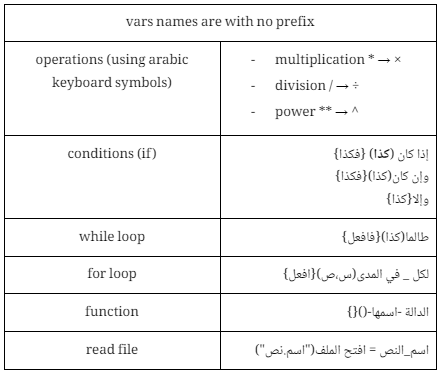
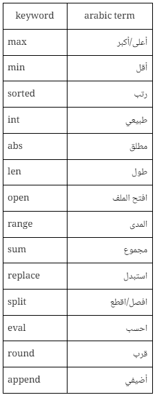
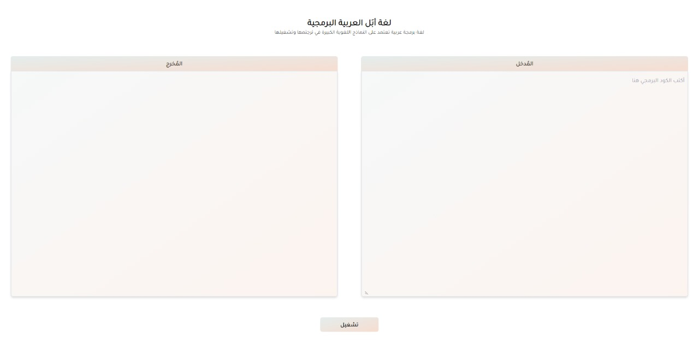
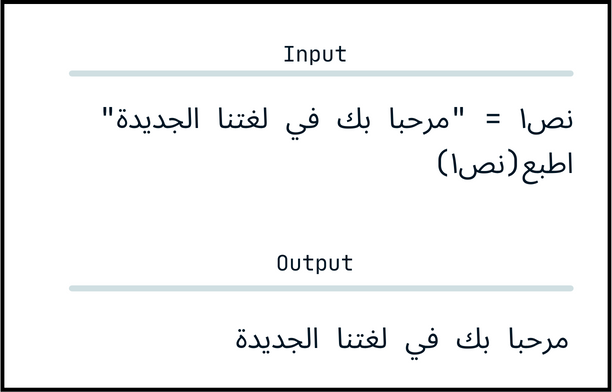
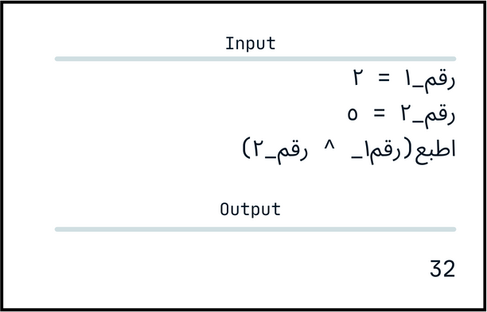
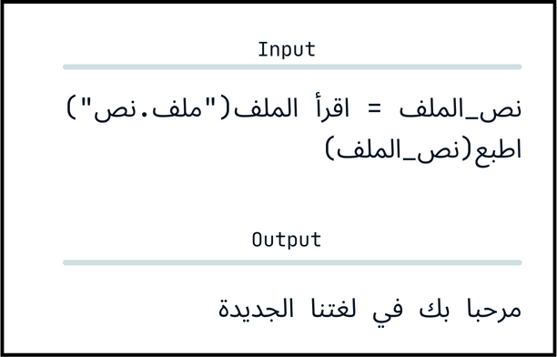
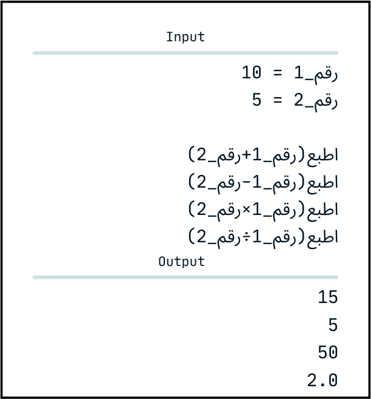
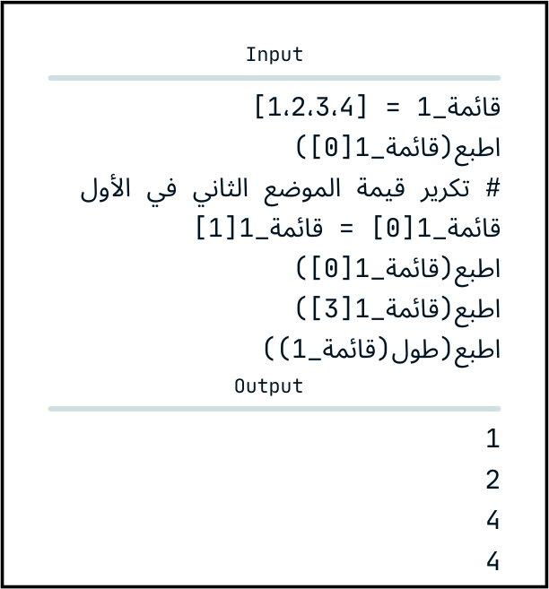
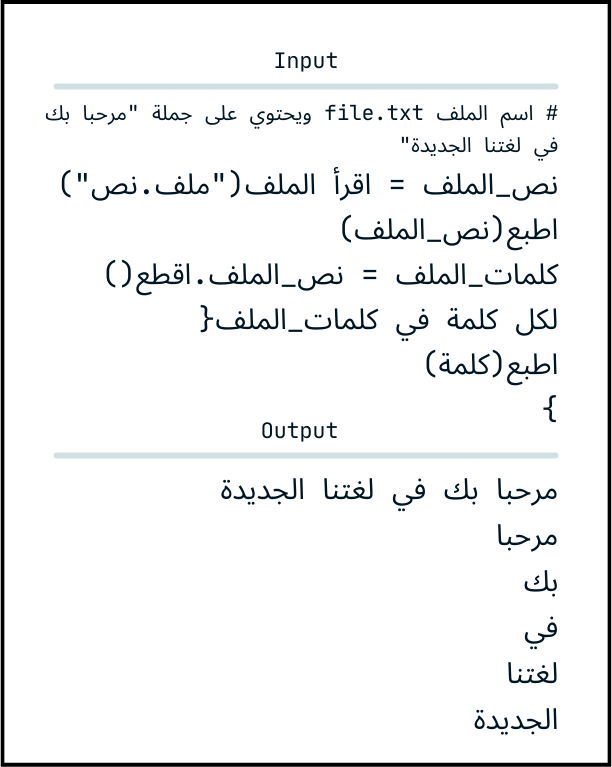

# LLMs 助力阿拉伯编程语言，担任“编译器”角色进一步优化：在最新的技术探索中，大型语言模型(LLMs)正在展现其潜力，担当起阿拉伯编程语言的编译器角色，助力这一语种在程序开发领域的高效运用与转化。

发布时间：2024年03月24日

`LLM应用` `编程语言` `源代码转换`

> LLMs as Compiler for Arabic Programming Language

# 摘要

> 在这篇论文中，我们推出了APL（Arabic Programming Language），它运用大型语言模型(LLM)作为半编译机制，实现从阿拉伯文本代码到Python代码的转换并运行代码。我们精心设计了一个从构建APL文本结构开始，经过提示工程优化后的指令输入，再到运用PyRunner执行生成Python代码的整体流程。此项目由三个核心部分构成：一个Python库、一个界面简洁的操作环境，以及本篇研究论文。

> In this paper we introduce APL (Arabic Programming Language) that uses Large language models (LLM) as semi-compiler to covert Arabic text code to python code then run the code. Designing a full pipeline from the structure of the APL text then a prompt (using prompt engineering) then running the prodcued python code using PyRunner. This project has a three parts first python library, a playground with simple interface and this research paper.

[Arxiv](https://arxiv.org/abs/2403.16087)