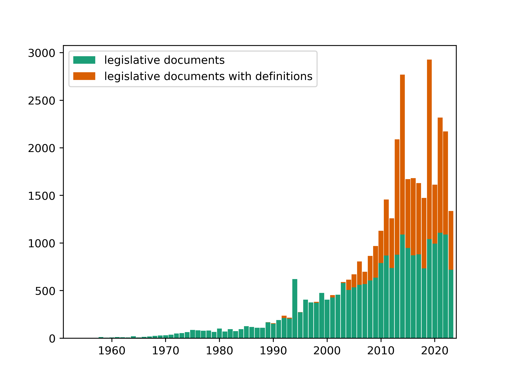
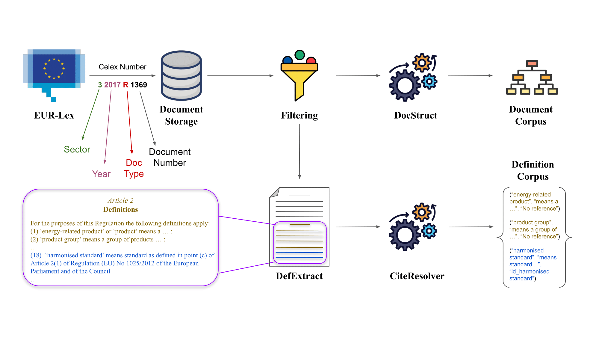
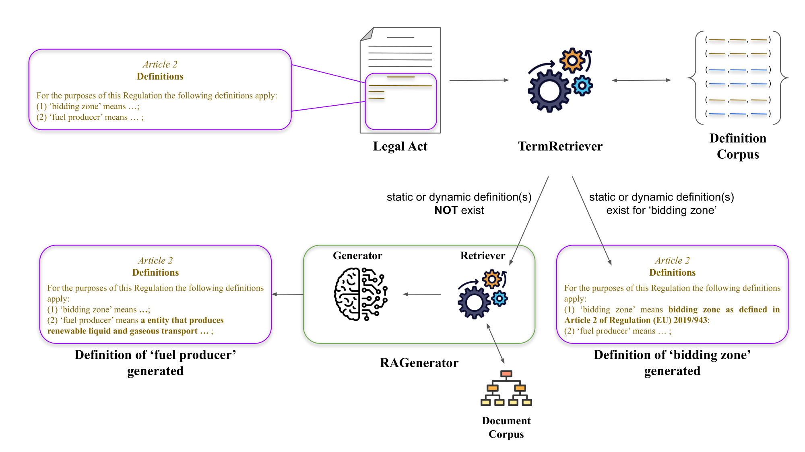
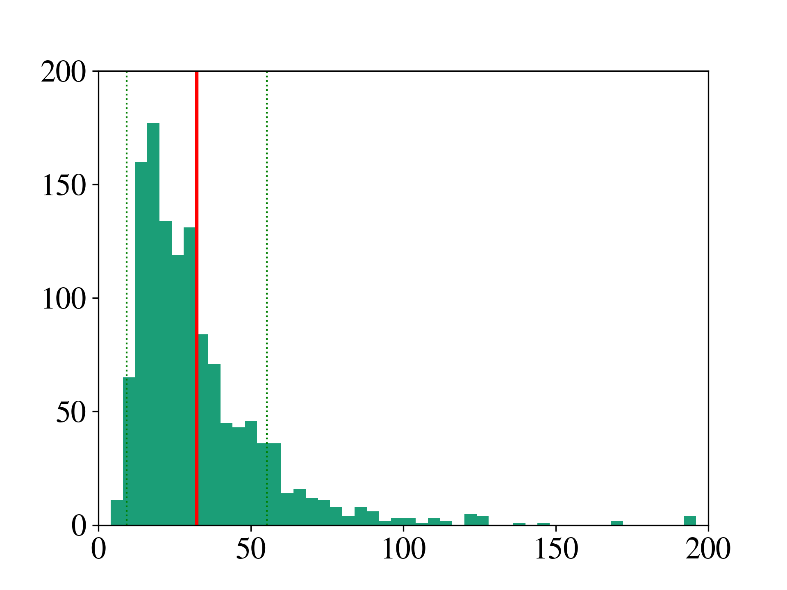

# LexDrafter 是一项利用检索增强生成技术的专业工具，专门用于为立法文件精准高效地起草术语内容。

发布时间：2024年03月24日

`RAG`

> LexDrafter: Terminology Drafting for Legislative Documents using Retrieval Augmented Generation

> 面对欧盟立法文件的迅速增长以及随之而来的新术语与定义的增多，欧洲议会、理事会及委员会联合指南指出，法律文件中的术语应用需保持一致性，确保相同概念无论在日常、法律或技术语境下都准确传达其原意。鉴于此，若能在制定新立法文件时，拥有一套能参考已有定义，并依据文件内容精准定义新术语的框架，有助于跨不同法规实现统一和谐的法律定义，从而消除潜在的模糊性。本文推出了一款名为LexDrafter的辅助工具，它结合了检索增强生成（RAG）技术和不同立法文件中现有的术语定义，以帮助用户为正在起草的立法文件创建定义条款。具体而言，通过对现存文件抽取定义要素，结合RAG技术，可按需为起草过程中的立法文件智能推荐定义条款内容。我们通过运用一系列欧盟能源领域的文件集合，展示了LexDrafter的实际操作效果并进行了评估。该LexDrafter框架的源代码已公开，访问地址为https://github.com/achouhan93/LexDrafter。

> With the increase in legislative documents at the EU, the number of new terms and their definitions is increasing as well. As per the Joint Practical Guide of the European Parliament, the Council and the Commission, terms used in legal documents shall be consistent, and identical concepts shall be expressed without departing from their meaning in ordinary, legal, or technical language. Thus, while drafting a new legislative document, having a framework that provides insights about existing definitions and helps define new terms based on a document's context will support such harmonized legal definitions across different regulations and thus avoid ambiguities. In this paper, we present LexDrafter, a framework that assists in drafting Definitions articles for legislative documents using retrieval augmented generation (RAG) and existing term definitions present in different legislative documents. For this, definition elements are built by extracting definitions from existing documents. Using definition elements and RAG, a Definitions article can be suggested on demand for a legislative document that is being drafted. We demonstrate and evaluate the functionality of LexDrafter using a collection of EU documents from the energy domain. The code for LexDrafter framework is available at https://github.com/achouhan93/LexDrafter.

[Arxiv](https://arxiv.org/abs/2403.16295)