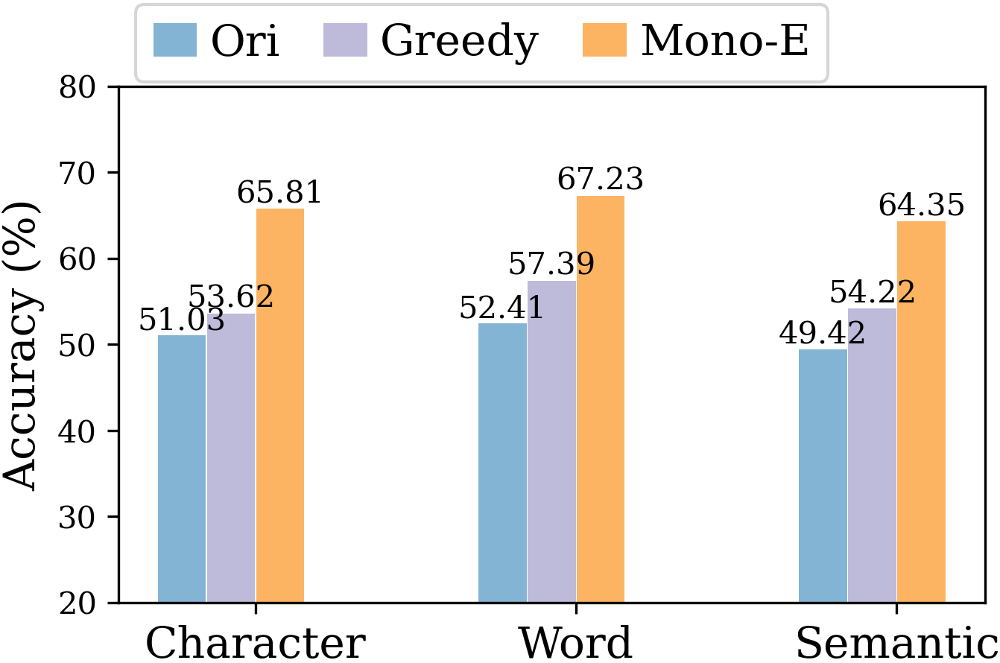

# 通过单调性释义优化，语言模型的提示泛化性能得到显著提升步骤详解：

发布时间：2024年03月24日

`LLM应用` `模型优化`

> Monotonic Paraphrasing Improves Generalization of Language Model Prompting

> 在LLMs中，面对同一任务的不同提示或指令，其性能表现可能存在差异，其中关键原因之一在于模型对所给提示或指令的熟悉度，而这一熟悉度通常通过模型困惑度来衡量。然而，要在海量可能的提示短语中找到最优困惑度的那一个并非易事。为此，本文提出了“单调性改写”（MonoPara）这一创新的端到端解码策略，它结合了一个负责提示（或指令）改写的改写语言模型集合与一个目标LM（即执行提示或指令的模型），在保持生成内容语义不变的前提下，高效地将原提示转化为更低困惑度的形式，且保证每一步生成的困惑度均呈单调下降趋势。我们深入探究了MonoPara的贪心解码和基于搜索的两种解码方式。重要的是，MonoPara无需额外训练就能确保改写后的提示或指令困惑度持续降低，进而显著提升零样本LM提示在多种任务上的表现。另外，MonoPara还展现出其在提升LM应对扰动及未见任务指令时的泛化能力。

> Performance of large language models (LLMs) may vary with different prompts or instructions of even the same task. One commonly recognized factor for this phenomenon is the model's familiarity with the given prompt or instruction, which is typically estimated by its perplexity. However, finding the prompt with the lowest perplexity is challenging, given the enormous space of possible prompting phrases. In this paper, we propose monotonic paraphrasing (MonoPara), an end-to-end decoding strategy that paraphrases given prompts or instructions into their lower perplexity counterparts based on an ensemble of a paraphrase LM for prompt (or instruction) rewriting, and a target LM (i.e. the prompt or instruction executor) that constrains the generation for lower perplexity. The ensemble decoding process can efficiently paraphrase the original prompt without altering its semantic meaning, while monotonically decreasing the perplexity of each generation as calculated by the target LM. We explore in detail both greedy and search-based decoding as two alternative decoding schemes of MonoPara. Notably, MonoPara does not require any training and can monotonically lower the perplexity of the paraphrased prompt or instruction, leading to improved performance of zero-shot LM prompting as evaluated on a wide selection of tasks. In addition, MonoPara is also shown to effectively improve LMs' generalization on perturbed and unseen task instructions.

[Arxiv](https://arxiv.org/abs/2403.16038)