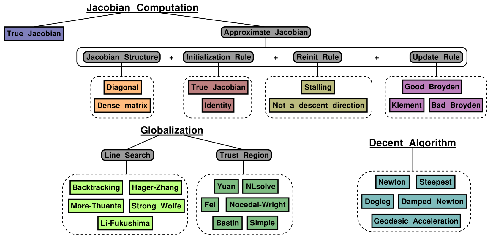
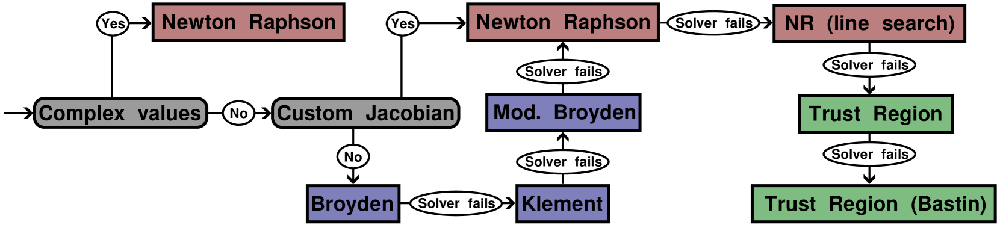
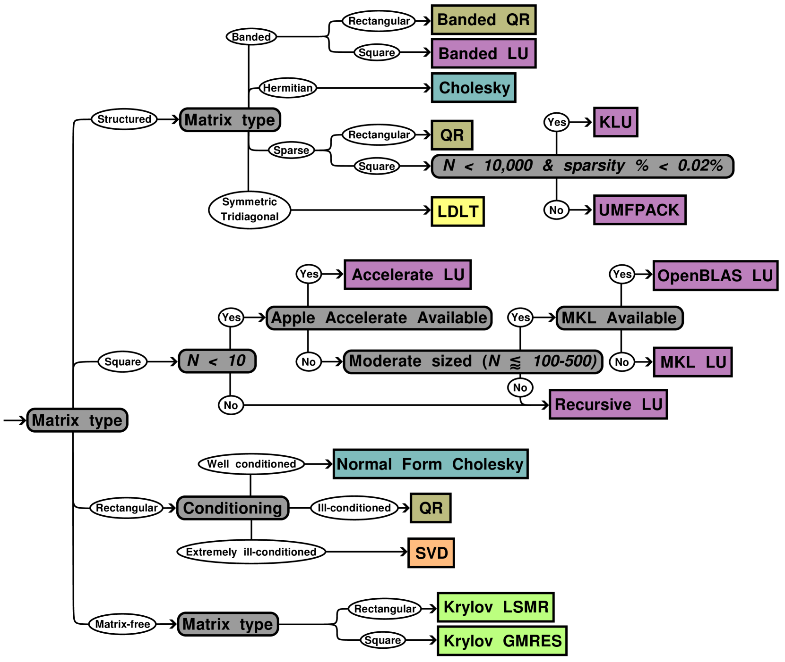

# NonlinearSolve.jl 是一款专为 Julia 语言设计的高性能、强健的非线性方程组求解工具，致力于解决各类复杂的非线性系统问题。

发布时间：2024年03月24日

`未给出

由于该论文摘要描述的是一个名为NonlinearSolve.jl的高性能开源非线性方程求解器套件的设计与应用，并未直接涉及“Agent”、“RAG”或“LLM（大型语言模型）”的相关理论或应用内容，因此无法将其归类到上述任何一个类别中。如果需要根据此摘要进行分类，可以考虑将其归为“数学软件应用”或“科学计算工具”等相关类别。` `科学计算` `工程仿真`

> NonlinearSolve.jl: High-Performance and Robust Solvers for Systems of Nonlinear Equations in Julia

# 摘要

> 解决非线性方程这一核心难题支撑着众多科学与工程学科的进步，但如何将其高效应用于复杂系统模型仍是一大挑战。本文推出的NonlinearSolve.jl是一款采用Julia编程语言原生开发的高性能开源非线性方程求解器套件，其亮点在于提供一个兼容多样求解器特性的统一API，比如可根据实时分析自动选择算法，利用静态数组内核加速GPU运算，并运用稀疏自动微分和无矩阵Krylov法应对大规模问题求解。经过与业界公认的Sundials和MINPACK等工具严格对比测试，NonlinearSolve.jl展现出卓越的稳定性和效率，在基准问题和棘手的实际应用场景中取得了显著成果。NonlinearSolve.jl的强大功能正在开启各领域建模与仿真的新可能，无疑成为了科研人员及实践者计算工具包中不可或缺的一部分。

> Efficiently solving nonlinear equations underpins numerous scientific and engineering disciplines, yet scaling these solutions for complex system models remains a challenge. This paper presents NonlinearSolve.jl - a suite of high-performance open-source nonlinear equation solvers implemented natively in the Julia programming language. NonlinearSolve.jl distinguishes itself by offering a unified API that accommodates a diverse range of solver specifications alongside features such as automatic algorithm selection based on runtime analysis, support for GPU-accelerated computation through static array kernels, and the utilization of sparse automatic differentiation and Jacobian-free Krylov methods for large-scale problem-solving. Through rigorous comparison with established tools such as Sundials and MINPACK, NonlinearSolve.jl demonstrates unparalleled robustness and efficiency, achieving significant advancements in solving benchmark problems and challenging real-world applications. The capabilities of NonlinearSolve.jl unlock new potentials in modeling and simulation across various domains, making it a valuable addition to the computational toolkit of researchers and practitioners alike.

[Arxiv](https://arxiv.org/abs/2403.16341)