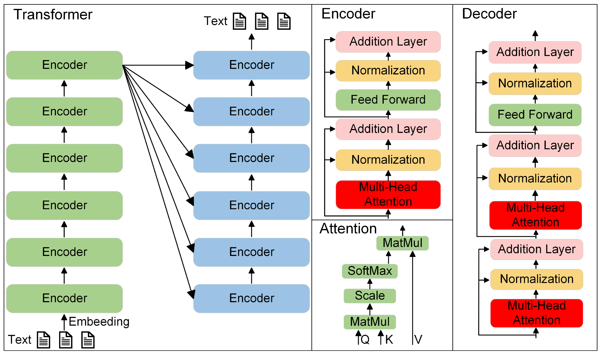
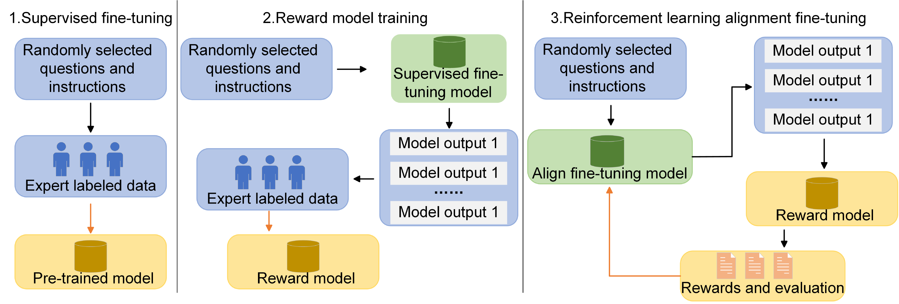
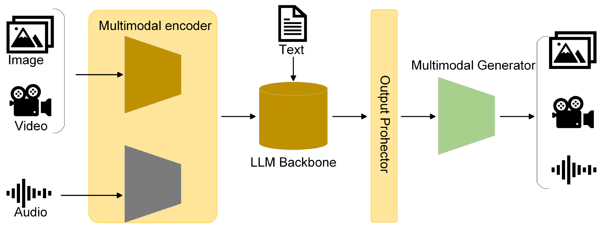
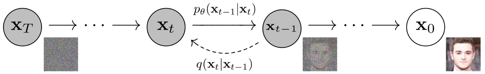
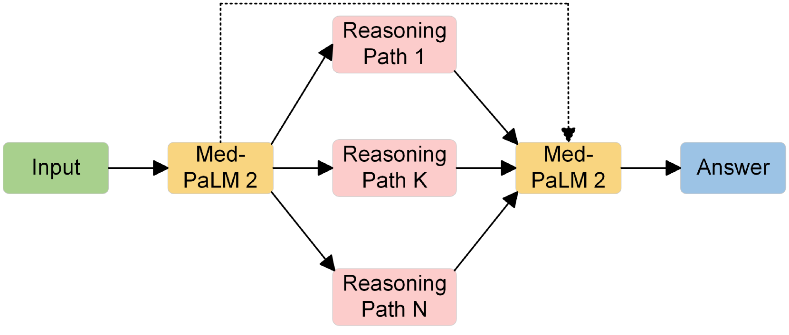
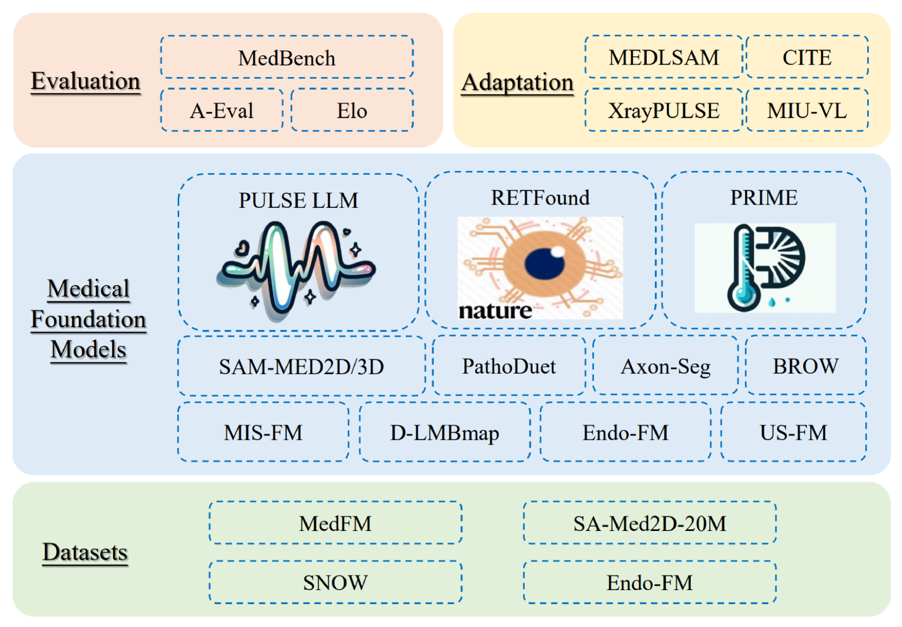

# 在放射学领域，大型AI模型的应用既带来了诸多机遇，也伴随着一系列挑战。

发布时间：2024年03月24日

`Agent` `放射医学` `人工智能`

> Opportunities and challenges in the application of large artificial intelligence models in radiology

# 摘要

> ChatGPT风潮引领下，全球范围内AI大模型的研发如火如荼，各类细分领域如放射影像大模型层出不穷，带来诸多便捷。本文首篇详述大型模型的演进历史、关键技术解析、工作流程以及多模态与视频生成大模型的工作原理。继而汇总AI大模型在放射医学教育、放射报告自动生成以及单模态与多模态放射医学应用等前沿进展。结尾部分，我们归纳了放射学中大型AI模型所面临的一些挑战，期冀助力放射学领域的深度革新与发展。

> Influenced by ChatGPT, artificial intelligence (AI) large models have witnessed a global upsurge in large model research and development. As people enjoy the convenience by this AI large model, more and more large models in subdivided fields are gradually being proposed, especially large models in radiology imaging field. This article first introduces the development history of large models, technical details, workflow, working principles of multimodal large models and working principles of video generation large models. Secondly, we summarize the latest research progress of AI large models in radiology education, radiology report generation, applications of unimodal and multimodal radiology. Finally, this paper also summarizes some of the challenges of large AI models in radiology, with the aim of better promoting the rapid revolution in the field of radiography.

[Arxiv](https://arxiv.org/abs/2403.16112)