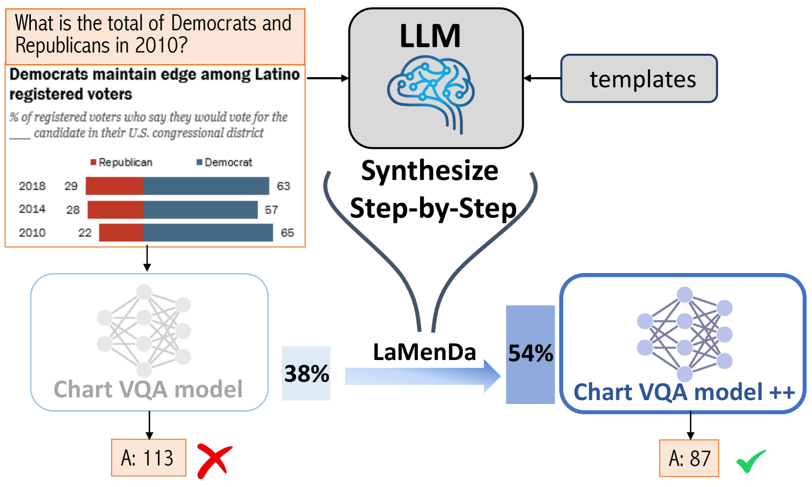
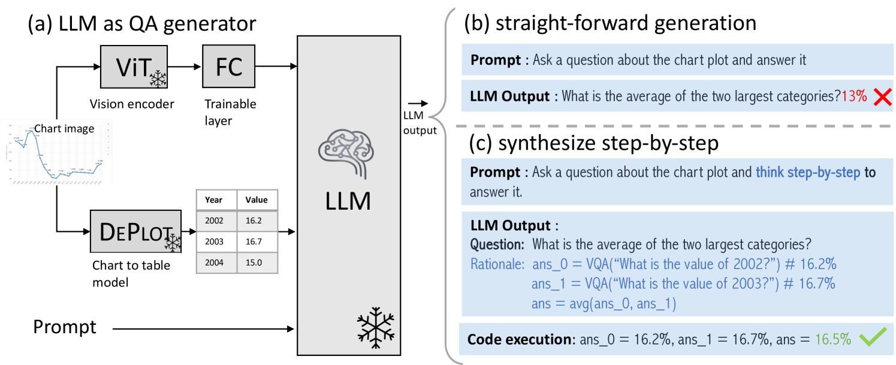
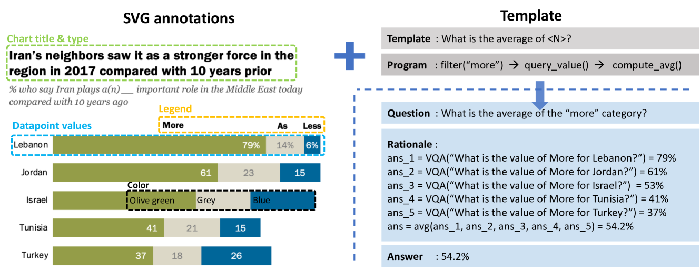
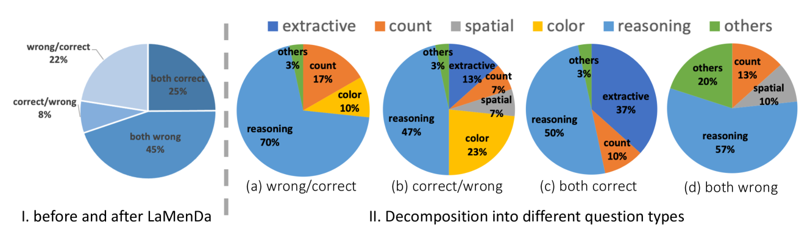
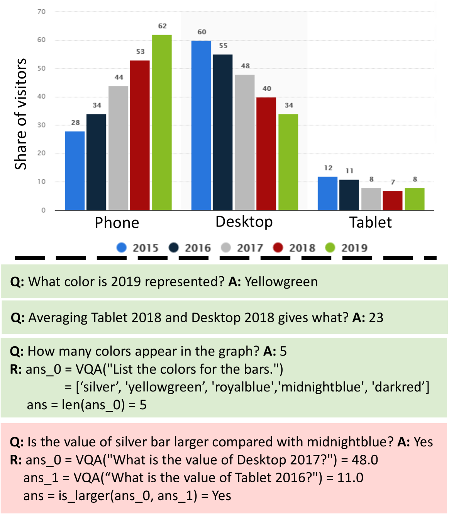
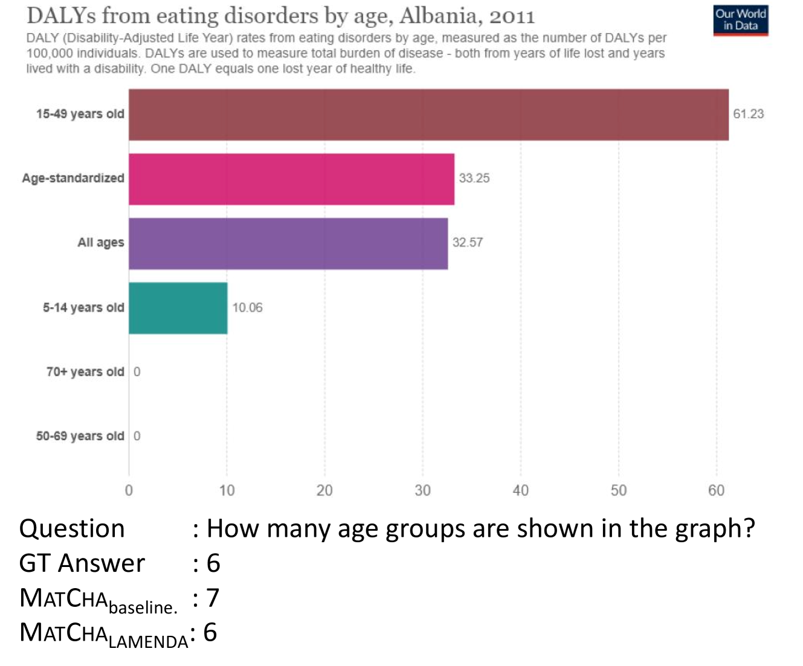
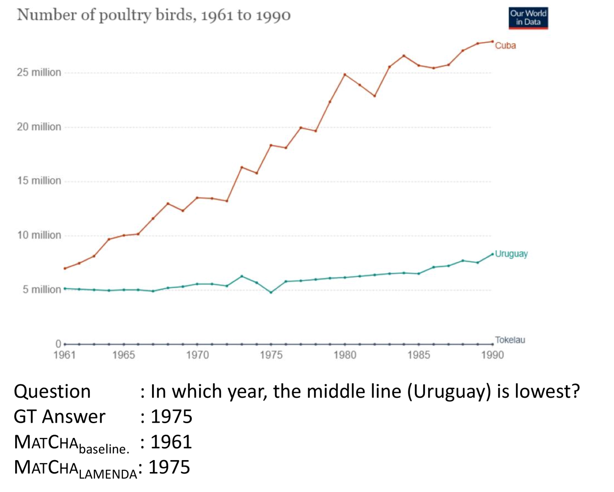
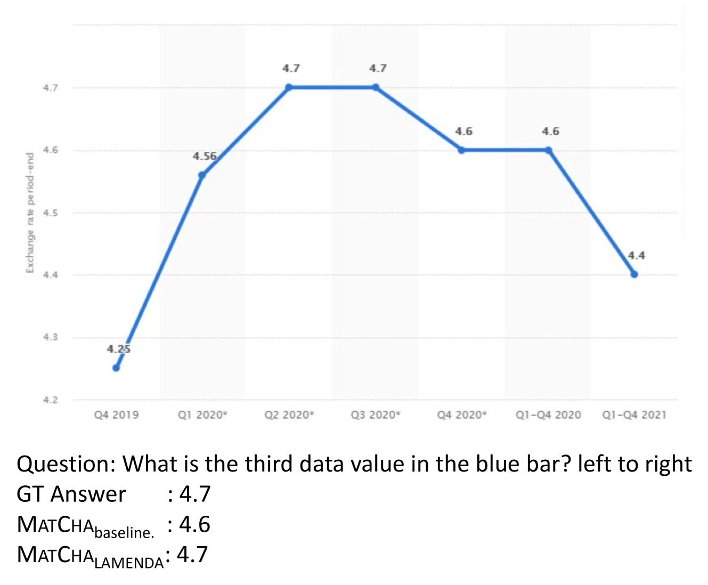
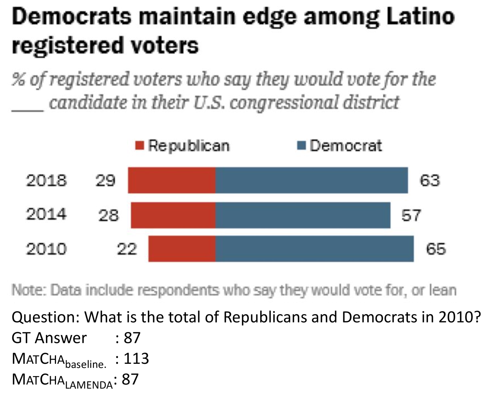

# 步步解析法：利用工具、模板以及大型语言模型作为数据生成器，助力基于推理的图表视觉问答研究进一步优化后的

发布时间：2024年03月24日

`LLM应用` `数据可视化` `人工智能(AI)`

> Synthesize Step-by-Step: Tools, Templates and LLMs as Data Generators for Reasoning-Based Chart VQA

# 摘要

> 要理解图表和图像类数据可视化，需兼顾视觉与数值信息的推理。目前的chart VQA模型虽在提取信息上表现出众，但在解答复杂推理题时力有未逮。为此，我们运用数据增强技术填补这一推理能力短板。巧妙地借助具备强大推理能力的LLMs，我们将之转化为自动化数据标注工具，生成图表图像对应的问题答案注释。本研究的核心创新点在于“步步合成”策略：我们训练的基于LLM的数据生成器能将复杂问题拆解为一系列循序渐进的子问题（理性依据），再运用诸如Python等外部工具，依据这些子问题得出最终答案。该步步生成过程以基于模板的QA生成流程产生的合成数据为训练基础。实验结果显示，提出的步步生成法意义重大。通过采用LLM增强数据（LAMENDA）进行训练，大幅提升了chart VQA模型的表现，使其在ChartQA和PlotQA数据集上刷新了最高准确率记录。特别是对于需要深度推理的人工编写的ChartQA数据集问题，我们的方法将先前最佳方法的准确率从38%提升至54%。我们期望本研究揭示合成数据的潜力，激发更多利用LLMs进行推理密集型任务数据增强的探索。

> Understanding data visualizations like charts and plots requires reasoning about both visual elements and numerics. Although strong in extractive questions, current chart visual question answering (chart VQA) models suffer on complex reasoning questions. In this work, we address the lack of reasoning ability by data augmentation. We leverage Large Language Models (LLMs), which have shown to have strong reasoning ability, as an automatic data annotator that generates question-answer annotations for chart images. The key innovation in our method lies in the Synthesize Step-by-Step strategy: our LLM-based data generator learns to decompose the complex question into step-by-step sub-questions (rationales), which are then used to derive the final answer using external tools, i.e. Python. This step-wise generation procedure is trained on synthetic data generated using a template-based QA generation pipeline. Experimental results highlight the significance of the proposed step-by-step generation. By training with the LLM-augmented data (LAMENDA), we significantly enhance the chart VQA models, achieving the state-of-the-art accuracy on the ChartQA and PlotQA datasets. In particular, our approach improves the accuracy of the previous state-of-the-art approach from 38% to 54% on the human-written questions in the ChartQA dataset, which needs strong reasoning. We hope our work underscores the potential of synthetic data and encourages further exploration of data augmentation using LLMs for reasoning-heavy tasks.

[Arxiv](https://arxiv.org/abs/2403.16385)