# ALISA技术：利用键值缓存的稀疏性特性，加速大型语言模型的推理过程。

发布时间：2024年03月25日

`LLM理论` `系统设计`

> ALISA: Accelerating Large Language Model Inference via Sparsity-Aware KV Caching

> Transformer架构极大地推动了自然语言处理技术的进步，并成为开发大型语言模型如LLaMA和OPT的基石，这些模型在众多NLP任务中已占据主导地位。尽管这些大型模型在精确度上表现优异，但其计算和内存需求之大也带来了实际应用的挑战。幸运的是，利用Transformer注意力层的KV缓存机制，通过线性内存访问替代二次计算复杂度，能有效提升模型推理速度。然而，随着序列长度增加，内存需求也随之增长，导致I/O瓶颈和内存不足等问题。为此，我们提出了ALISA，一种创新的算法与系统协同设计方案，旨在解决KV缓存所面临的挑战。ALISA通过稀疏窗口注意力算法，优先处理生成新标记时最关键的信息，从而在几乎不影响准确度的前提下，显著降低内存占用。此外，ALISA还实现了三阶段动态调度和缓存与重计算之间的优化平衡，以在资源受限环境下最大化性能。在单一GPU-CPU系统中，ALISA在不同负载下，分别将FlexGen和vLLM等基准系统的处理能力提升了至多3倍和1.9倍。

> The Transformer architecture has significantly advanced natural language processing (NLP) and has been foundational in developing large language models (LLMs) such as LLaMA and OPT, which have come to dominate a broad range of NLP tasks. Despite their superior accuracy, LLMs present unique challenges in practical inference, concerning the compute and memory-intensive nature. Thanks to the autoregressive characteristic of LLM inference, KV caching for the attention layers in Transformers can effectively accelerate LLM inference by substituting quadratic-complexity computation with linear-complexity memory accesses. Yet, this approach requires increasing memory as demand grows for processing longer sequences. The overhead leads to reduced throughput due to I/O bottlenecks and even out-of-memory errors, particularly on resource-constrained systems like a single commodity GPU. In this paper, we propose ALISA, a novel algorithm-system co-design solution to address the challenges imposed by KV caching. On the algorithm level, ALISA prioritizes tokens that are most important in generating a new token via a Sparse Window Attention (SWA) algorithm. SWA introduces high sparsity in attention layers and reduces the memory footprint of KV caching at negligible accuracy loss. On the system level, ALISA employs three-phase token-level dynamical scheduling and optimizes the trade-off between caching and recomputation, thus maximizing the overall performance in resource-constrained systems. In a single GPU-CPU system, we demonstrate that under varying workloads, ALISA improves the throughput of baseline systems such as FlexGen and vLLM by up to 3X and 1.9X, respectively.

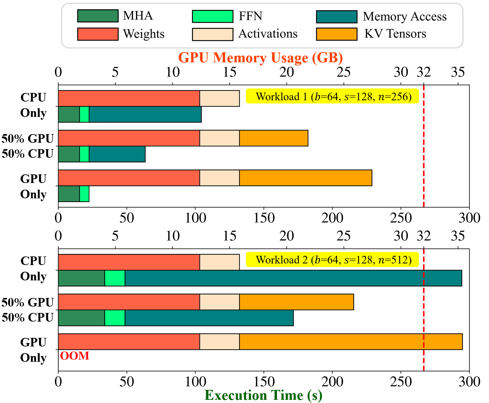

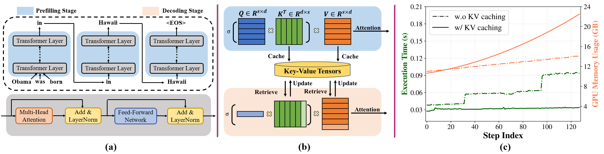

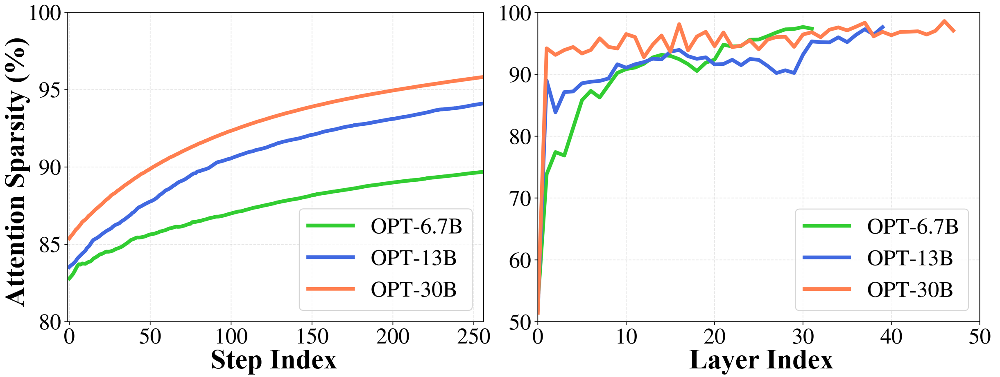

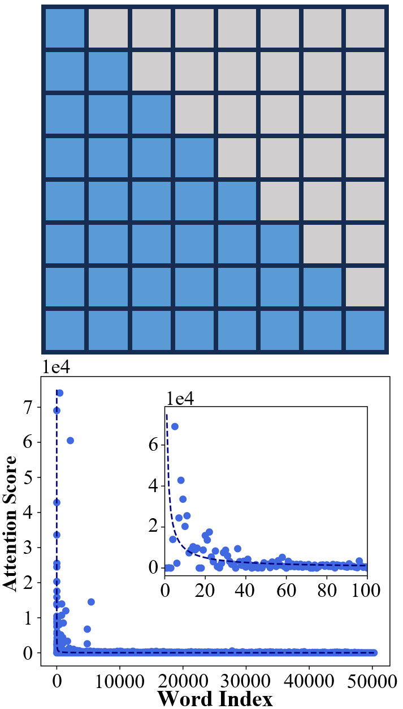

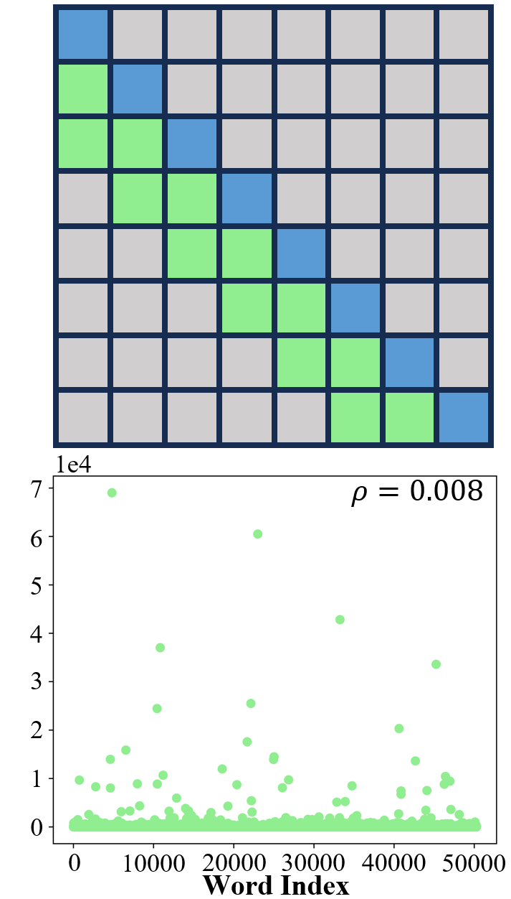

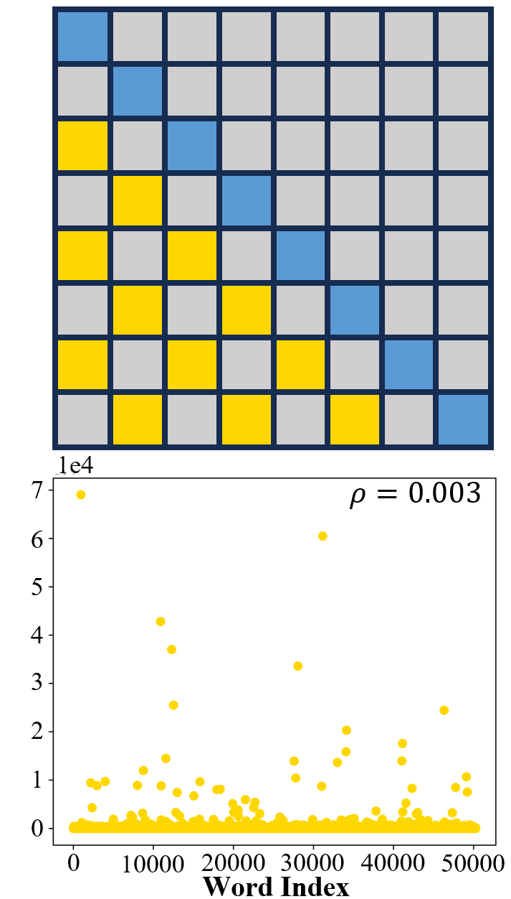

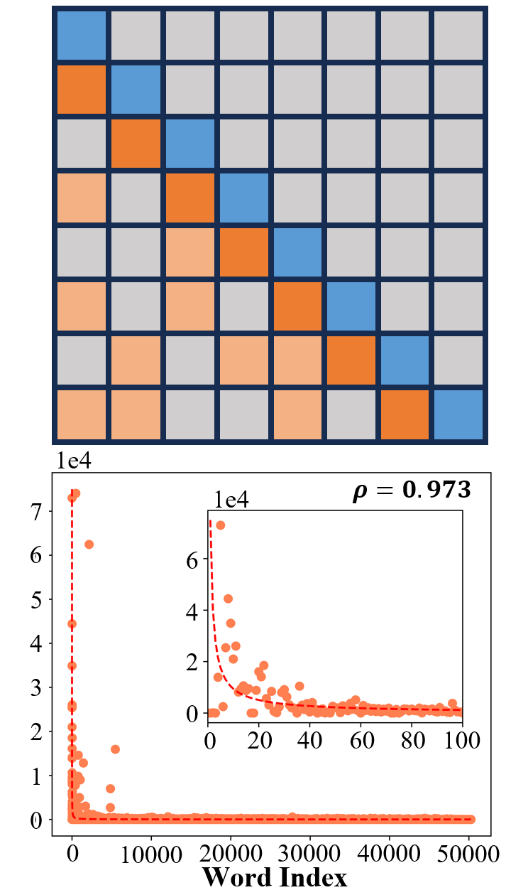

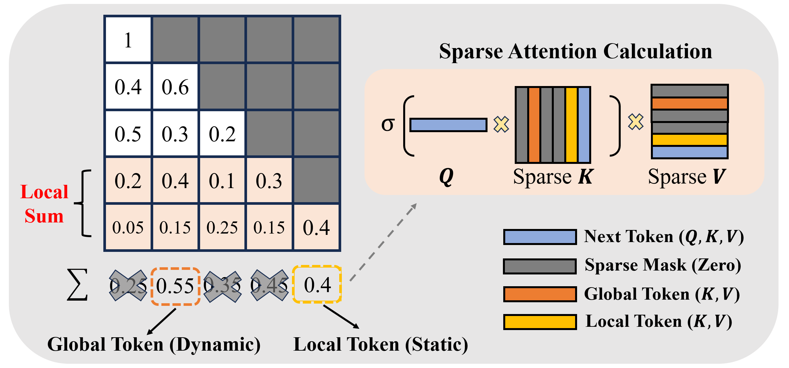

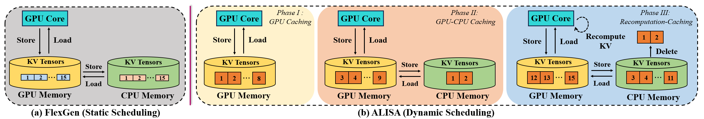

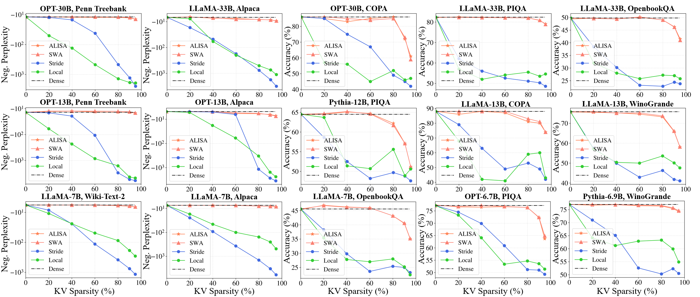

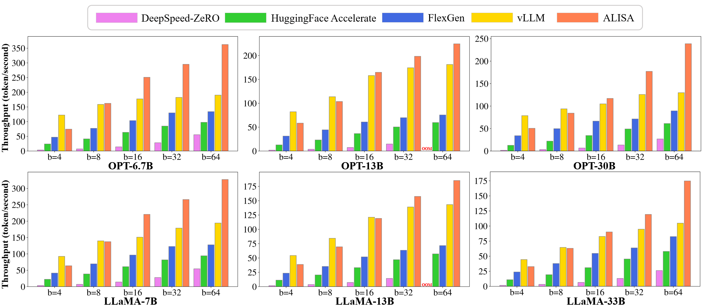

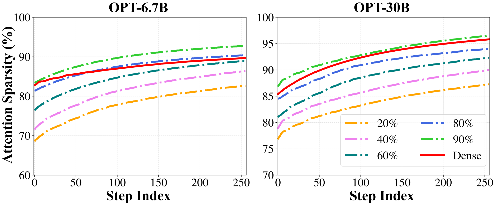

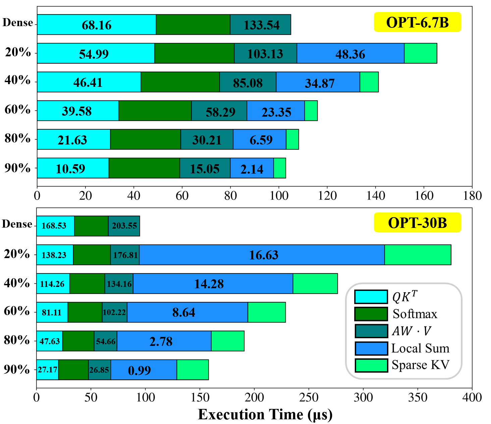

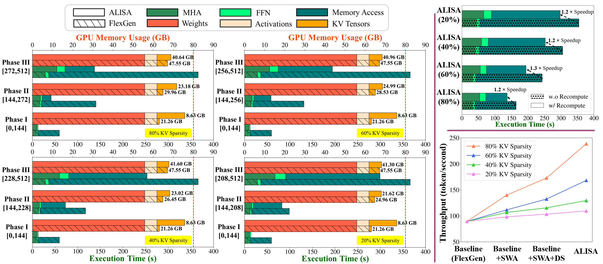

[Arxiv](https://arxiv.org/abs/2403.17312)