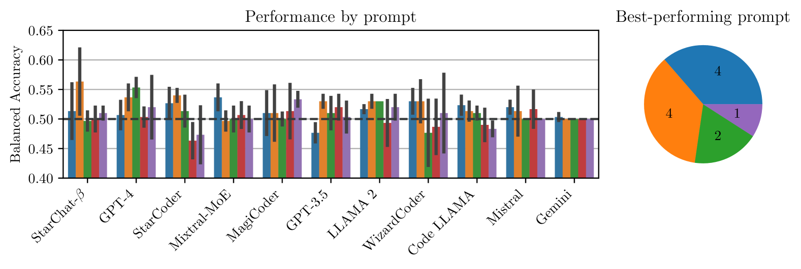
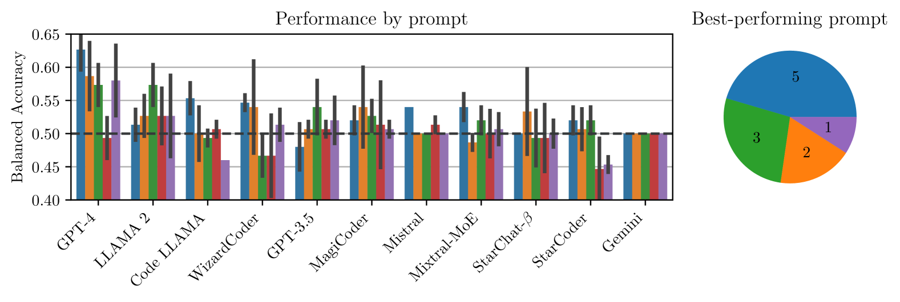
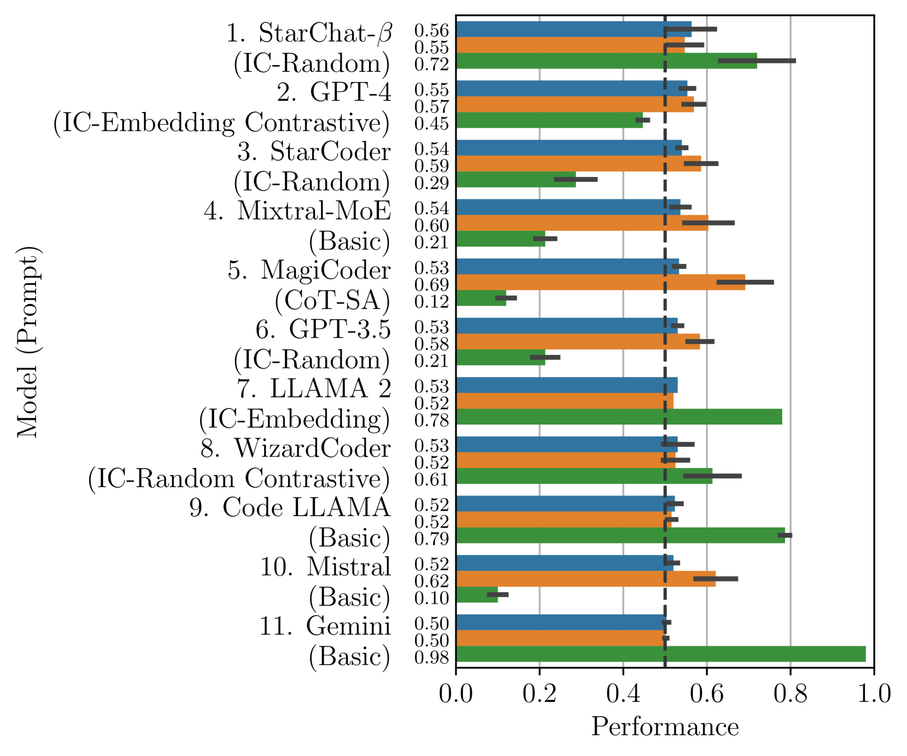
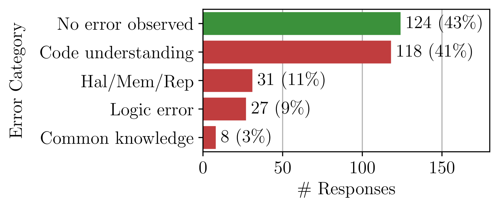
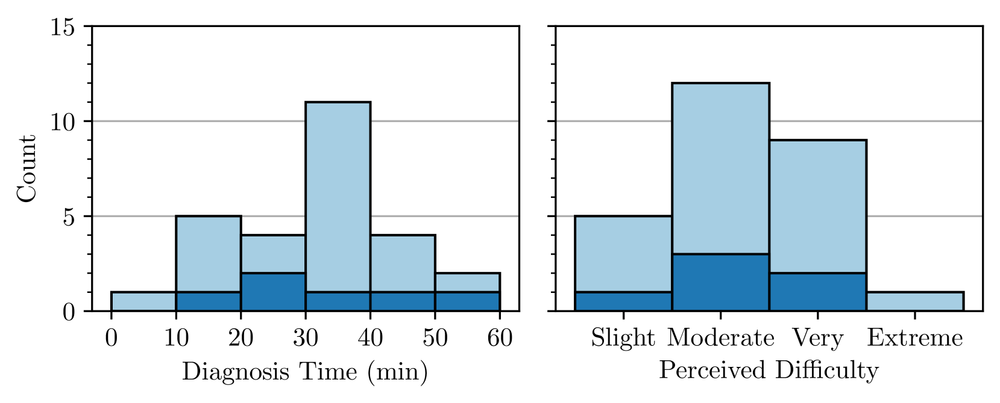
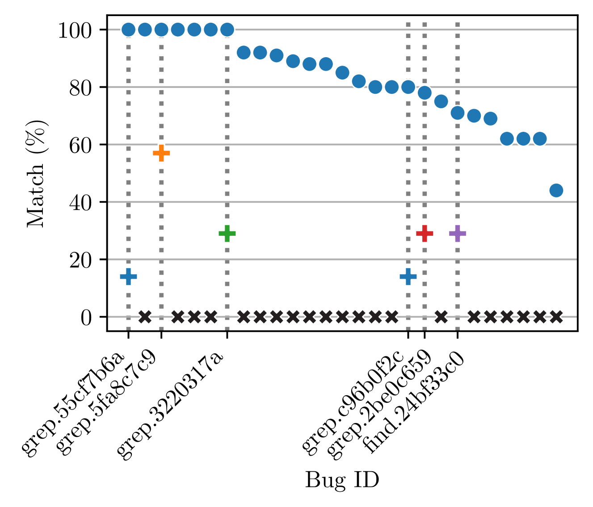

# 本研究全面探讨了大型语言模型在识别安全漏洞方面的能力。

发布时间：2024年03月25日

`LLM应用` `软件工程` `漏洞检测`

> A Comprehensive Study of the Capabilities of Large Language Models for Vulnerability Detection

> 大型语言模型（LLMs）在编码及软件工程领域展现出巨大潜力。确保软件系统的安全性、完整性和可靠性，漏洞检测起着至关重要的作用。精准的漏洞检测需对代码进行深入推理，成为检验LLMs推理能力边界的理想场景。尽管已有研究尝试利用LLMs进行漏洞检测，但其在此领域的真正潜力及解释漏洞时可能出现的错误尚未明确。本研究对十一个业界领先的代码生成LLMs进行了深入调研，评估了它们在漏洞检测方面的表现。我们系统性地探索了最有效的提示策略，运用了上下文学习和思维链等技巧，并提出了三种新的提示方法。研究结果显示，尽管这些方法在一定程度上提升了模型的检测效果，但LLMs在漏洞识别上仍面临挑战。模型的平衡准确度介于0.5至0.63之间，平均来看，它们在76%的情况下无法准确区分程序的缺陷版和修复版。通过对287个模型推理样本的细致分析，我们发现超过半数的LLM响应存在错误，模型常误判代码错误位置并错误识别错误类型。在DbgBench的27个错误样本中，LLMs仅正确识别出6个，而人类参与者的正确识别率高达70-100%。这一发现提示我们，尽管LLMs在其他领域有着显著潜力，但在理解和处理关键代码结构及安全概念方面，它们可能仍显不足。相关数据和代码已公开于 https://figshare.com/s/78fe02e56e09ec49300b。

> Large Language Models (LLMs) have demonstrated great potential for code generation and other software engineering tasks. Vulnerability detection is of crucial importance to maintaining the security, integrity, and trustworthiness of software systems. Precise vulnerability detection requires reasoning about the code, making it a good case study for exploring the limits of LLMs' reasoning capabilities. Although recent work has applied LLMs to vulnerability detection using generic prompting techniques, their full capabilities for this task and the types of errors they make when explaining identified vulnerabilities remain unclear.
  In this paper, we surveyed eleven LLMs that are state-of-the-art in code generation and commonly used as coding assistants, and evaluated their capabilities for vulnerability detection. We systematically searched for the best-performing prompts, incorporating techniques such as in-context learning and chain-of-thought, and proposed three of our own prompting methods. Our results show that while our prompting methods improved the models' performance, LLMs generally struggled with vulnerability detection. They reported 0.5-0.63 Balanced Accuracy and failed to distinguish between buggy and fixed versions of programs in 76% of cases on average. By comprehensively analyzing and categorizing 287 instances of model reasoning, we found that 57% of LLM responses contained errors, and the models frequently predicted incorrect locations of buggy code and misidentified bug types. LLMs only correctly localized 6 out of 27 bugs in DbgBench, and these 6 bugs were predicted correctly by 70-100% of human participants. These findings suggest that despite their potential for other tasks, LLMs may fail to properly comprehend critical code structures and security-related concepts. Our data and code are available at https://figshare.com/s/78fe02e56e09ec49300b.

[Arxiv](https://arxiv.org/abs/2403.17218)