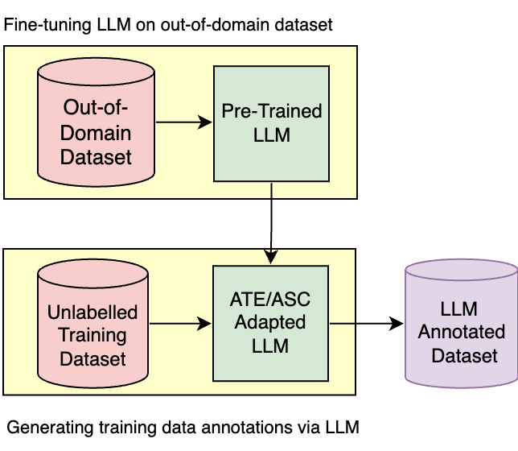
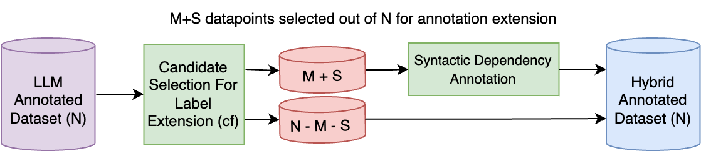
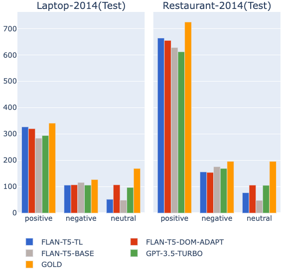
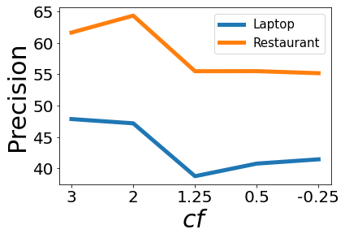
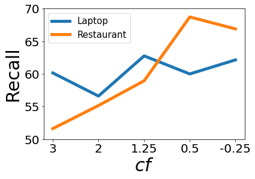

# 本研究提出了一种融合方法，通过迁移学习来加强基于方面的情感分析，旨在提升情感识别的准确性和效率。

发布时间：2024年03月25日

`LLM应用` `情感分析`

> A Hybrid Approach To Aspect Based Sentiment Analysis Using Transfer Learning

# 摘要

> 情感分析（ABSA）致力于发掘表达情绪的词汇或短语，并确定它们所关联的情绪倾向。尽管监督学习模型在该研究领域占据主导地位，但其训练过程需要依赖昂贵且费时的人工注释数据集，且这些数据集往往只适用于特定的领域、语言和文本类型。本研究旨在应对 ABSA 领域的这一重大挑战。我们提出了一种结合迁移学习的基于方面的 sentimental 分析的混合方法，通过发挥大型语言模型（LLM）和传统句法分析的优势，生成弱监督注释。我们利用句子的句法结构来增强 LLM 生成的注释，因为这些模型可能会忽略与特定领域相关的关键术语。通过在多个数据集上的广泛实验，我们证明了这种混合方法在提取关键术语和进行情绪分类任务上的有效性。关键词：基于方面的 sentimental 分析，句法分析，大型语言模型（LLM）

> Aspect-Based Sentiment Analysis (ABSA) aims to identify terms or multiword expressions (MWEs) on which sentiments are expressed and the sentiment polarities associated with them. The development of supervised models has been at the forefront of research in this area. However, training these models requires the availability of manually annotated datasets which is both expensive and time-consuming. Furthermore, the available annotated datasets are tailored to a specific domain, language, and text type. In this work, we address this notable challenge in current state-of-the-art ABSA research. We propose a hybrid approach for Aspect Based Sentiment Analysis using transfer learning. The approach focuses on generating weakly-supervised annotations by exploiting the strengths of both large language models (LLM) and traditional syntactic dependencies. We utilise syntactic dependency structures of sentences to complement the annotations generated by LLMs, as they may overlook domain-specific aspect terms. Extensive experimentation on multiple datasets is performed to demonstrate the efficacy of our hybrid method for the tasks of aspect term extraction and aspect sentiment classification.
  Keywords: Aspect Based Sentiment Analysis, Syntactic Parsing, large language model (LLM)

[Arxiv](https://arxiv.org/abs/2403.17254)