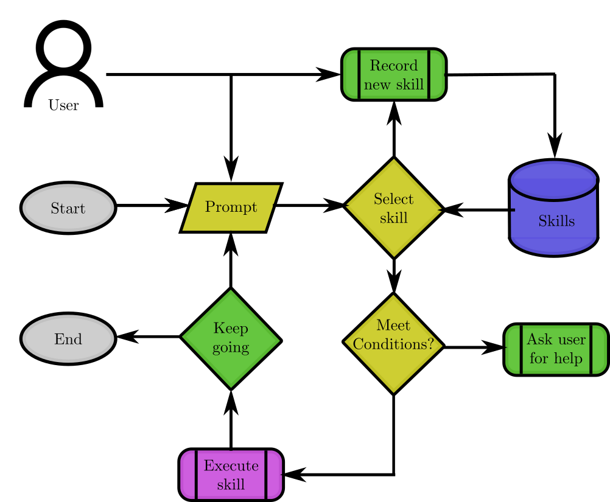
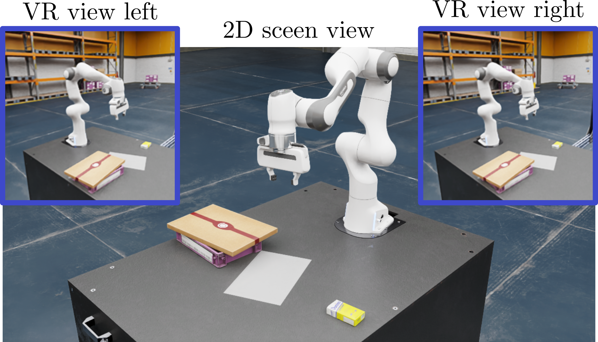
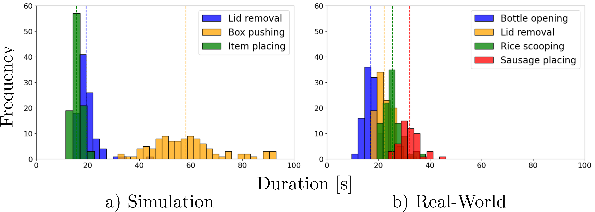
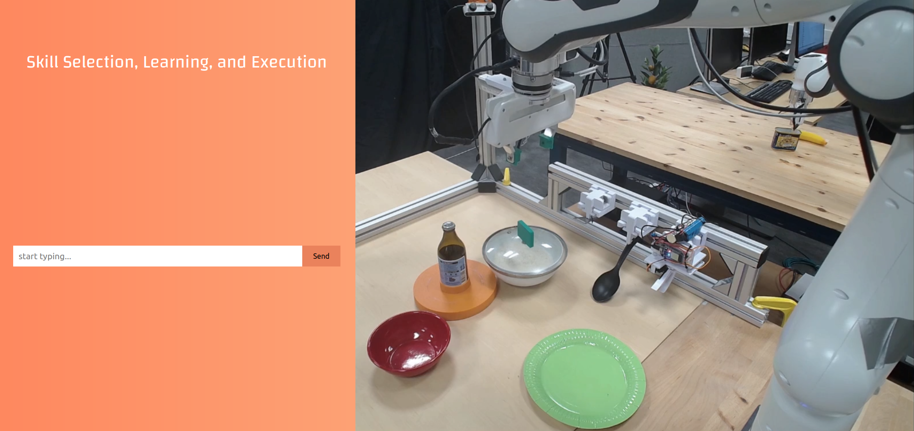

# 我们构建了一种创新的机器人技能学习系统，该系统巧妙融合了扩散策略与基础模型的优势。这一系统利用扩散策略进行高效决策制定，同时借助基础模型的强大泛化能力，共同促进机器人的技能习得与提升。

发布时间：2024年03月25日

`Agent` `机器人` `视觉智能`

> A Robotic Skill Learning System Built Upon Diffusion Policies and Foundation Models

# 摘要

> 本文结合了视觉运动操纵扩散策略与大型预训练多模态基础模型这两大前沿成果，构建了一套能够通过模仿学习，利用远程演示教习新技能的机器人技能学习体系。面对用户的自然语言指令，基础模型被用于选取合适的技能，并在实施前依据对工作空间的观测进行前置条件核查。我们不仅对比了多种基础模型在此情境下的性能表现，还详尽地评估了用户在仿真及真实环境中教授的各项技能。最终，在一项颇具挑战的真实场景——食物服务任务中，我们展示了整套系统的综合应用效果。项目网站提供了所有实验执行过程及其在仿真与真实环境下教授新技能过程的视频资料。

> In this paper, we build upon two major recent developments in the field, Diffusion Policies for visuomotor manipulation and large pre-trained multimodal foundational models to obtain a robotic skill learning system. The system can obtain new skills via the behavioral cloning approach of visuomotor diffusion policies given teleoperated demonstrations. Foundational models are being used to perform skill selection given the user's prompt in natural language. Before executing a skill the foundational model performs a precondition check given an observation of the workspace. We compare the performance of different foundational models to this end as well as give a detailed experimental evaluation of the skills taught by the user in simulation and the real world. Finally, we showcase the combined system on a challenging food serving scenario in the real world. Videos of all experimental executions, as well as the process of teaching new skills in simulation and the real world, are available on the project's website.

[Arxiv](https://arxiv.org/abs/2403.16730)