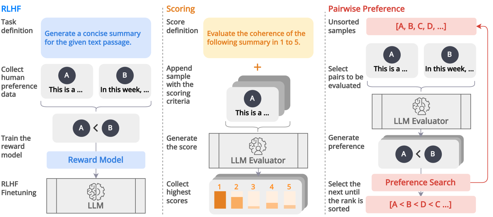
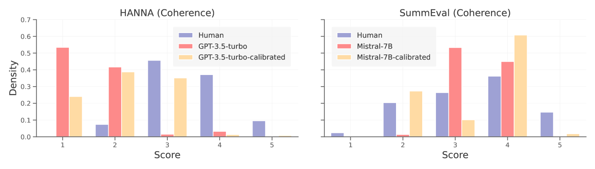
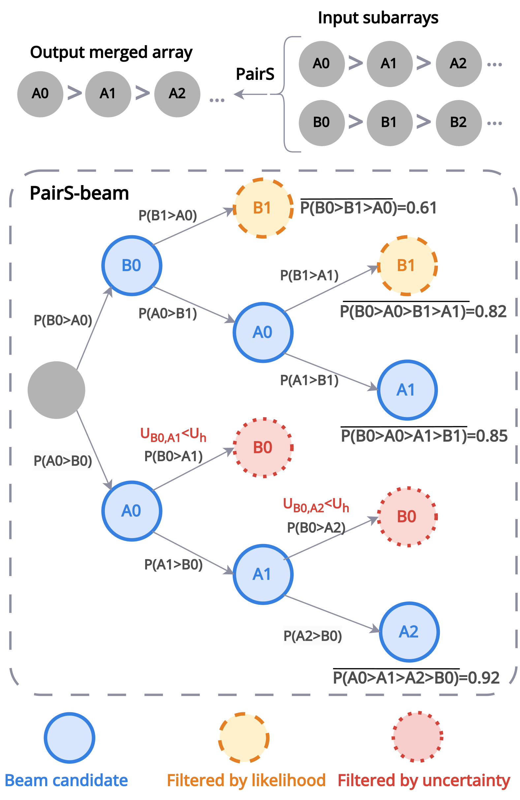
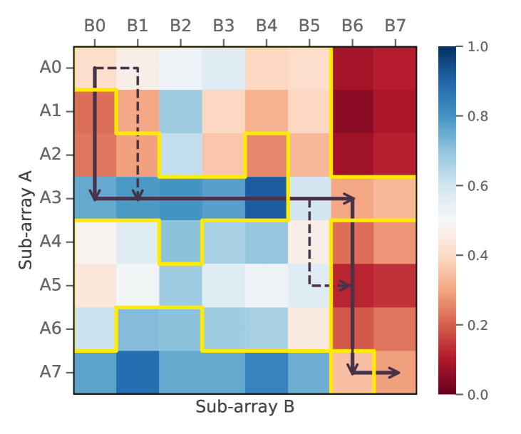
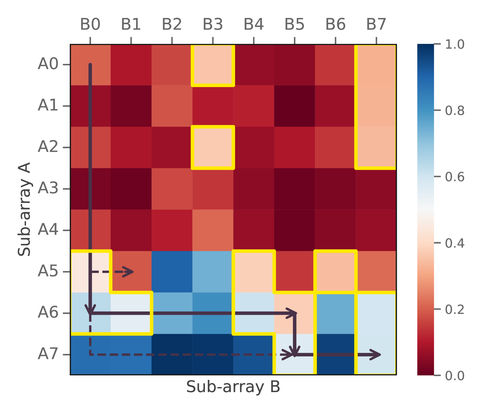
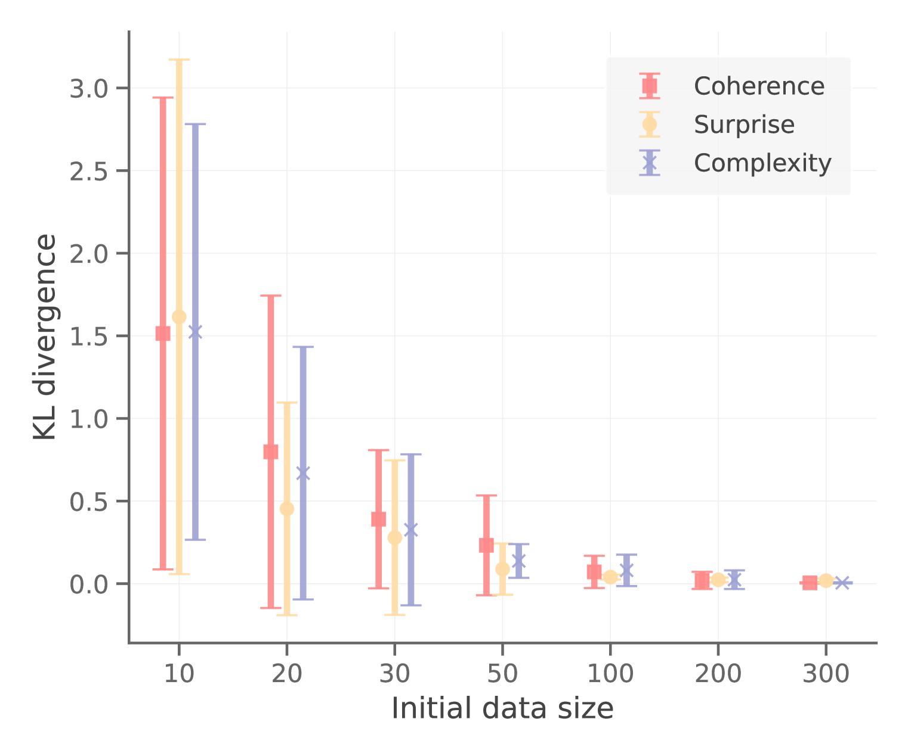

# 探究大型语言模型评估器如何通过成对偏好与人类判断保持一致，揭示成对偏好在决定模型质量中的关键作用。

发布时间：2024年03月25日

`LLM应用` `机器学习评估`

> Aligning with Human Judgement: The Role of Pairwise Preference in Large Language Model Evaluators

> LLMs已展现出作为自动评估工具的巨大潜力，能够评估生成自然语言的质量，但它们在评估时仍存偏见，难以产生与人类评判相契合的连贯评估结果。为此，我们首先全面剖析了LLMs评估与人类判断之间的错位现象，揭示出当前旨在减少偏见的校准方法尚无法有效校准LLMs评估器。受RLHF中偏好数据应用的启示，我们创新性地将评估问题转化为排序问题，并提出了一种名为“PAIRS”的不确定性引导搜索方法。PAIRS巧妙运用LLMs进行成对比较，高效地对候选文本进行排序，从而在代表性的评估任务上取得了最新突破，并明显超越了直接打分的方式。同时，我们还揭示了成对偏好在衡量LLMs传递性中的作用，以及PAIRS如何从校准中获得实质性的提升。

> Large Language Models (LLMs) have demonstrated promising capabilities as automatic evaluators in assessing the quality of generated natural language. However, LLMs still exhibit biases in evaluation and often struggle to generate coherent evaluations that align with human assessments. In this work, we first conduct a systematic study of the misalignment between LLM evaluators and human judgement, revealing that existing calibration methods aimed at mitigating biases are insufficient for effectively aligning LLM evaluators. Inspired by the use of preference data in RLHF, we formulate the evaluation as a ranking problem and introduce Pairwise-preference Search (PAIRS), an uncertainty-guided search method that employs LLMs to conduct pairwise comparisons and efficiently ranks candidate texts. PAIRS achieves state-of-the-art performance on representative evaluation tasks and demonstrates significant improvements over direct scoring. Furthermore, we provide insights into the role of pairwise preference in quantifying the transitivity of LLMs and demonstrate how PAIRS benefits from calibration.

[Arxiv](https://arxiv.org/abs/2403.16950)