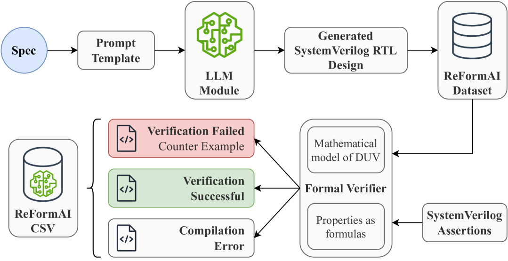
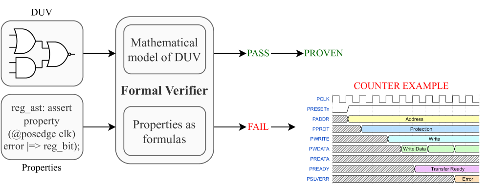
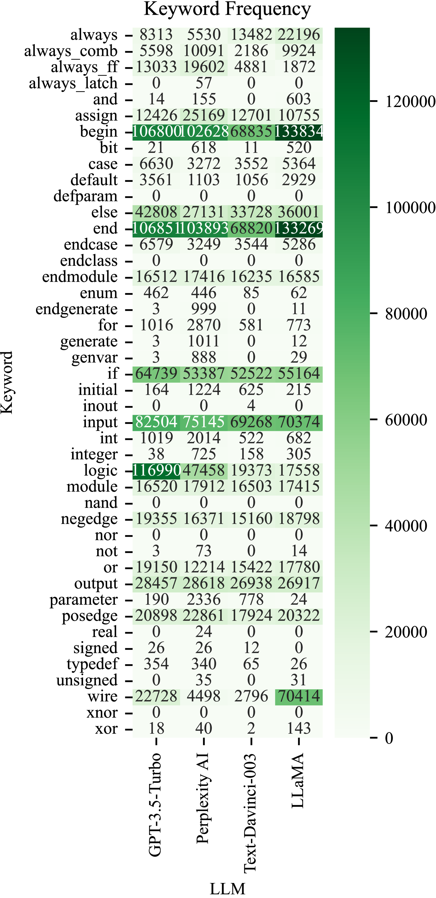
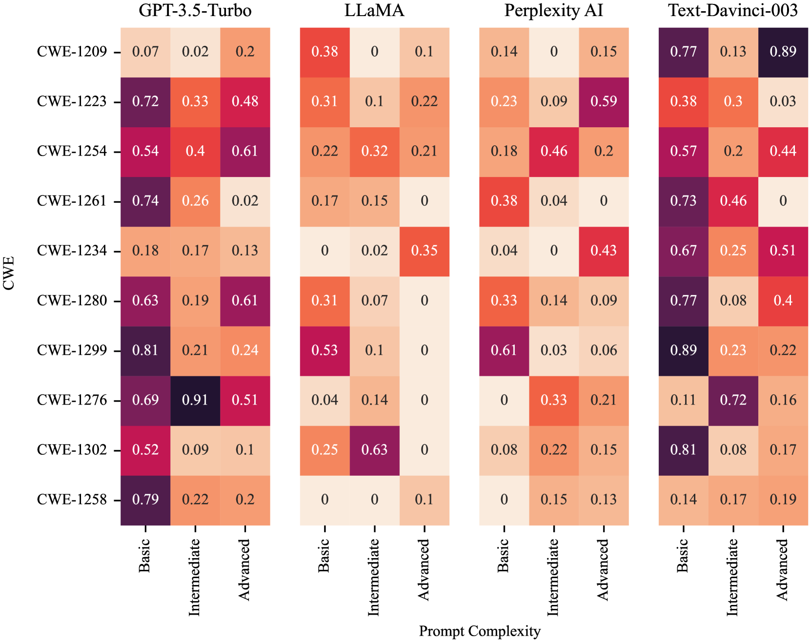
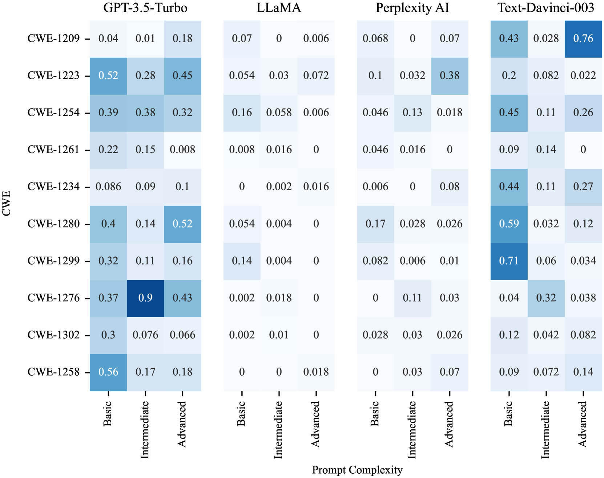

# 一切皆人工打造，智能尚欠火候——透过形式验证镜头透视GenAI

发布时间：2024年03月25日

`LLM应用` `硬件设计` `安全工程`

> All Artificial, Less Intelligence: GenAI through the Lens of Formal Verification

> 现今的硬件设计愈发精巧且复杂，却常受共同弱点枚举（CWEs）困扰。本文以大型语言模型（LLMs）驱动的再生人工智能生成的SystemVerilog硬件设计数据集为对象，对其内含的CWEs进行了形式化验证。我们通过验证，将这些设计标记为“存在漏洞”或“无CWE问题”。这一数据集由4种不同的LLMs产生，针对我们在论文中探讨的10种CWEs，分别提供了一套独一无二的设计实例。我们已将6万个生成的SystemVerilog寄存器传输级（RTL）代码与相应的CWE编号对应起来，揭示其存在的安全漏洞。研究还发现，大部分LLMs在生成硬件代码时并未意识到这些硬件CWEs的存在。我们的研究表明，大约有60%由LLMs生成的硬件设计存在CWEs隐患，这无疑增加了潜在的安全威胁。此数据集恰可作为理想资源，用于训练LLMs和机器学习（ML）算法，使它们学会规避生成带有CWEs倾向的硬件设计。

> Modern hardware designs have grown increasingly efficient and complex. However, they are often susceptible to Common Weakness Enumerations (CWEs). This paper is focused on the formal verification of CWEs in a dataset of hardware designs written in SystemVerilog from Regenerative Artificial Intelligence (AI) powered by Large Language Models (LLMs). We applied formal verification to categorize each hardware design as vulnerable or CWE-free. This dataset was generated by 4 different LLMs and features a unique set of designs for each of the 10 CWEs we target in our paper. We have associated the identified vulnerabilities with CWE numbers for a dataset of 60,000 generated SystemVerilog Register Transfer Level (RTL) code. It was also found that most LLMs are not aware of any hardware CWEs; hence they are usually not considered when generating the hardware code. Our study reveals that approximately 60% of the hardware designs generated by LLMs are prone to CWEs, posing potential safety and security risks. The dataset could be ideal for training LLMs and Machine Learning (ML) algorithms to abstain from generating CWE-prone hardware designs.

[Arxiv](https://arxiv.org/abs/2403.16750)