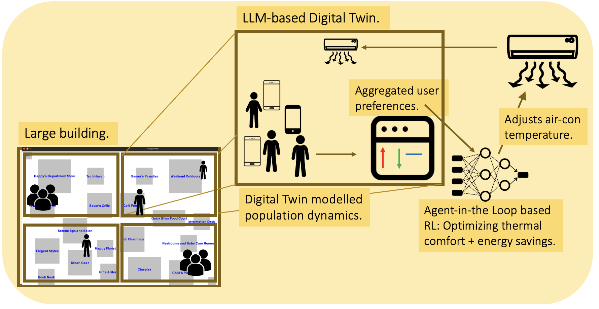
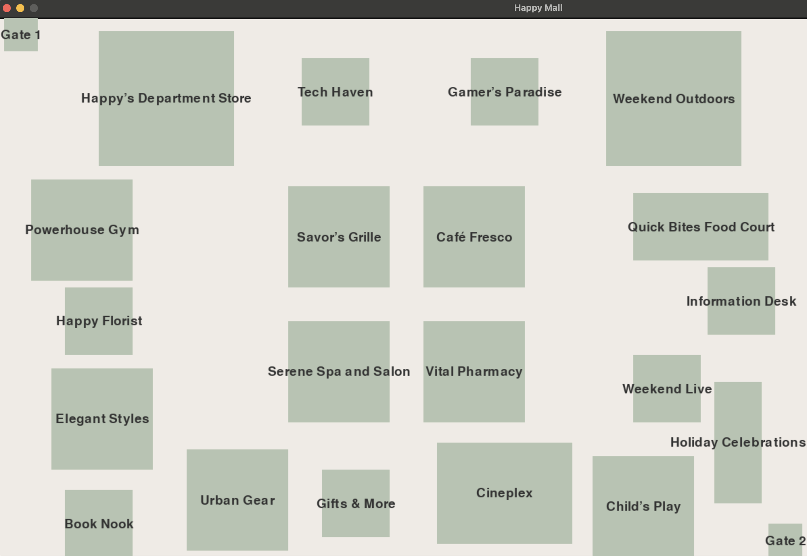
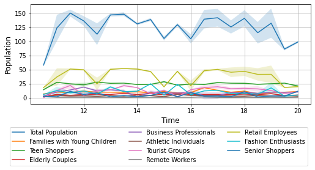
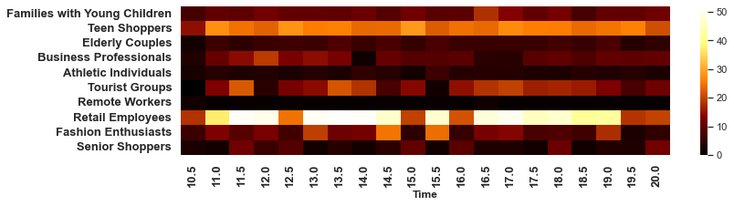
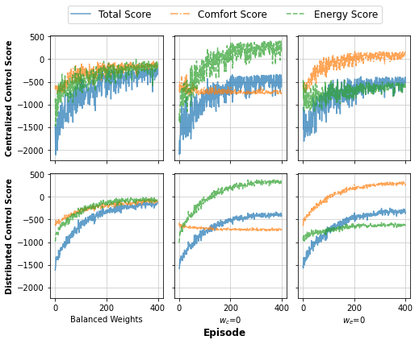
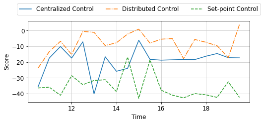
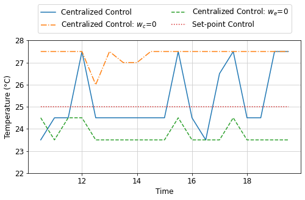
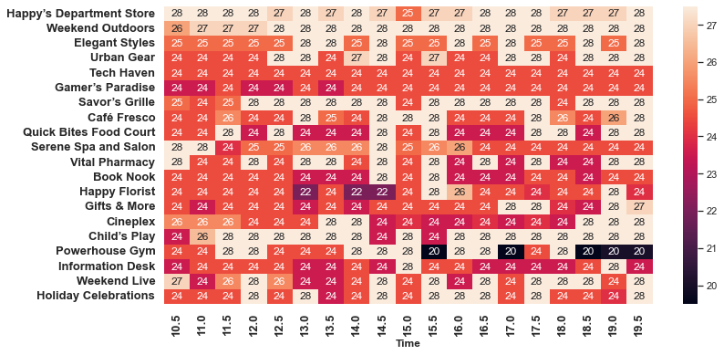
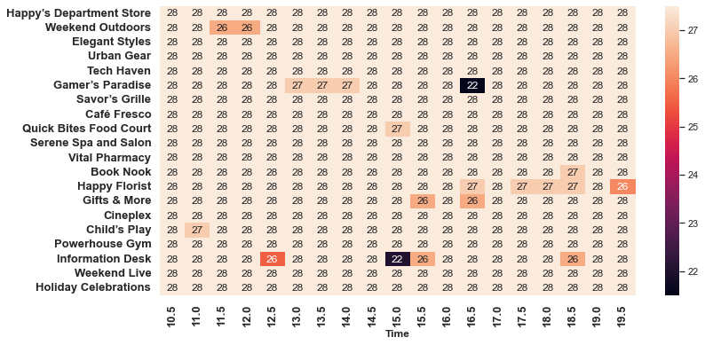
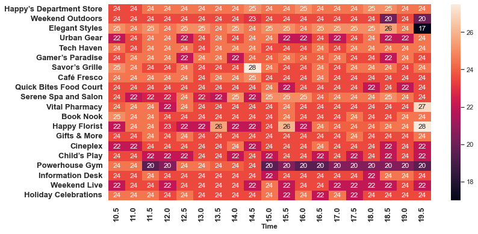

# 针对人机协同系统的优化，我们提出了一种基于大型语言模型（LLM）的数字孪生方案。该技术利用LLM的强大能力，旨在提升人机交互系统的效能与智能性。

发布时间：2024年03月25日

`Agent` `CPS-IoT` `能源管理/智能建筑`

> An LLM-Based Digital Twin for Optimizing Human-in-the Loop Systems

> 随着CPS-IoT应用与基础模型的广泛应用，借助实时环境控制技术涌现出众多创新应用，比如通过实时调控HVAC系统，在保证人们舒适度的同时，减少不必要的能源消耗。然而，在实际操作中，捕捉此类有人参与闭环系统中用户实时偏好的数据颇具挑战。为此，我们提议运用大型语言模型（LLMs）解决CPS优化过程中遇到的环境动态变化和数据难获取问题。在这篇论文中，我们通过一项实例研究展示了如何让LLM代理模仿购物中心内各个人群群体（例如年轻家庭、老年人）的行为模式及其对温度的不同喜好。我们将这些综合的热舒适偏好信息整合进一个基于代理的强化学习算法AitL-RL中，利用LLM动态模拟物理环境，学会如何巧妙地平衡节能与用户舒适度。实验结果显示，LLMs能够有效地模拟大型开放空间中人群的复杂流动情况；而AitL-RL算法在对比现行的设定点控制策略时展现出了明显优势，这进一步证明了在CPS-IoT应用中采取适应性和个性化决策的重要性。通过这项研究，我们揭示了将诸如LLMs的高级基础模型融入CPS-IoT系统的潜力，可以显著增强系统的适应能力和运行效率。相关项目代码已上传至我们的GitHub库供查阅。

> The increasing prevalence of Cyber-Physical Systems and the Internet of Things (CPS-IoT) applications and Foundation Models are enabling new applications that leverage real-time control of the environment. For example, real-time control of Heating, Ventilation and Air-Conditioning (HVAC) systems can reduce its usage when not needed for the comfort of human occupants, hence reducing energy consumption. Collecting real-time feedback on human preferences in such human-in-the-loop (HITL) systems, however, is difficult in practice. We propose the use of large language models (LLMs) to deal with the challenges of dynamic environments and difficult-to-obtain data in CPS optimization. In this paper, we present a case study that employs LLM agents to mimic the behaviors and thermal preferences of various population groups (e.g. young families, the elderly) in a shopping mall. The aggregated thermal preferences are integrated into an agent-in-the-loop based reinforcement learning algorithm AitL-RL, which employs the LLM as a dynamic simulation of the physical environment to learn how to balance between energy savings and occupant comfort. Our results show that LLMs are capable of simulating complex population movements within large open spaces. Besides, AitL-RL demonstrates superior performance compared to the popular existing policy of set point control, suggesting that adaptive and personalized decision-making is critical for efficient optimization in CPS-IoT applications. Through this case study, we demonstrate the potential of integrating advanced Foundation Models like LLMs into CPS-IoT to enhance system adaptability and efficiency. The project's code can be found on our GitHub repository.

[Arxiv](https://arxiv.org/abs/2403.16809)