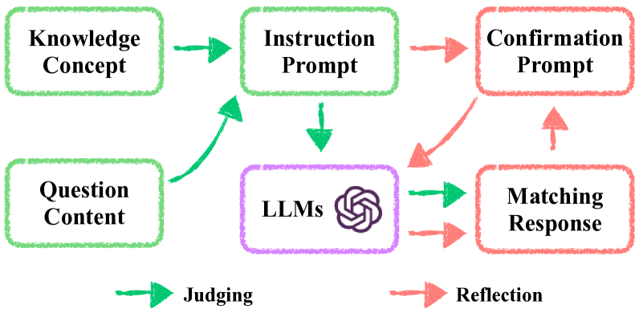
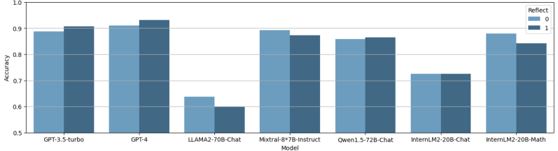
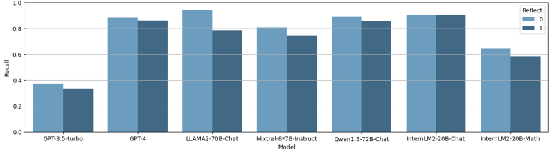
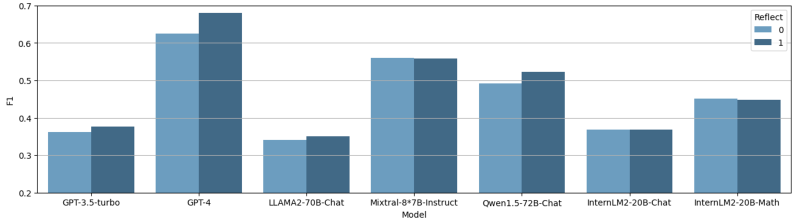

# 借助大型语言模型，实现数学问题知识概念的自动标注。

发布时间：2024年03月25日

`LLM应用` `智能教育` `自动标注`

> Automate Knowledge Concept Tagging on Math Questions with LLMs

# 摘要

> 在当今智能教育应用领域，问题的知识概念标签扮演着核心角色，涉及学习进程的诊断、练习题的推荐以及课程内容的编排。这类工作传统上依赖于教育专家的手动标注，因为它不仅要求对问题文本和知识定义有深刻的语义理解，还要求能够精准地将解题思路与相应的知识概念相连。本文探讨了利用大型语言模型（LLMs）自动化完成知识概念标签的工作，以应对传统手动方法无法满足教育应用中日益增长的概念标签需求的问题。LLMs的零/少次学习能力特别适合教育环境，后者在收集大规模专家标注数据集方面常遭遇挑战。通过一系列广泛的实验，我们验证了LLMs在数学问题概念标签上的应用前景。通过案例分析不同LLMs的结果，我们总结了应用LLMs进行自动概念标签工作成功的关键要素。

> Knowledge concept tagging for questions plays a crucial role in contemporary intelligent educational applications, including learning progress diagnosis, practice question recommendations, and course content organization. Traditionally, these annotations have been conducted manually with help from pedagogical experts, as the task requires not only a strong semantic understanding of both question stems and knowledge definitions but also deep insights into connecting question-solving logic with corresponding knowledge concepts. In this paper, we explore automating the tagging task using Large Language Models (LLMs), in response to the inability of prior manual methods to meet the rapidly growing demand for concept tagging in questions posed by advanced educational applications. Moreover, the zero/few-shot learning capability of LLMs makes them well-suited for application in educational scenarios, which often face challenges in collecting large-scale, expertise-annotated datasets. By conducting extensive experiments with a variety of representative LLMs, we demonstrate that LLMs are a promising tool for concept tagging in math questions. Furthermore, through case studies examining the results from different LLMs, we draw some empirical conclusions about the key factors for success in applying LLMs to the automatic concept tagging task.

[Arxiv](https://arxiv.org/abs/2403.17281)