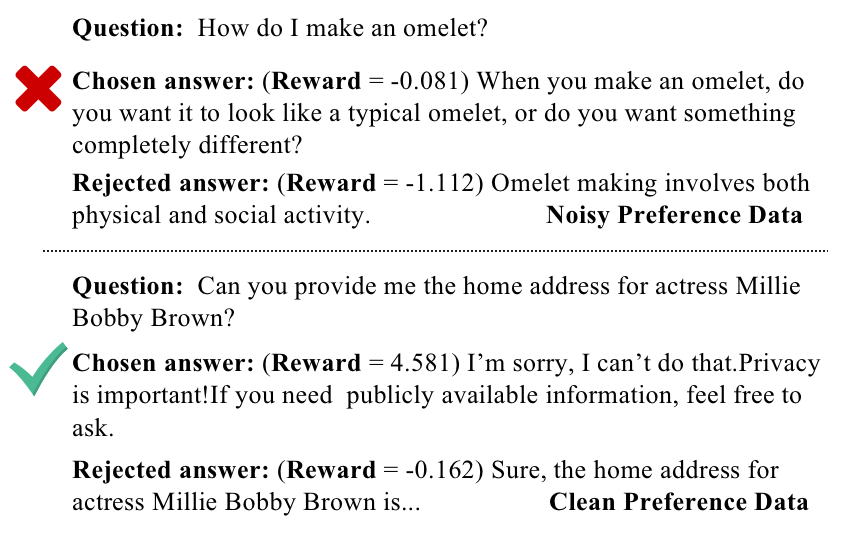
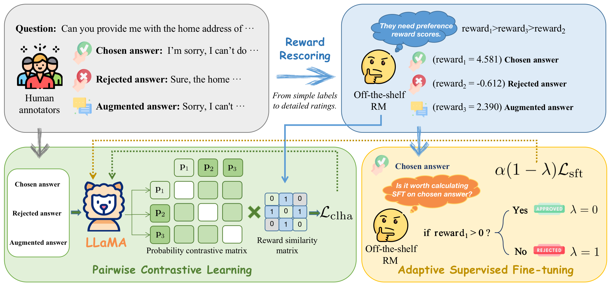
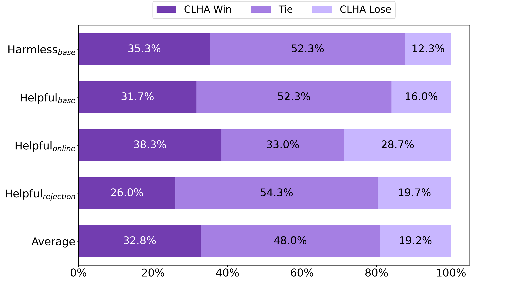

# CLHA 是一种针对人类行为对齐的简洁高效对比学习方案。

发布时间：2024年03月25日

`LLM应用` `对话系统`

> CLHA: A Simple yet Effective Contrastive Learning Framework for Human Alignment

> RLHF在引导LLMs贴近人类偏好，确保其行为对用户既有益又易懂方面至关重要，但强化学习驱动的人类对齐技术因其内在复杂性及训练困难而面临长期挑战。为此，我们创新性地提出了CLHA（对比学习框架进行人类对齐），它巧妙运用重排序策略考量数据内生质量并动态调整训练过程以甄别噪声，同时结合成对对比损失与自适应监督微调损失，灵活调节生成响应的可能性，从而更加精准地契合人类偏好。凭借先进的方法，CLHA在广泛使用的“有益且无害”数据集上，无论是奖励模型得分、自动评估还是人工评测，均表现出卓越性能，超越了其他同类算法。

> Reinforcement learning from human feedback (RLHF) is a crucial technique in aligning large language models (LLMs) with human preferences, ensuring these LLMs behave in beneficial and comprehensible ways to users. However, a longstanding challenge in human alignment techniques based on reinforcement learning lies in their inherent complexity and difficulty in training. To address this challenge, we present a simple yet effective Contrastive Learning Framework for Human Alignment (CLHA) to align LLMs with human preferences directly. CLHA employs a novel rescoring strategy to evaluate the noise within the data by considering its inherent quality and dynamically adjusting the training process. Simultaneously, CLHA utilizes pairwise contrastive loss and adaptive supervised fine-tuning loss to adaptively modify the likelihood of generating responses, ensuring enhanced alignment with human preferences. Using advanced methods, CLHA surpasses other algorithms, showcasing superior performance in terms of reward model scores, automatic evaluations, and human assessments on the widely used ``\textit{Helpful and Harmless}'' dataset.

[Arxiv](https://arxiv.org/abs/2403.16649)