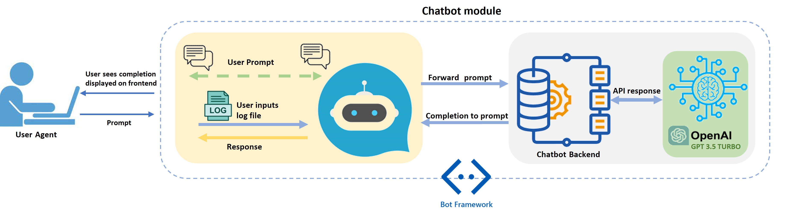
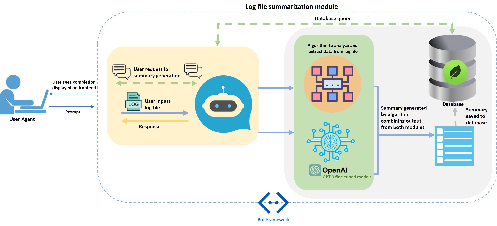
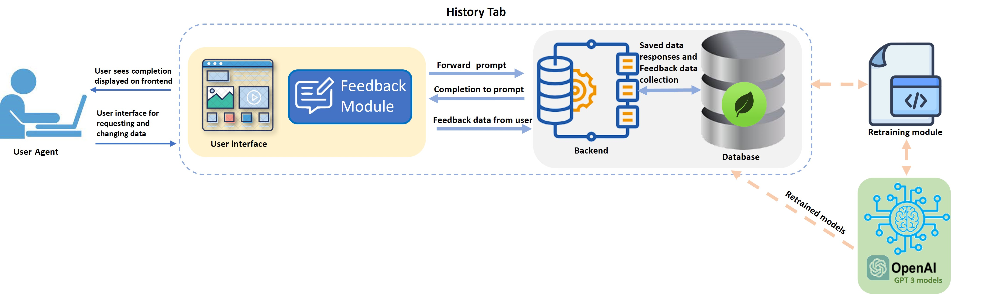
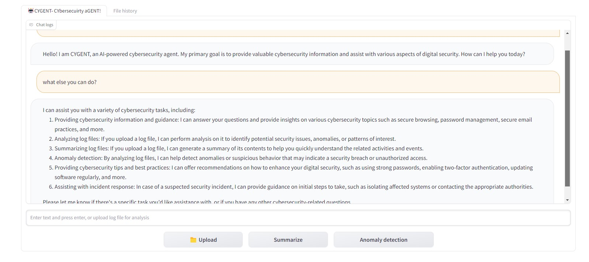
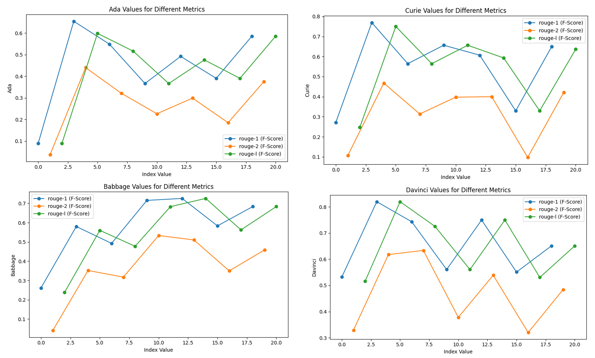
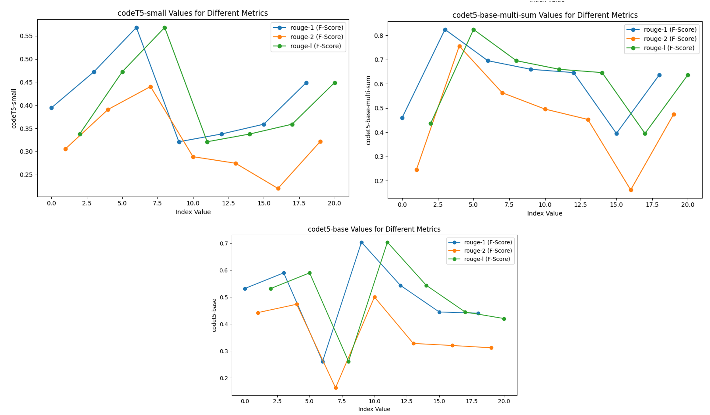
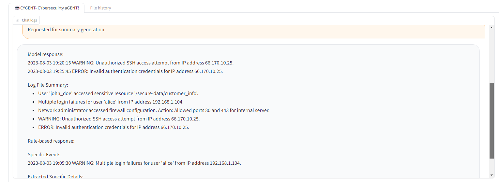
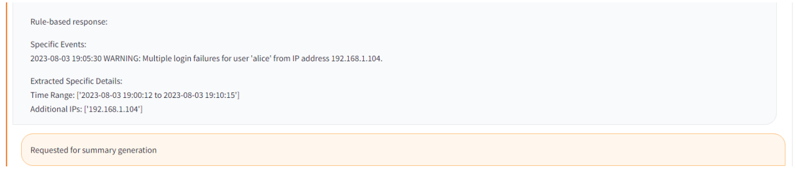
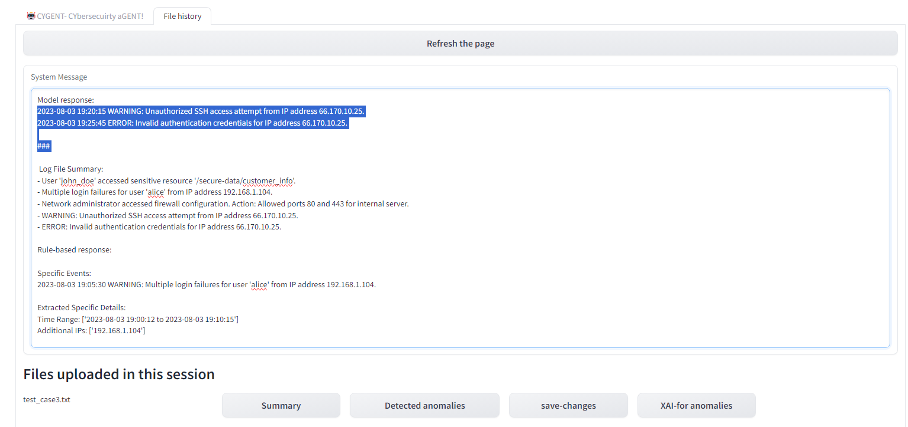

# CYGENT：一款搭载了GPT-3技术的网络安全智能对话助手，擅长进行日志智能摘要。

发布时间：2024年03月25日

`LLM应用` `网络安全` `物联网`

> CYGENT: A cybersecurity conversational agent with log summarization powered by GPT-3

# 摘要

> 面对当今IT与物联网领域不断升级的网络威胁，我们推出了CYGENT——一款由GPT-3.5涡轮模型支持的对话式助手框架，旨在助力系统管理员保障系统性能最优、资源供应稳定。本项研究着眼于对GPT-3模型进行网络安全领域的精细化调整，涵盖了为网络安全行动量身打造的对话式AI和生成式AI。CYGENT通过提供网络安全资讯、深入分析及总结日志文件、识别特定事件并给出关键指令，为用户提供了极大便利。该对话式代理基于GPT-3.5涡轮模型构建，我们通过手动创建的数据点对摘要模型（GPT3）进行了精准调校和验证。采用这一策略，我们实现了超过97%的BERTscore，充分证明了GPT-3在将日志文件转换为人类可读格式并提供必要信息方面的强大能力。此外，我们还对GPT-3模型与其他大型语言模型（如CodeT5-small、CodeT5-base和CodeT5-base-multi-sum）进行了对比分析，以探究日志分析技术。分析结果一致显示，Davinci（GPT-3）模型在性能上超越了所有其他模型，显示出卓越的实力。这些重要发现对于提升人们理解和处理日志文件的能力极为关键，尤其是在物联网设备数量激增的背景下。研究还发现，CodeT5-base-multi-sum模型在日志总结方面与Davinci模型在一定程度上表现相近，显示出其作为离线模型的潜力。

> In response to the escalating cyber-attacks in the modern IT and IoT landscape, we developed CYGENT, a conversational agent framework powered by GPT-3.5 turbo model, designed to aid system administrators in ensuring optimal performance and uninterrupted resource availability. This study focuses on fine-tuning GPT-3 models for cybersecurity tasks, including conversational AI and generative AI tailored specifically for cybersecurity operations. CYGENT assists users by providing cybersecurity information, analyzing and summarizing uploaded log files, detecting specific events, and delivering essential instructions. The conversational agent was developed based on the GPT-3.5 turbo model. We fine-tuned and validated summarizer models (GPT3) using manually generated data points. Using this approach, we achieved a BERTscore of over 97%, indicating GPT-3's enhanced capability in summarizing log files into human-readable formats and providing necessary information to users. Furthermore, we conducted a comparative analysis of GPT-3 models with other Large Language Models (LLMs), including CodeT5-small, CodeT5-base, and CodeT5-base-multi-sum, with the objective of analyzing log analysis techniques. Our analysis consistently demonstrated that Davinci (GPT-3) model outperformed all other LLMs, showcasing higher performance. These findings are crucial for improving human comprehension of logs, particularly in light of the increasing numbers of IoT devices. Additionally, our research suggests that the CodeT5-base-multi-sum model exhibits comparable performance to Davinci to some extent in summarizing logs, indicating its potential as an offline model for this task.

[Arxiv](https://arxiv.org/abs/2403.17160)