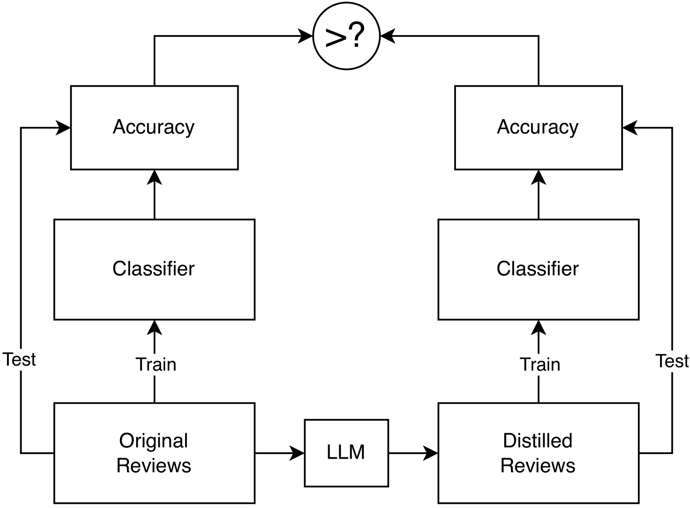

# 大型语言模型乃至人类是否具备提炼文本的能力？

发布时间：2024年03月25日

`LLM应用` `计算社会科学`

> Can Large Language Models (or Humans) Distill Text?

> 我们探索LLMs能否有效提炼文本，即剔除不受欢迎的特定变量痕迹，同时保持其他相关信息。通过使用多种架构和训练方式的LLMs，我们尝试识别并移除目标变量信息的同时保持其余相关信号。这项研究揭示了LLMs在处理文本提炼任务中的优劣势，并为如何在包含文本数据的计算社会科学探究中运用此类模型提供了深入见解。特别是在极端情况下，即使经过LLM提炼，机器学习分类器仍能在一定程度上从处理过的文本中检测到情感与文本之间的统计关联。同时，我们发现人类注解员在保有其他语义内容的前提下，同样难以精准剔除情感成分。这暗示在某些文本环境中，概念变量间的区分度可能有限，这不仅暴露了依赖文本层级变换方法的局限性，同时也对那些旨在在表征空间中实现统计独立性的提炼方法的鲁棒性提出了质疑，因为即便是人类编码员直接操作原始文本，也可能难以达到理想的独立性。

> We investigate the potential of large language models (LLMs) to distill text: to remove the textual traces of an undesired forbidden variable. We employ a range of LLMs with varying architectures and training approaches to distill text by identifying and removing information about the target variable while preserving other relevant signals. Our findings shed light on the strengths and limitations of LLMs in addressing the distillation and provide insights into the strategies for leveraging these models in computational social science investigations involving text data. In particular, we show that in the strong test of removing sentiment, the statistical association between the processed text and sentiment is still clearly detectable to machine learning classifiers post-LLM-distillation. Furthermore, we find that human annotators also struggle to distill sentiment while preserving other semantic content. This suggests there may be limited separability between concept variables in some text contexts, highlighting limitations of methods relying on text-level transformations and also raising questions about the robustness of distillation methods that achieve statistical independence in representation space if this is difficult for human coders operating on raw text to attain.

[Arxiv](https://arxiv.org/abs/2403.16584)