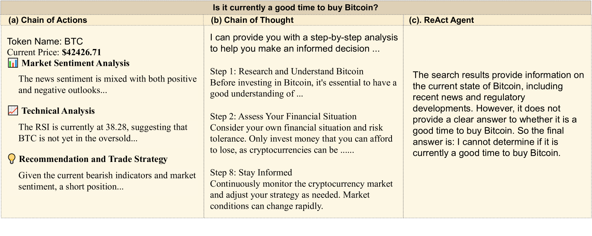
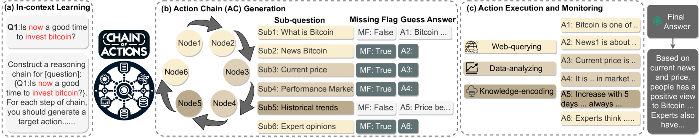
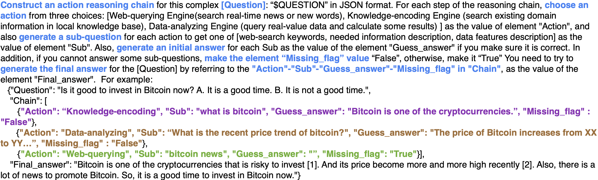
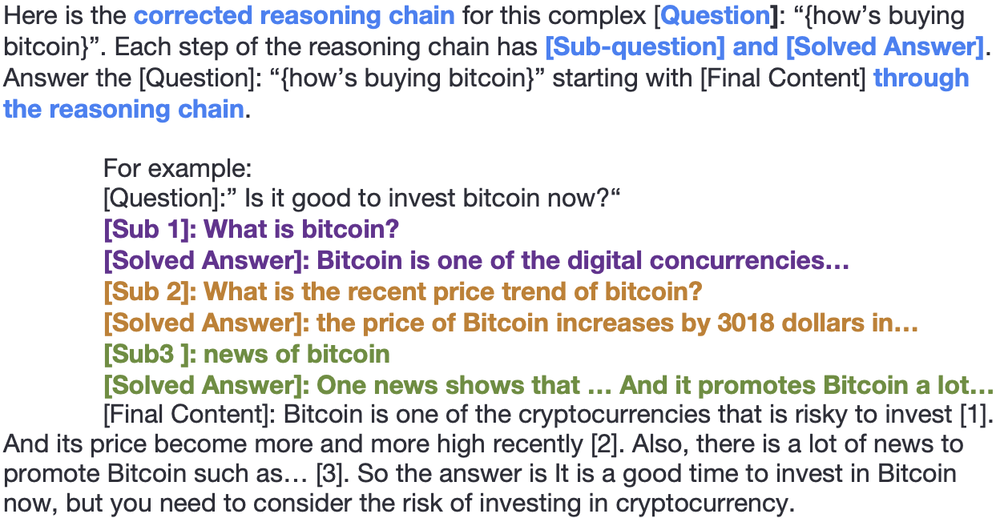
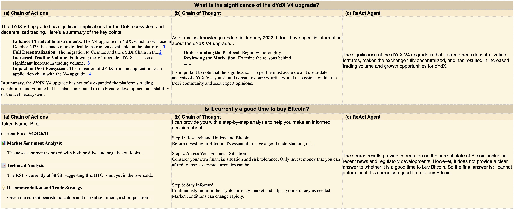
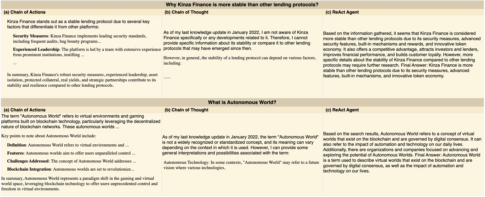

# Chain-of-Action：借助大型语言模型，实现准确且多模态的问题解答

发布时间：2024年03月25日

`RAG` `问答系统` `多模态` `检索增强`

> Chain-of-Action: Faithful and Multimodal Question Answering through Large Language Models

# 摘要

> 我们推出了一种行动链（CoA）框架，旨在提升多模态和检索增强型问答系统的性能。相较于现有研究，CoA成功解决了现有QA系统面临的两大难题：（i）避免与现实事实脱节的不真实幻想，以及（ii）增强对复杂信息的推理能力。我们的核心创新在于一种新颖的推理-检索机制，它能够通过系统化提示和定制行动，将复杂问题转化为一系列推理步骤。在方法上，我们设计了三种适应性强的“即插即用”行动，用以从多样化资源中实时获取信息。此外，我们还引入了多参考真实度评分（MRFS），用以检验并调和答案中的不一致。通过公共基准测试和Web3案例分析，我们实证证明了CoA框架相较于其他方法的优越性。

> We present a Chain-of-Action (CoA) framework for multimodal and retrieval-augmented Question-Answering (QA). Compared to the literature, CoA overcomes two major challenges of current QA applications: (i) unfaithful hallucination that is inconsistent with real-time or domain facts and (ii) weak reasoning performance over compositional information. Our key contribution is a novel reasoning-retrieval mechanism that decomposes a complex question into a reasoning chain via systematic prompting and pre-designed actions. Methodologically, we propose three types of domain-adaptable `Plug-and-Play' actions for retrieving real-time information from heterogeneous sources. We also propose a multi-reference faith score (MRFS) to verify and resolve conflicts in the answers. Empirically, we exploit both public benchmarks and a Web3 case study to demonstrate the capability of CoA over other methods.

[Arxiv](https://arxiv.org/abs/2403.17359)