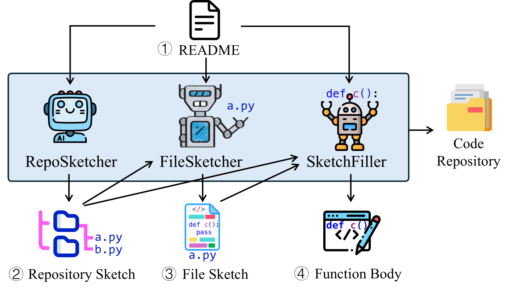
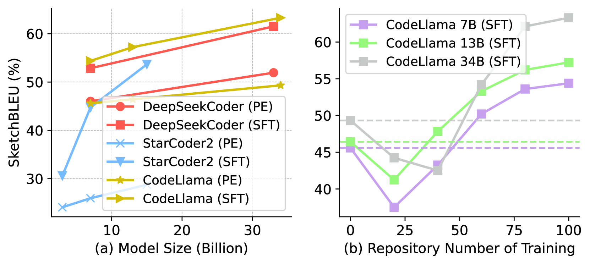
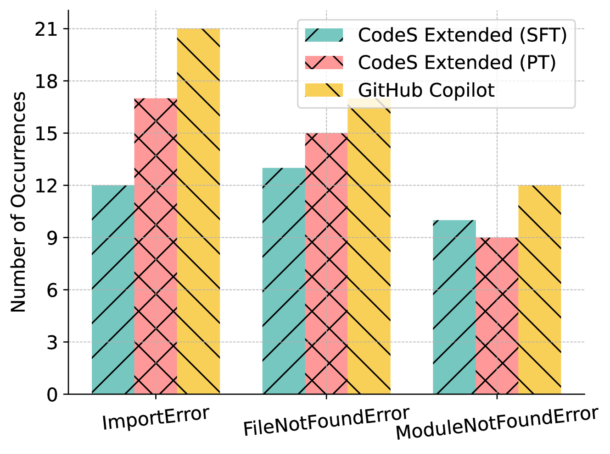
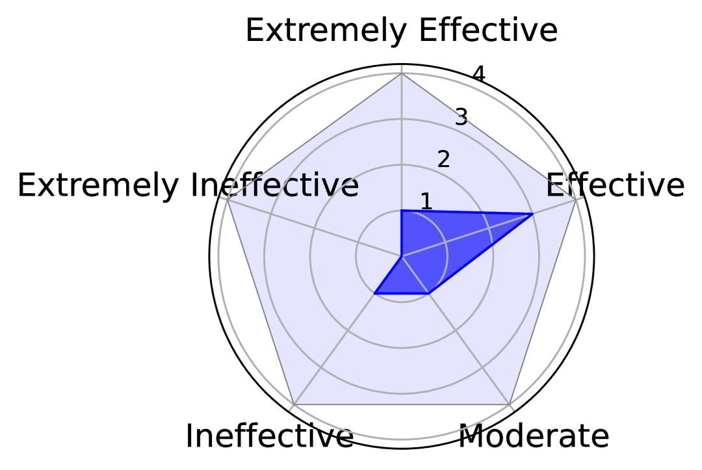

# CodeS 是一个创新方法，通过多层草图机制，实现从自然语言描述到代码仓库的精准转化。

发布时间：2024年03月25日

`LLM应用` `软件工程`

> CodeS: Natural Language to Code Repository via Multi-Layer Sketch

> 鉴于LLMs在处理代码任务时展现的卓越潜力，我们创新性地提出了一项名为“NL2Repo”的软件工程新挑战——根据自然语言需求自动生成完整的代码仓库。为此，我们提出了一个简明高效的框架CodeS，它采用多层草图法将这一难题拆解为若干个子任务。CodeS由RepoSketcher、FileSketcher和SketchFiller三个部分构成：RepoSketcher负责根据需求描绘出仓库的目录架构；FileSketcher则为架构中的每个文件绘制初步蓝图；SketchFiller则进一步细化每个函数的具体实现。为了全面验证CodeS在NL2Repo任务上的实力，我们采取自动化基准测试和人工反馈深度分析相结合的方式进行严谨评估。在基准测试阶段，我们精心构建了SketchEval这一面向仓库的基准集，并设计了一种评估指标SketchBLEU；而在反馈分析阶段，我们开发了一款CodeS VSCode插件，并邀请30位参与者进行实证研究。广泛深入的实验已有力证明CodeS在解决NL2Repo任务时的有效性和实用性。

> The impressive performance of large language models (LLMs) on code-related tasks has shown the potential of fully automated software development. In light of this, we introduce a new software engineering task, namely Natural Language to code Repository (NL2Repo). This task aims to generate an entire code repository from its natural language requirements. To address this task, we propose a simple yet effective framework CodeS, which decomposes NL2Repo into multiple sub-tasks by a multi-layer sketch. Specifically, CodeS includes three modules: RepoSketcher, FileSketcher, and SketchFiller. RepoSketcher first generates a repository's directory structure for given requirements; FileSketcher then generates a file sketch for each file in the generated structure; SketchFiller finally fills in the details for each function in the generated file sketch. To rigorously assess CodeS on the NL2Repo task, we carry out evaluations through both automated benchmarking and manual feedback analysis. For benchmark-based evaluation, we craft a repository-oriented benchmark, SketchEval, and design an evaluation metric, SketchBLEU. For feedback-based evaluation, we develop a VSCode plugin for CodeS and engage 30 participants in conducting empirical studies. Extensive experiments prove the effectiveness and practicality of CodeS on the NL2Repo task.

[Arxiv](https://arxiv.org/abs/2403.16443)