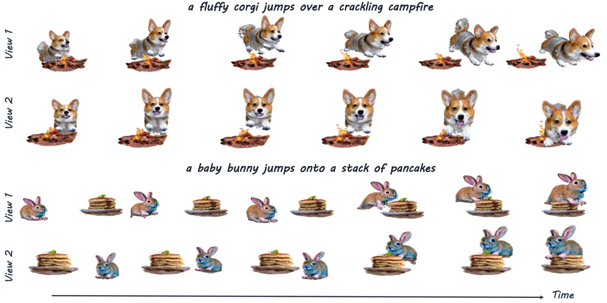
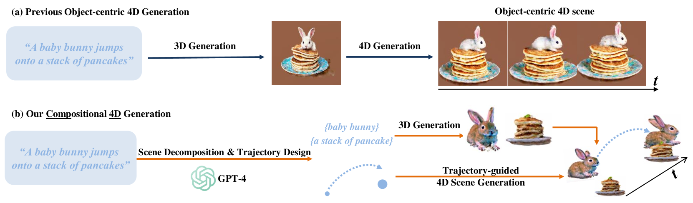
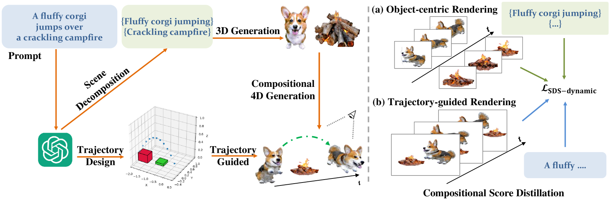
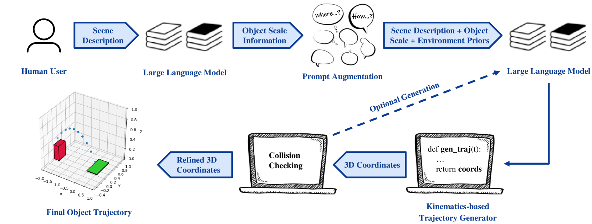
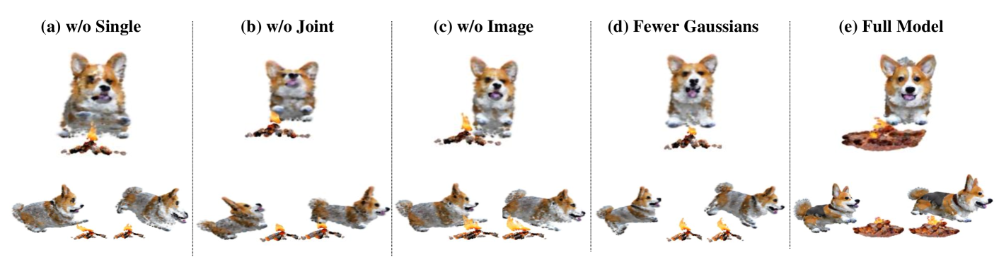

# Comp4D 是一项利用大型语言模型（LLM）指导的组合式 4D 场景生成技术，旨在通过 LLN 的智能引导，构建并生成具有时间维度的复杂场景内容。

发布时间：2024年03月25日

`LLM应用` `3D建模` `视频生成`

> Comp4D: LLM-Guided Compositional 4D Scene Generation

> 近期扩散模型在2D和3D内容创造上的突破引发了四维内容生成领域的热潮，但由于3D场景数据集稀少，目前的方法大多局限于对象为核心的生成方式。为解决此问题，我们推出了Comp4D——一个革新性的组合式四维生成框架。区别于传统的整体场景单一4D表达生成手段，Comp4D独具匠心地将场景内的每个4D对象单独构建。借助大型语言模型(LLMs)，该框架先将输入文本指令拆解为各个独立实体并规划其运动轨迹，接着精准地沿预定路径放置这些对象以构造出组合型4D场景。为进一步提升场景质量，我们运用基于预设轨迹引导的组合分数蒸馏技术，整合预先训练的跨文本至图像、文本至视频及文本至3D领域的扩散模型。广泛的实验证明，相较于先前技术，我们的方法在四维内容创作上表现出色，不仅视觉效果超群，动态逼真度高，还显著增强了对象间的互动性。

> Recent advancements in diffusion models for 2D and 3D content creation have sparked a surge of interest in generating 4D content. However, the scarcity of 3D scene datasets constrains current methodologies to primarily object-centric generation. To overcome this limitation, we present Comp4D, a novel framework for Compositional 4D Generation. Unlike conventional methods that generate a singular 4D representation of the entire scene, Comp4D innovatively constructs each 4D object within the scene separately. Utilizing Large Language Models (LLMs), the framework begins by decomposing an input text prompt into distinct entities and maps out their trajectories. It then constructs the compositional 4D scene by accurately positioning these objects along their designated paths. To refine the scene, our method employs a compositional score distillation technique guided by the pre-defined trajectories, utilizing pre-trained diffusion models across text-to-image, text-to-video, and text-to-3D domains. Extensive experiments demonstrate our outstanding 4D content creation capability compared to prior arts, showcasing superior visual quality, motion fidelity, and enhanced object interactions.

[Arxiv](https://arxiv.org/abs/2403.16993)