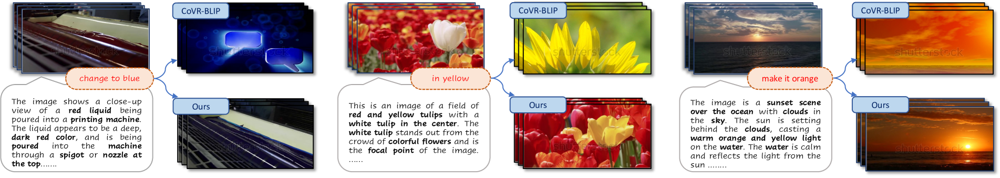
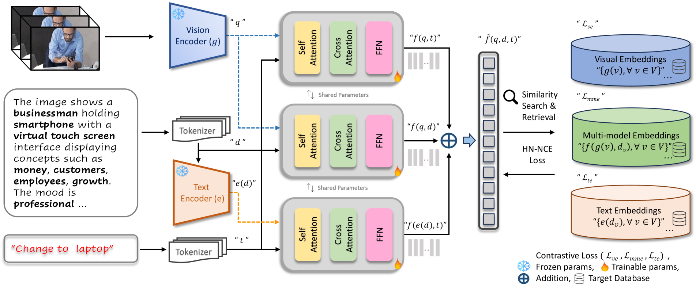
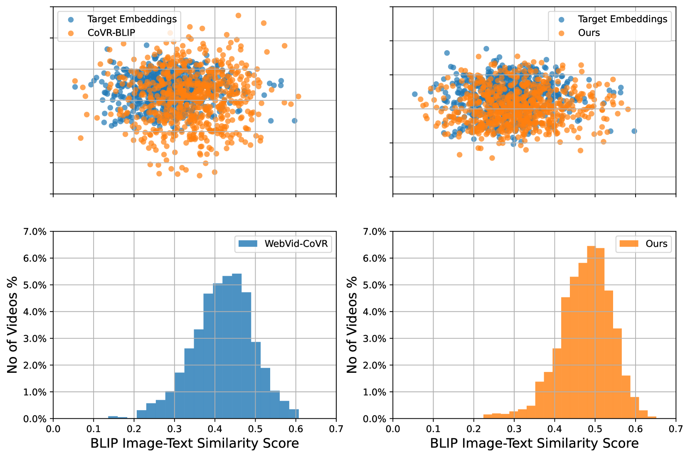
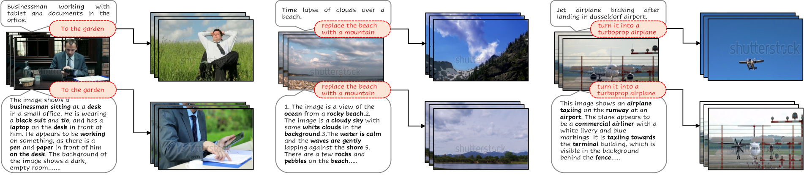
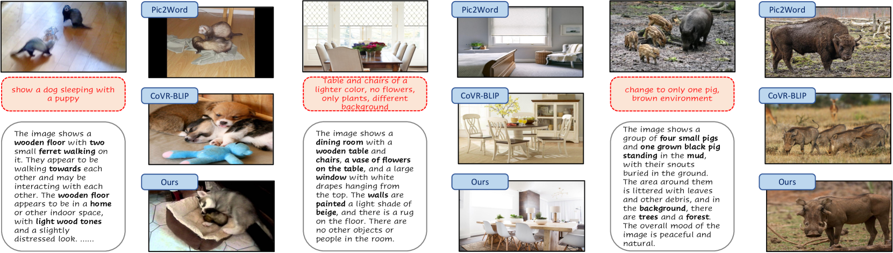

# 通过增强上下文信息与区分性嵌入技术，本研究提出了一种新型的视频片段检索方法。

发布时间：2024年03月25日

`Agent` `视频检索` `计算机视觉`

> Composed Video Retrieval via Enriched Context and Discriminative Embeddings

> 面对组合视频检索这一计算机视觉领域的挑战性问题，最新研究关注如何通过整合修改文本与视觉查询，在大型数据库中实现更为精准复杂的视频搜索。现有方法多依赖结合文本修改的视觉查询去筛选相关视频，但在捕获到的目标视频中完整保留丰富且具有针对性的查询语境信息上存在不足，仅仅依赖视觉嵌入来表征目标视频。为此，我们创新性地设计了一个CoVR框架，巧妙运用详尽的语言描述精确编码特定查询的上下文信息，并分别针对视觉、文本以及视觉-文本学习出有区分性的嵌入，从而更准确地对齐并检索到匹配的目标视频。此框架不仅适用于组合视频检索（CoVR），也适用于组合图像检索（CoIR）。实验证明，在三个数据集上，我们的方法在CoVR和零样本CoIR任务中均取得了最新的最优性能，其中在召回率recall@K=1这一指标上最高可提升约7%。我们的代码、模型及WebViD-CoVR数据集的详细语言描述已开放在GitHub仓库：\url{https://github.com/OmkarThawakar/composed-video-retrieval}。

> Composed video retrieval (CoVR) is a challenging problem in computer vision which has recently highlighted the integration of modification text with visual queries for more sophisticated video search in large databases. Existing works predominantly rely on visual queries combined with modification text to distinguish relevant videos. However, such a strategy struggles to fully preserve the rich query-specific context in retrieved target videos and only represents the target video using visual embedding. We introduce a novel CoVR framework that leverages detailed language descriptions to explicitly encode query-specific contextual information and learns discriminative embeddings of vision only, text only and vision-text for better alignment to accurately retrieve matched target videos. Our proposed framework can be flexibly employed for both composed video (CoVR) and image (CoIR) retrieval tasks. Experiments on three datasets show that our approach obtains state-of-the-art performance for both CovR and zero-shot CoIR tasks, achieving gains as high as around 7% in terms of recall@K=1 score. Our code, models, detailed language descriptions for WebViD-CoVR dataset are available at \url{https://github.com/OmkarThawakar/composed-video-retrieval}

[Arxiv](https://arxiv.org/abs/2403.16997)