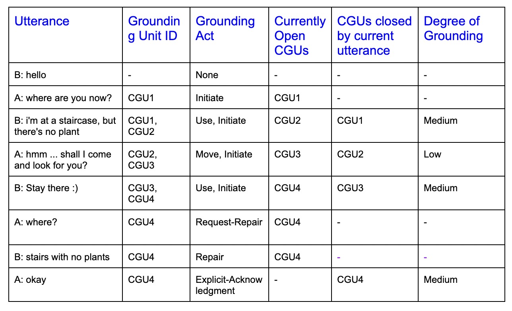

# 对话锚定研究：深入标注与分析锚定行为及锚定单元

发布时间：2024年03月25日

`Agent` `对话系统`

> Conversational Grounding: Annotation and Analysis of Grounding Acts and Grounding Units

> 成功的对话通常依赖于共享信息的共识，这一称为对话基底构建的过程是构建可信赖、能精确追踪与回忆信息的对话系统的基石。代理在锚定信息传达方面的技能对于打造可靠对话系统至关重要。尽管对话系统技术发展迅速，但其在基底构建能力方面仍有明显短板。Traum 曾提出一种包含“基底行为”和“基底单元”的对话基底构建框架，但尤其在大规模语言模型领域，实质性突破依然欠缺。为此，我们对两个对话语料库进行了标注，涉及基底行为、基底单元及其基底程度的量化指标。在标注过程中，我们分享了核心发现，并提供了一个基准模型，用以检验当前语言模型对对话中基底行为分类的能力。我们的研究致力于为改善日常协作对话中机器对话的理解度和可靠性提供有价值的参考资源，助力该领域的深入研究。

> Successful conversations often rest on common understanding, where all parties are on the same page about the information being shared. This process, known as conversational grounding, is crucial for building trustworthy dialog systems that can accurately keep track of and recall the shared information. The proficiencies of an agent in grounding the conveyed information significantly contribute to building a reliable dialog system. Despite recent advancements in dialog systems, there exists a noticeable deficit in their grounding capabilities. Traum provided a framework for conversational grounding introducing Grounding Acts and Grounding Units, but substantial progress, especially in the realm of Large Language Models, remains lacking. To bridge this gap, we present the annotation of two dialog corpora employing Grounding Acts, Grounding Units, and a measure of their degree of grounding. We discuss our key findings during the annotation and also provide a baseline model to test the performance of current Language Models in categorizing the grounding acts of the dialogs. Our work aims to provide a useful resource for further research in making conversations with machines better understood and more reliable in natural day-to-day collaborative dialogs.

[Arxiv](https://arxiv.org/abs/2403.16609)