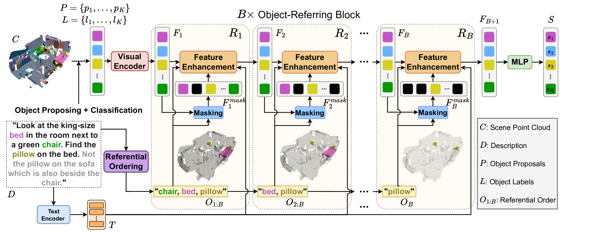
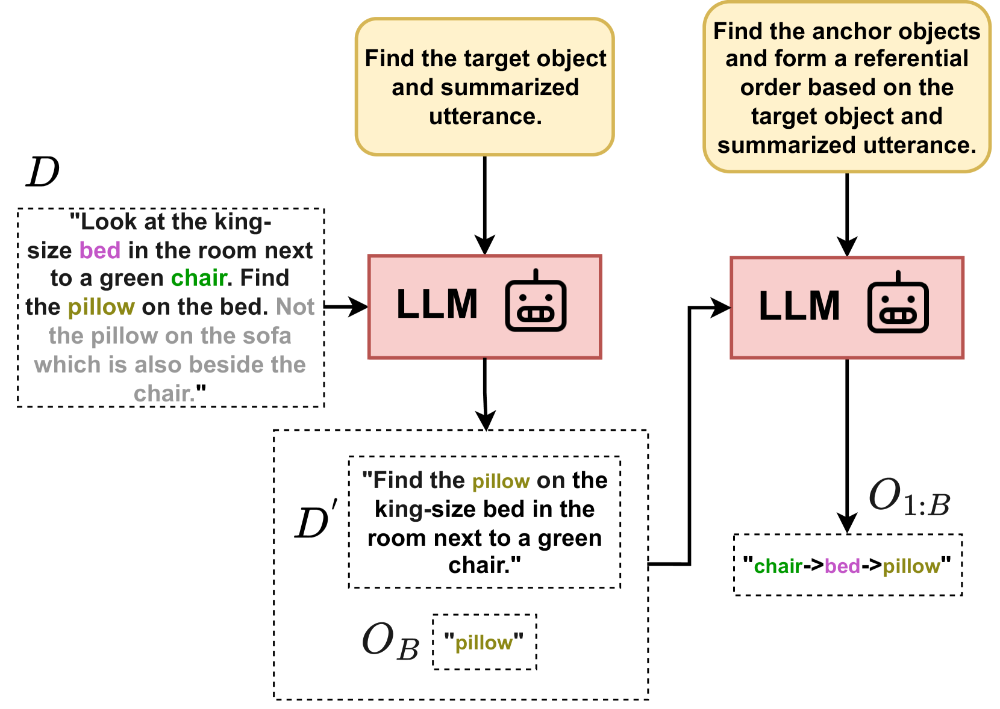
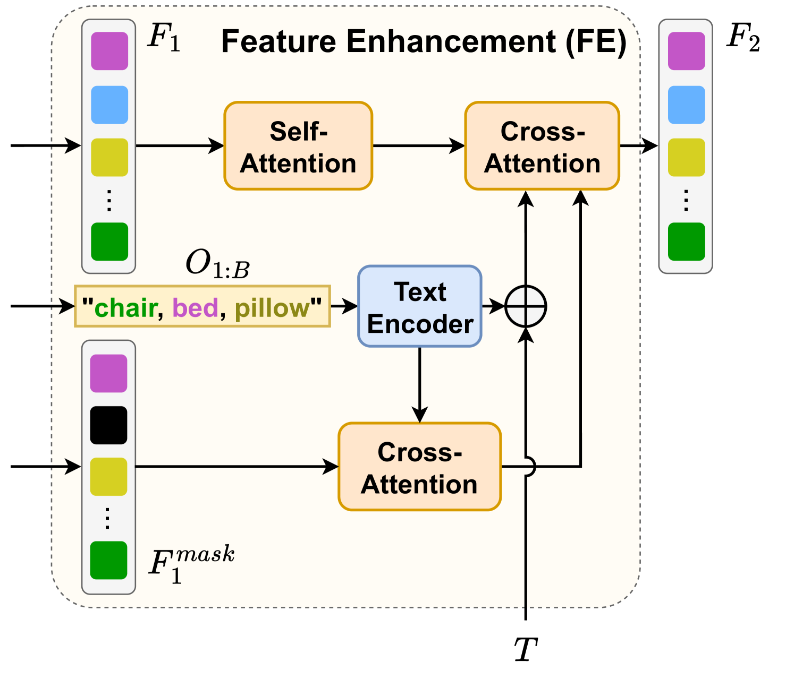
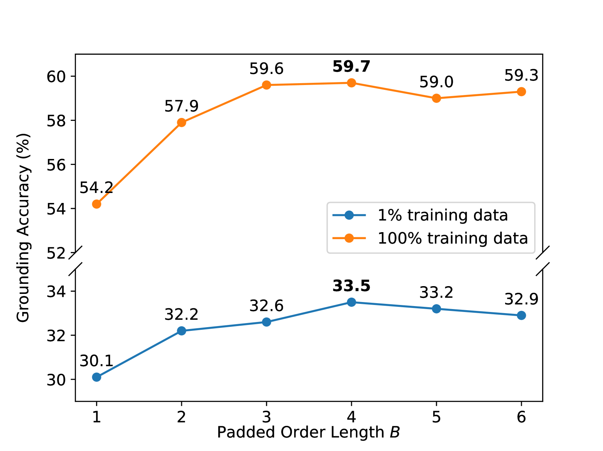
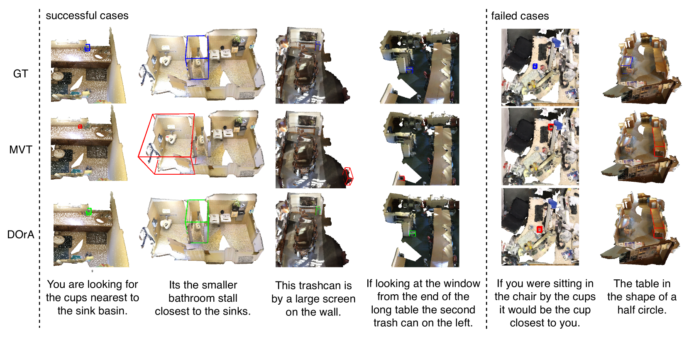
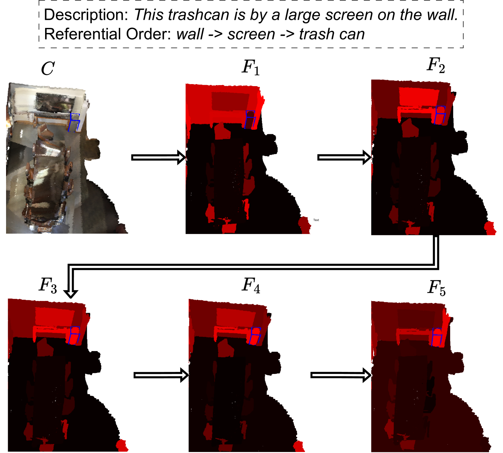

# DOrA 是一种创新的三维视觉定位方法，它特别强调并利用了顺序感知引用机制，实现了对三维空间中目标对象的精准定位。

发布时间：2024年03月25日

`Agent` `三维视觉`

> DOrA: 3D Visual Grounding with Order-Aware Referring

# 摘要

> 三维视觉定位技术旨在根据自然语言描述，在三维点云场景中锁定目标对象。然而，面对非结构化的人类语言描述及散乱的物体时，传统采用跨模态变压器挖掘语义-视觉关联的方法可能效果欠佳。为此，本文提出了DOrA——一种创新的具备顺序感知引用功能的三维视觉定位框架。DOrA巧妙运用大型语言模型解析文本信息，为锚定对象设定合理的引用顺序。这一有序的锚定对象序列助力DOrA在定位过程中精准调整视觉特征，从而实现对目标物体的有效定位。实验证明，在NR3D和ScanRefer数据集上，DOrA无论在少量数据还是全量数据场景下均展现出显著优势，特别是在仅使用1%或10%数据的情况下，其定位精度分别比现有最先进框架提升了9.3%和7.8%。

> 3D visual grounding aims to identify the target object within a 3D point cloud scene referred to by a natural language description. While previous works attempt to exploit the verbo-visual relation with proposed cross-modal transformers, unstructured natural utterances and scattered objects might lead to undesirable performances. In this paper, we introduce DOrA, a novel 3D visual grounding framework with Order-Aware referring. DOrA is designed to leverage Large Language Models (LLMs) to parse language description, suggesting a referential order of anchor objects. Such ordered anchor objects allow DOrA to update visual features and locate the target object during the grounding process. Experimental results on the NR3D and ScanRefer datasets demonstrate our superiority in both low-resource and full-data scenarios. In particular, DOrA surpasses current state-of-the-art frameworks by 9.3% and 7.8% grounding accuracy under 1% data and 10% data settings, respectively.

[Arxiv](https://arxiv.org/abs/2403.16539)