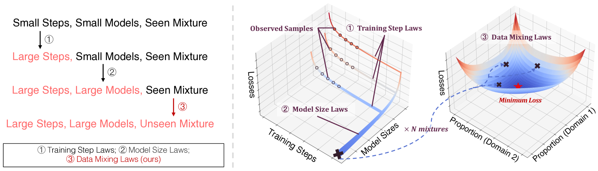
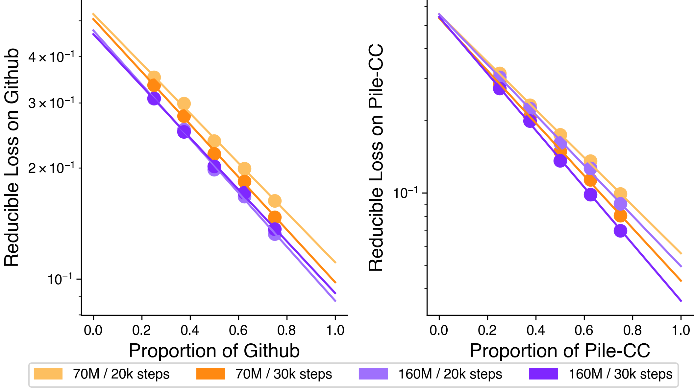
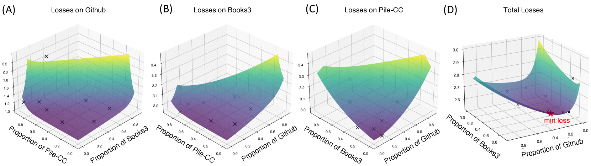
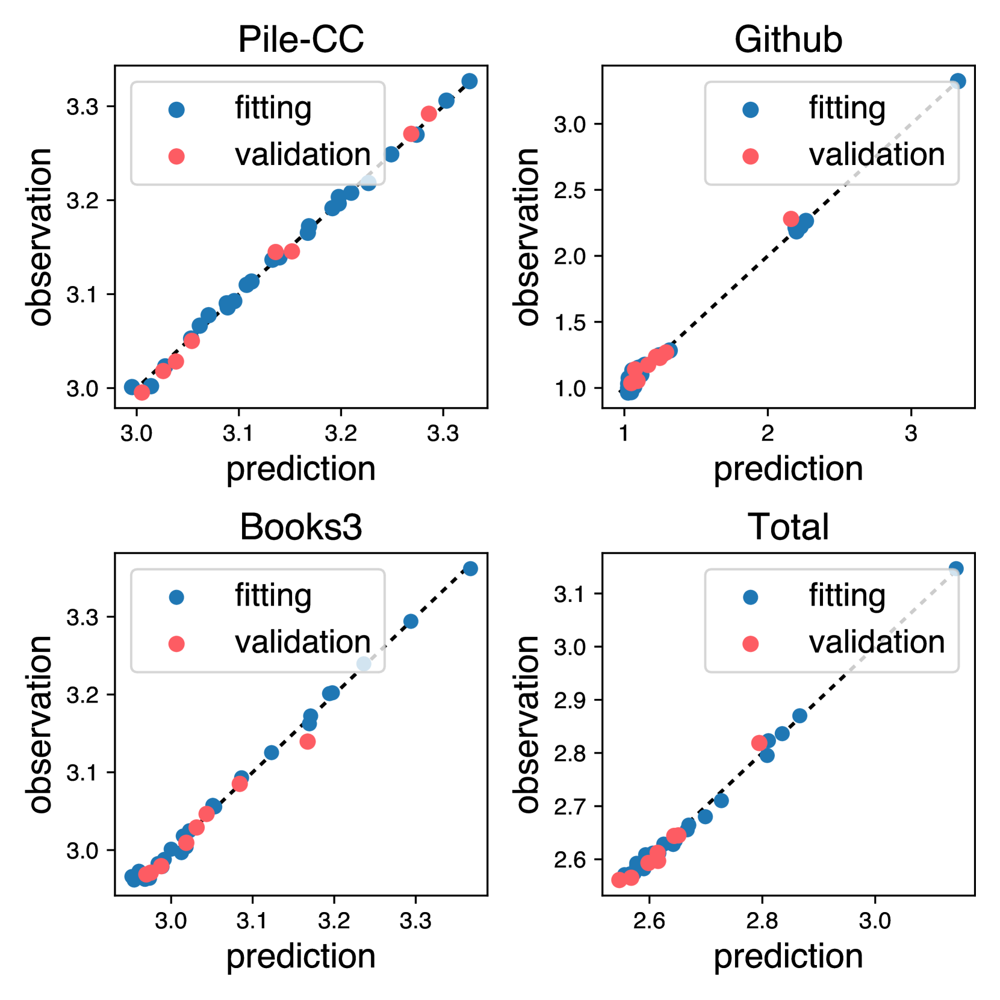
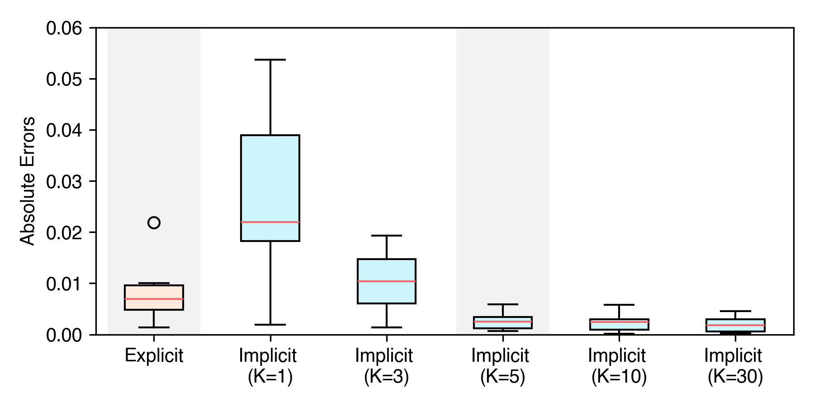
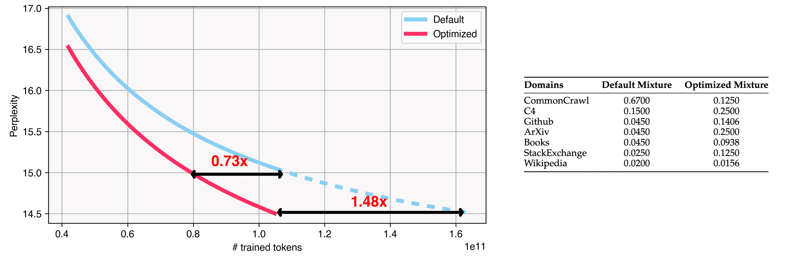
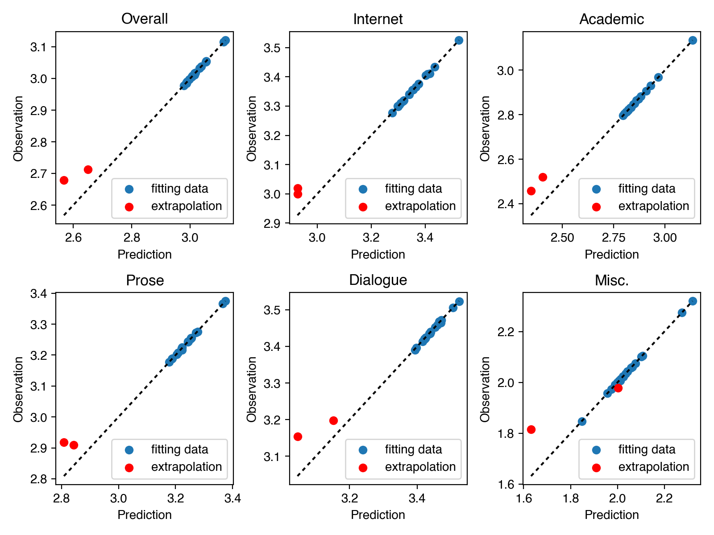
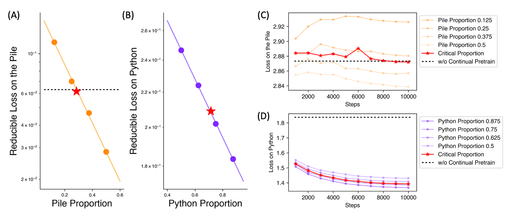
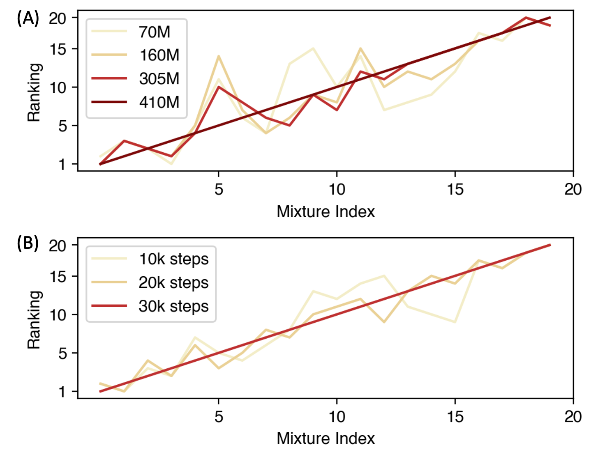
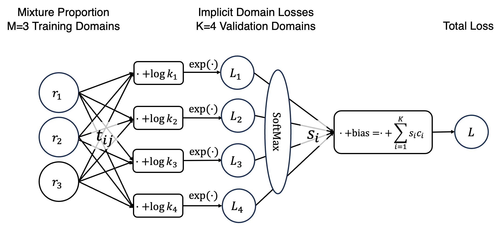

# 数据混合定律：探究通过预测语言模型性能来优化数据混合的方法进一步优化后的翻译结果2（更简洁优雅通顺）：“数据混合法则：通过预估语言模型表现优化数据组合”

发布时间：2024年03月25日

`LLM理论` `模型训练`

> Data Mixing Laws: Optimizing Data Mixtures by Predicting Language Modeling Performance

> 大规模语言模型预训练数据涵盖了多种来源，如网络文本、学术文献及代码等，其中各领域的混合比例对最终模型能力具有决定性影响。现有研究大多依赖经验和定性策略调整这些比例，而我们发现了模型性能与混合比例间存在着定量预测关系，我们称之为“数据混合定律”。通过对样本混合数据拟合此定律，可在真实训练前预测模型在新混合数据上的表现，从而指导筛选最佳数据混合方案。我们还创新性地结合了训练步数、模型大小的扩展定律与数据混合定律，使得只需进行小规模训练就能预测大模型在多种混合数据下的海量训练表现。实验结果显示，这种方法成功优化了RedPajama中训练1000亿令牌的10亿参数模型的数据混合比例，使其性能达到在默认混合比例下额外训练48%步数的水平。数据混合定律进一步应用于连续训练场景，能精准预测防止灾难性遗忘的关键混合比例，并预见动态数据调度的可能性。

> Pretraining data of large language models composes multiple domains (e.g., web texts, academic papers, codes), whose mixture proportions crucially impact the competence of outcome models. While existing endeavors rely on heuristics or qualitative strategies to tune the proportions, we discover the quantitative predictability of model performance regarding the mixture proportions in function forms, which we refer to as the data mixing laws. Fitting such functions on sample mixtures unveils model performance on unseen mixtures before actual runs, thus guiding the selection of an ideal data mixture. Furthermore, we propose nested use of the scaling laws of training steps, model sizes, and our data mixing law to enable predicting the performance of large models trained on massive data under various mixtures with only small-scale training. Moreover, experimental results verify that our method effectively optimizes the training mixture of a 1B model trained for 100B tokens in RedPajama, reaching a performance comparable to the one trained for 48% more steps on the default mixture. Extending the application of data mixing laws to continual training accurately predicts the critical mixture proportion that avoids catastrophic forgetting and outlooks the potential for dynamic data schedules

[Arxiv](https://arxiv.org/abs/2403.16952)