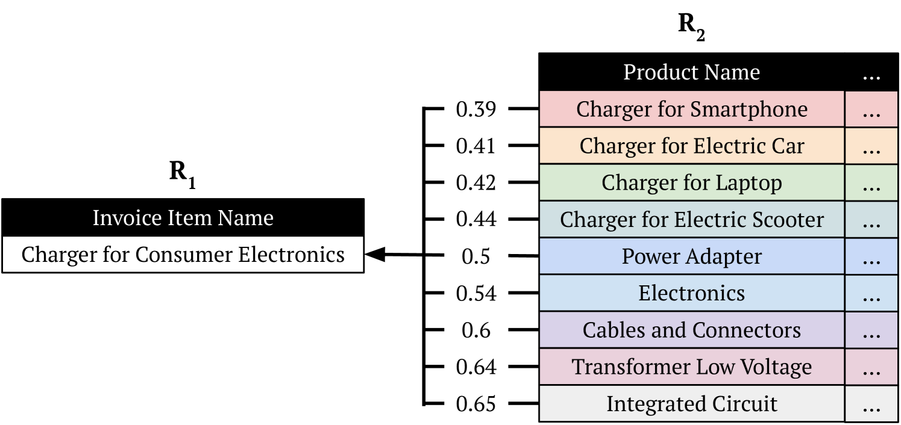
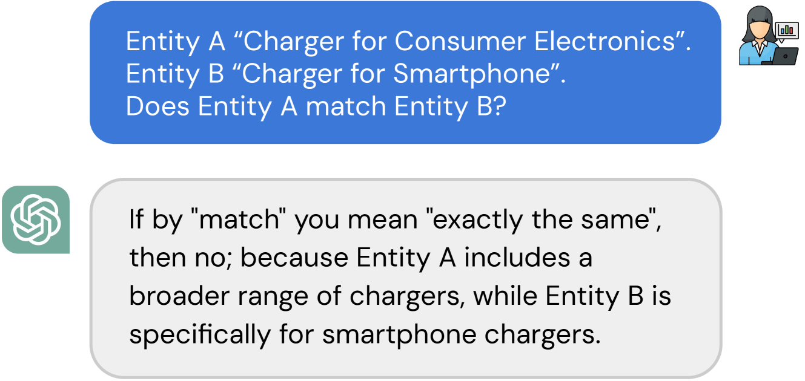
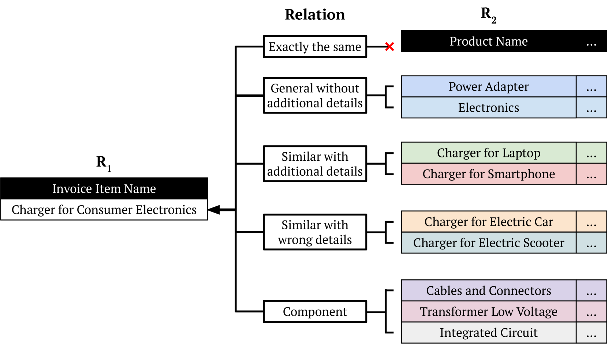
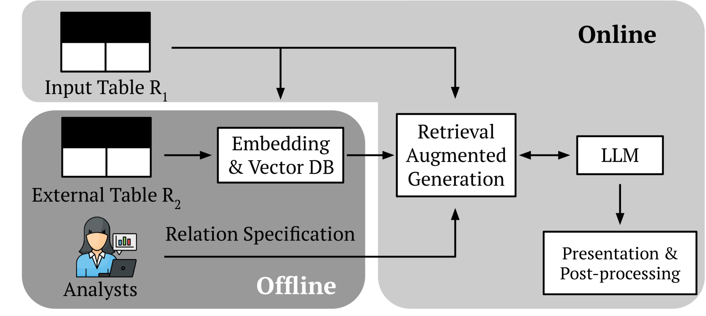

# 利用大型语言模型发掘关系，实现实体匹配的精确区分

发布时间：2024年03月25日

`RAG` `数据整合` `实体匹配`

> Disambiguate Entity Matching through Relation Discovery with Large Language Models

# 摘要

> 在数据整合和清洗领域，准确实现实体匹配至关重要，它对于执行模糊连接和去重等任务起着核心作用。传统方法试图通过编辑距离、Jaccard相似度等技术，以及嵌入技术和深度神经网络，比如GPT这样的大型语言模型的进步，来解决术语模糊的问题。但实体匹配的真正难题不仅在于术语的不确定性，更在于如何界定“匹配”的标准，特别是在整合外部数据库时。由于实体的细节程度和粒度不同，这种歧义使得精确匹配变得更加困难。我们提出了一种创新的方法，不再单纯追求实体间的语义相似性，而是转而关注理解和明确实体间“关系”的定义，这对于解决匹配过程中的歧义至关重要。通过预设与当前任务相关的关系集，我们的方法使得分析师能够更加高效地处理从精确匹配到概念关联实体的各种相似性问题。

> Entity matching is a critical challenge in data integration and cleaning, central to tasks like fuzzy joins and deduplication. Traditional approaches have focused on overcoming fuzzy term representations through methods such as edit distance, Jaccard similarity, and more recently, embeddings and deep neural networks, including advancements from large language models (LLMs) like GPT. However, the core challenge in entity matching extends beyond term fuzziness to the ambiguity in defining what constitutes a "match," especially when integrating with external databases. This ambiguity arises due to varying levels of detail and granularity among entities, complicating exact matches. We propose a novel approach that shifts focus from purely identifying semantic similarities to understanding and defining the "relations" between entities as crucial for resolving ambiguities in matching. By predefining a set of relations relevant to the task at hand, our method allows analysts to navigate the spectrum of similarity more effectively, from exact matches to conceptually related entities.

[Arxiv](https://arxiv.org/abs/2403.17344)