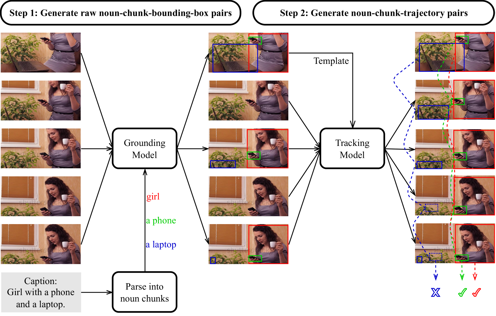
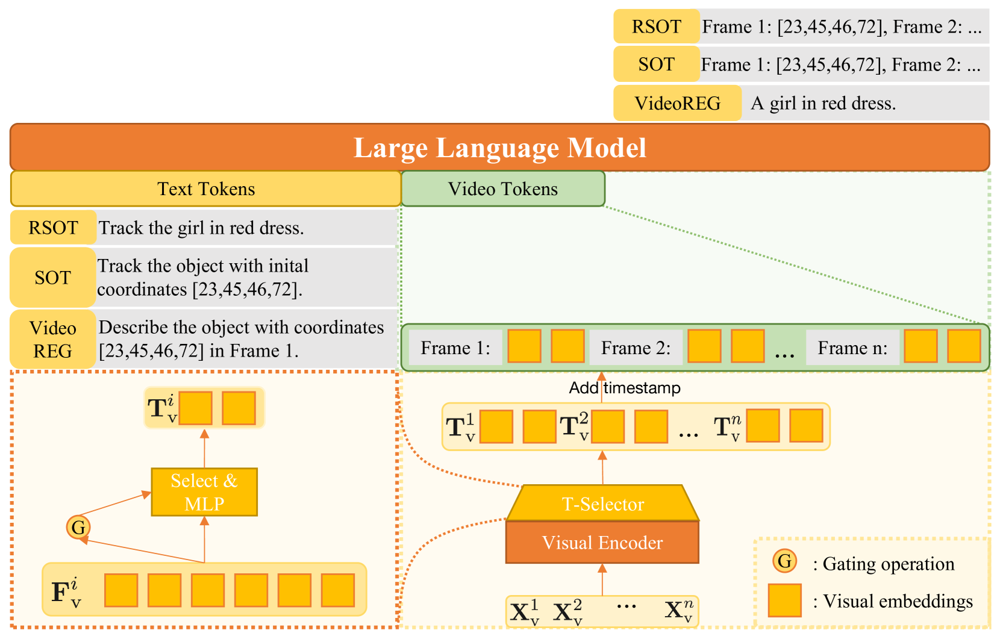

# Elysium项目致力于借助多模态预训练语言模型，在视频内容中深入探究对象级别的感知能力。

发布时间：2024年03月25日

`LLM应用` `视频分析` `物体检测与跟踪`

> Elysium: Exploring Object-level Perception in Videos via MLLM

> MLLM 在识别静态图像中的物体表现出色，但其在视频对象跟踪等领域的应用尚待深入挖掘。这主要是因为两大难题：首先，要让 MLLM 能够跨帧识物并理解帧间联系，就需要在大规模视频数据集上进行大量预训练；其次，LLM 上下文窗口内处理大量视频帧会带来巨大的计算压力。为破解第一道难关，我们推出了包含127万张带有标注物体框与描述信息的视频帧数据集——ElysiumTrack-1M，并设计了创新任务 RSOT 和 Video-REG。借此数据集，我们不仅对 MLLM 进行了针对性训练，还提出了用于解决第二难题的令牌压缩模型 T-Selector。最终，我们提出的名为“Elysium”的端到端可训练 MLLM 系统，成为首个无需借助额外插件或专业模型就能在视频中执行对象级别任务的研究成果。

> Multi-modal Large Language Models (MLLMs) have demonstrated their ability to perceive objects in still images, but their application in video-related tasks, such as object tracking, remains understudied. This lack of exploration is primarily due to two key challenges. Firstly, extensive pretraining on large-scale video datasets is required to equip MLLMs with the capability to perceive objects across multiple frames and understand inter-frame relationships. Secondly, processing a large number of frames within the context window of Large Language Models (LLMs) can impose a significant computational burden. To address the first challenge, we introduce ElysiumTrack-1M, a large-scale video dataset paired with novel tasks: Referring Single Object Tracking (RSOT) and Video Referring Expression Generation (Video-REG). ElysiumTrack-1M contains 1.27 million annotated video frames with corresponding object boxes and descriptions. Leveraging this dataset, we conduct training of MLLMs and propose a token-compression model T-Selector to tackle the second challenge. Our proposed approach, Elysium: Exploring Object-level Perception in Videos via MLLM, is an end-to-end trainable MLLM that makes the first attempt to conduct object-level tasks in videos without requiring any additional plug-in or expert models.

[Arxiv](https://arxiv.org/abs/2403.16558)