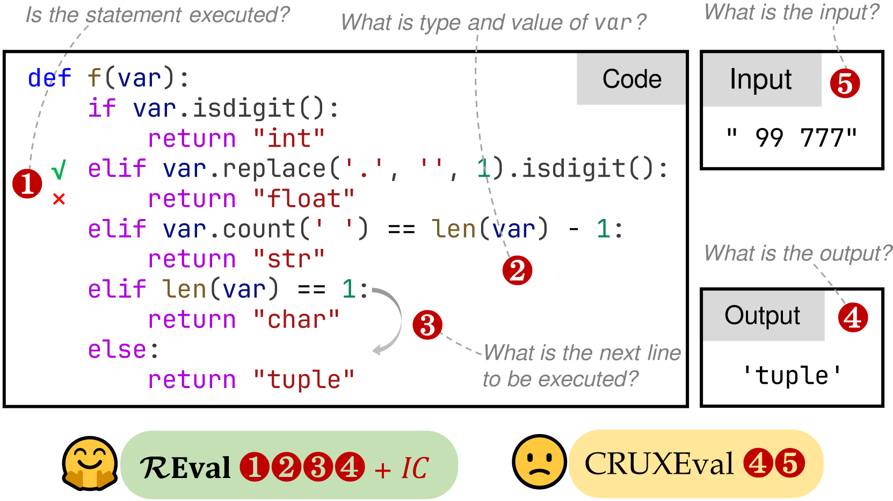
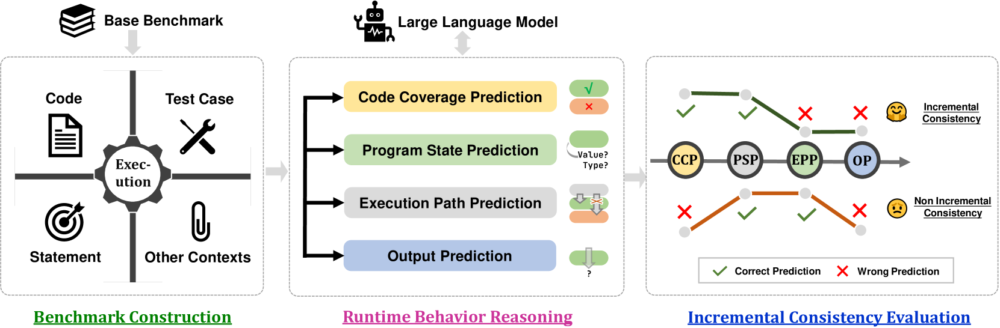
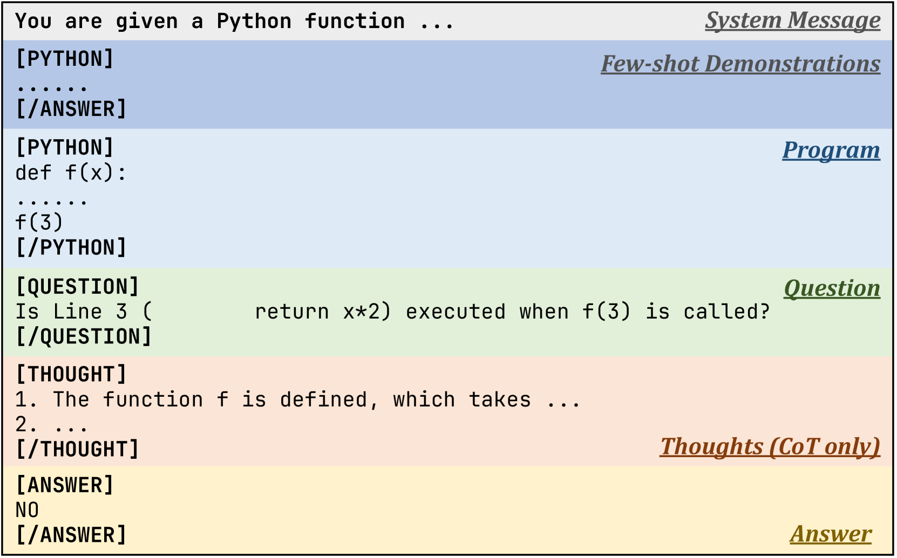
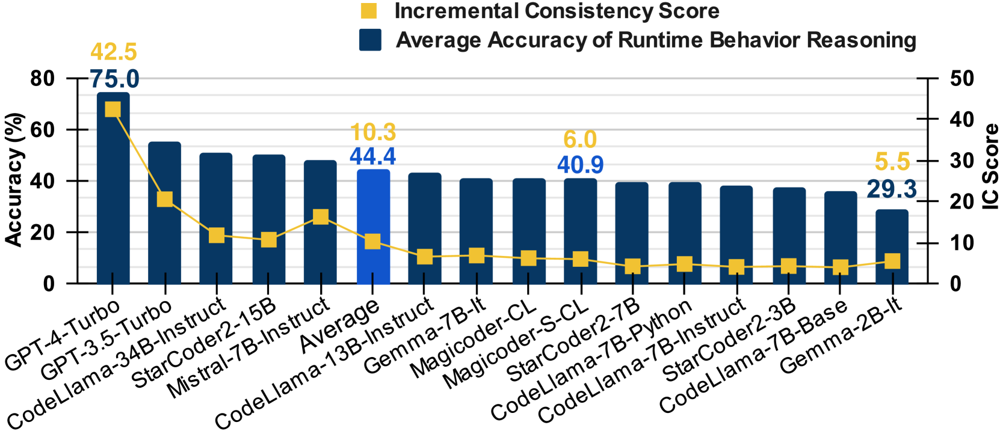
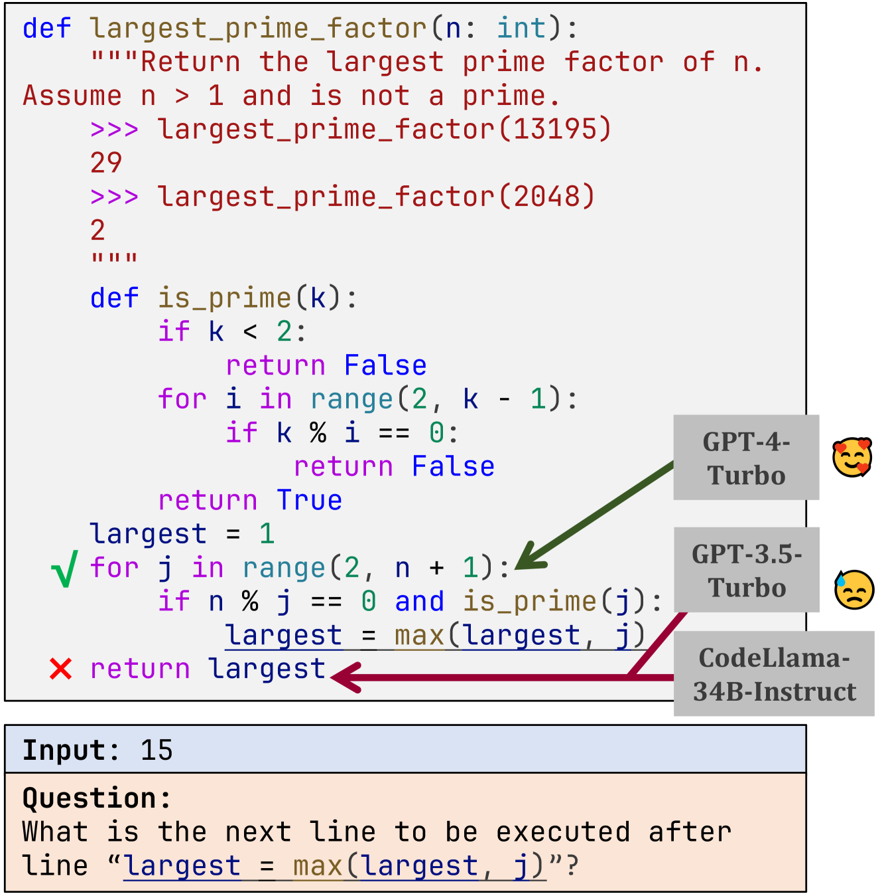

# 在本研究中，我们提出通过程序执行过程中的实际运行时行为来评估大型语言模型的表现，从而揭示模型在真实应用环境下的性能与适应性。

发布时间：2024年03月25日

`LLM应用` `人工智能`

> Evaluating Large Language Models with Runtime Behavior of Program Execution

> 现今的代码LLMs展现了卓越的代码理解和生成实力，因此人们设计了诸如HumanEval和ClassEval等多维度评估体系以全面检验其能力。然而，针对代码推理这一关键能力，现存基准尚不足以深入探究。通常，这些基准仅关注程序的输入输出预测，却忽视了程序执行过程中的中间行为分析以及逻辑一致性验证（比如，当推理出的执行路径有误时，模型应无法得出正确答案）。鉴于此，本文提出了一个名为REval的框架，该框架通过结合程序执行过程来评估和衡量代码LLMs在推理能力和一致性上的表现。我们借助既有基准并创新性地将其融入REval框架，构建了全新的评测标准。经大规模实证研究表明，当前多数代码LLMs在Runtime Behavior Reasoning（平均准确率仅44.4%）与Incremental Consistency Evaluation（平均IC得分仅为10.3）这两项测试中表现欠佳。这揭示了当前社区亟需强化代码LLMs在代码推理能力上的提升。

> Large language models for code (i.e., code LLMs) have shown strong code understanding and generation capabilities. To evaluate the capabilities of code LLMs in various aspects, many benchmarks have been proposed (e.g., HumanEval and ClassEval). Code reasoning is one of the most essential abilities of code LLMs, but existing benchmarks for code reasoning are not sufficient. Typically, they focus on predicting the input and output of a program, ignoring the evaluation of the intermediate behavior during program execution, as well as the logical consistency (e.g., the model should not give the correct output if the prediction of execution path is wrong) when performing the reasoning. To address these problems, in this paper, we propose a framework, namely REval, for evaluating code reasoning abilities and consistency of code LLMs with program execution. We utilize existing code benchmarks and adapt them to new benchmarks within our framework. A large-scale empirical study is conducted and most LLMs show unsatisfactory performance on both Runtime Behavior Reasoning (i.e., an average accuracy of 44.4%) and Incremental Consistency Evaluation (i.e., an average IC score of 10.3). Evaluation results of current code LLMs reflect the urgent need for the community to strengthen the code reasoning capability of code LLMs.

[Arxiv](https://arxiv.org/abs/2403.16437)