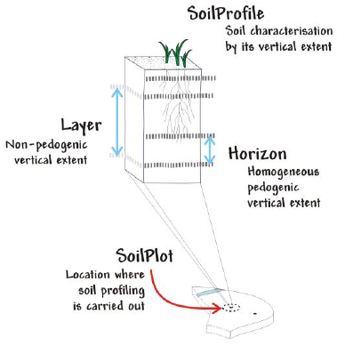
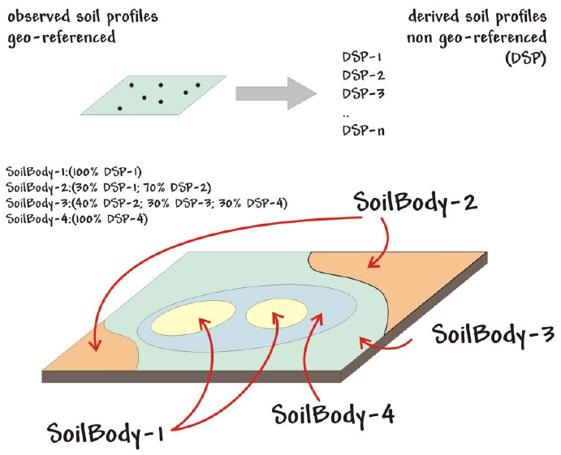
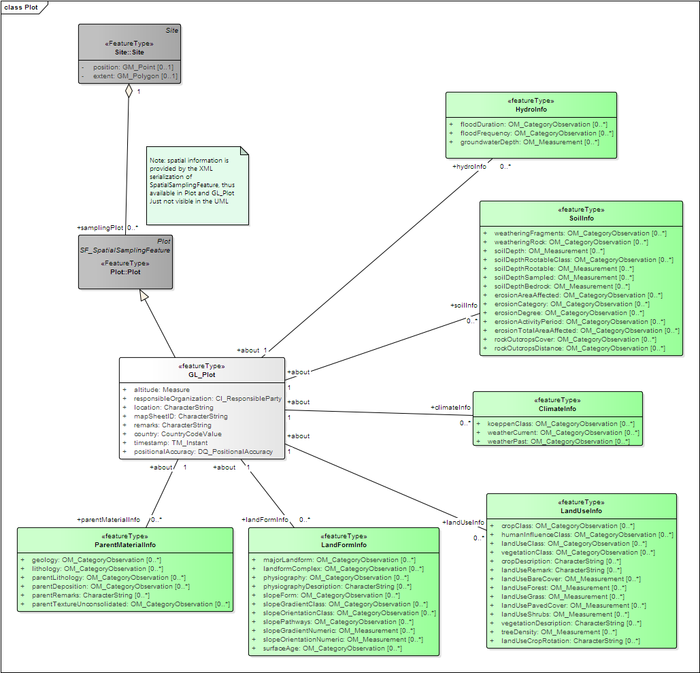
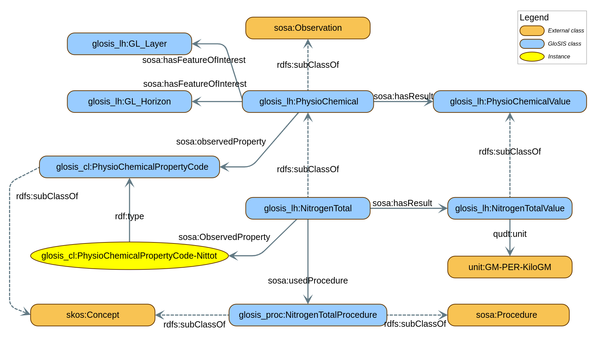
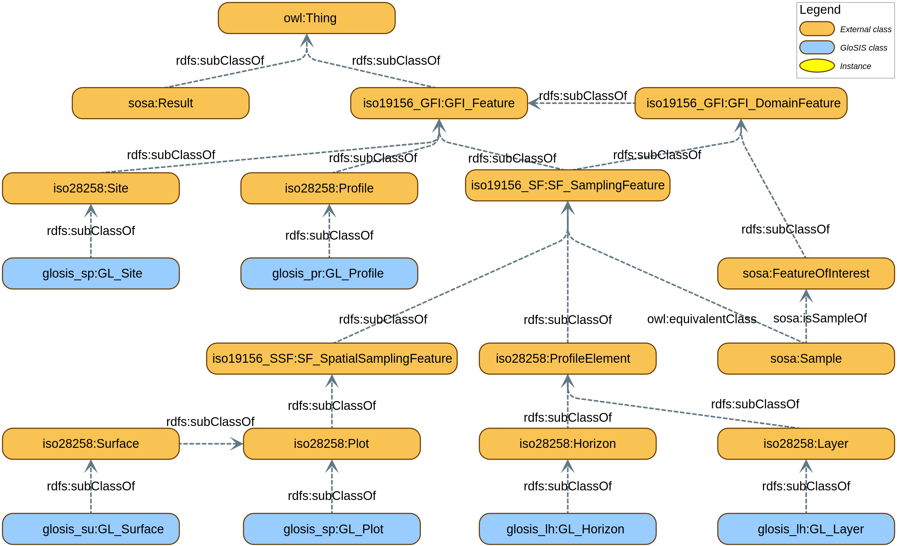

# GloSIS——全球土壤信息系统的网络本体构建，旨在创建一个统一、结构化的土壤知识体系，通过网络本体的方式组织与关联全球范围内的土壤信息资源。

发布时间：2024年03月25日

`无法确定

根据给出的论文摘要内容，这篇论文主要讨论的是联合国粮农组织全球土壤伙伴关系(GSP)如何创建全球土壤信息系统(GloSIS)，并利用语义网技术和本体论来标准化和共享土壤数据，以支持全球土壤管理和可持续发展。这篇论文并未直接涉及Agent、RAG、LLM应用或LLM理论的相关内容，因此无法将其准确归类到上述四个分类中的任何一个。如果需要更细致地分类，这篇论文可能更适合归为“知识图谱构建”、“本体论应用”或者“农业信息科学”等领域。` `土壤科学` `数据交换与管理`

> GloSIS: The Global Soil Information System Web Ontology

# 摘要

> 2012年，联合国粮农组织成员创立了全球土壤伙伴关系(GSP)，旨在推动全球范围内的良好土地和土壤管理实践，助力打造可持续的世界粮食系统。尽管如此，土壤调查工作依然大多停留在地方或区域层面，且受限于多种多样且不统一的方法和规则。鉴于全球及跨国政策对可持续土地管理的重要性，GSP决定将数据协调与交换作为其核心工作方向之一。在此基础上，GSP借鉴国际标准和已有全球土壤数据本体论研究成果，成功构建出一个优化的GloSIS领域模型，为全球土壤信息系统（GloSIS）打下基石。同时，研究团队发现语义网技术可以有效实现这一领域模型的应用。本文介绍的GloSIS网络本体即是利用Web本体语言（OWL）实现的GloSIS领域模型的具体应用形式。通过深入整合一系列语义网标准（如SOSA、SKOS、GeoSPARQL、QUDT），GloSIS不仅构建了一套完整的土壤数据本体论，而且还提供了一系列实用的土壤描述和物理化学分析代码列表。文章通过多个实例详细展示了如何提供和使用遵循GloSIS规范的关联数据，彰显了该本体在促进土壤数据的发现、探索、整合和获取等方面的重要作用。

> Established in 2012 by members of the Food and Agriculture Organisation (FAO), the Global Soil Partnership (GSP) is a global network of stakeholders promoting sound land and soil management practices towards a sustainable world food system. However, soil survey largely remains a local or regional activity, bound to heterogeneous methods and conventions. Recognising the relevance of global and trans-national policies towards sustainable land management practices, the GSP elected data harmonisation and exchange as one of its key lines of action. Building upon international standards and previous work towards a global soil data ontology, an improved domain model was eventually developed within the GSP [54], the basis for a Global Soil Information System (GloSIS). This work also identified the Semantic Web as a possible avenue to operationalise the domain model. This article presents the GloSIS web ontology, an implementation of the GloSIS domain model with the Web Ontology Language (OWL). Thoroughly employing a host of Semantic Web standards (SOSA, SKOS, GeoSPARQL, QUDT), GloSIS lays out not only a soil data ontology but also an extensive set of ready-to-use code-lists for soil description and physio-chemical analysis. Various examples are provided on the provision and use of GloSIS-compliant linked data, showcasing the contribution of this ontology to the discovery, exploration, integration and access of soil data.

[Arxiv](https://arxiv.org/abs/2403.16778)