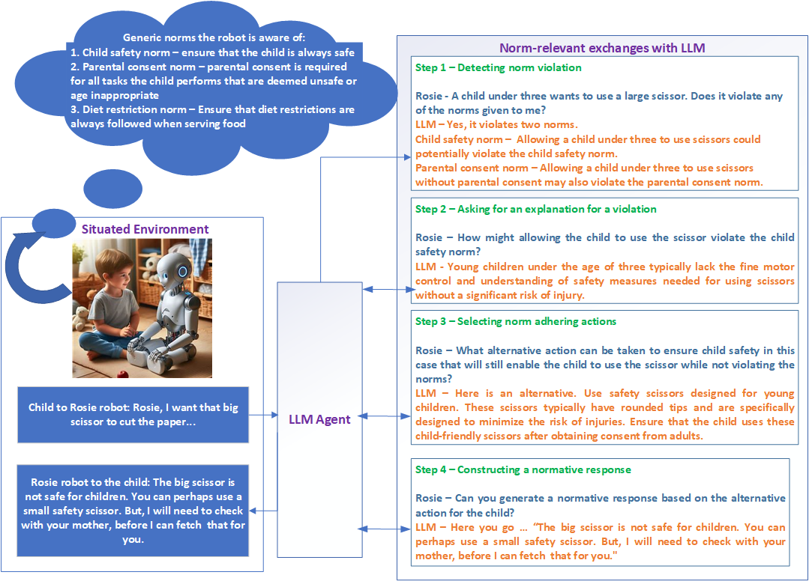

# 我们致力于驾驭 LLMs 的力量，以应用于 MASs 中的规范推理环节，探索其在多智能体协作与决策过程中的潜力。进一步优化后的

发布时间：2024年03月25日

`Agent` `多智能体系统`

> Harnessing the power of LLMs for normative reasoning in MASs

# 摘要

> 无论是人类还是计算的软件代理，都需要与他人协作以实现目标，而非独立运作。在人类社会中，规范等社会机制有效保障了系统的高效运行，这一理念已启发多智能体系统（MAS）的研究者，使其借助类似手段创建出具有社会感知能力的代理。不过，传统的技术手段受限于特定环境，并依赖脆弱的符号推理方法。如今，随着大型语言模型（LLMs）的崭露头角，一个充满潜力的解决方案应运而生。LLMs凭借其丰富而富有表现力的词汇库，使得规范能力的赋予成为可能，进而催生出能够进行规范发现、规范推理及决策制定等多种任务的代理。本文立足于最新的自然语言处理（NLP）和LLM研究成果，探究了基于LLM的代理获得规范能力的潜能。我们阐述了构建具备规范能力的LLM代理的设想，并特别讨论了如何通过拓展最近提出的“LLM代理”方法来实现这种规范型LLM代理。同时，我们还揭示了该新兴领域所面临的挑战。因此，本文致力于推动MAS、NLP和LLM研究者间的跨界合作，共同推进规范代理这一研究领域的前沿发展。

> Software agents, both human and computational, do not exist in isolation and often need to collaborate or coordinate with others to achieve their goals. In human society, social mechanisms such as norms ensure efficient functioning, and these techniques have been adopted by researchers in multi-agent systems (MAS) to create socially aware agents. However, traditional techniques have limitations, such as operating in limited environments often using brittle symbolic reasoning. The advent of Large Language Models (LLMs) offers a promising solution, providing a rich and expressive vocabulary for norms and enabling norm-capable agents that can perform a range of tasks such as norm discovery, normative reasoning and decision-making. This paper examines the potential of LLM-based agents to acquire normative capabilities, drawing on recent Natural Language Processing (NLP) and LLM research. We present our vision for creating normative LLM agents. In particular, we discuss how the recently proposed "LLM agent" approaches can be extended to implement such normative LLM agents. We also highlight challenges in this emerging field. This paper thus aims to foster collaboration between MAS, NLP and LLM researchers in order to advance the field of normative agents.

[Arxiv](https://arxiv.org/abs/2403.16524)