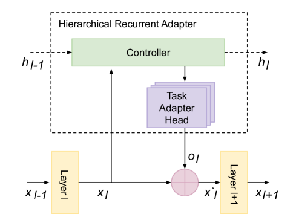
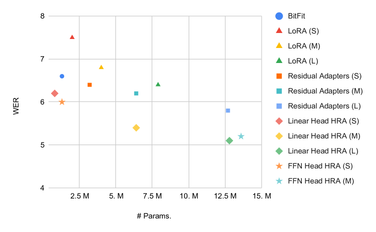
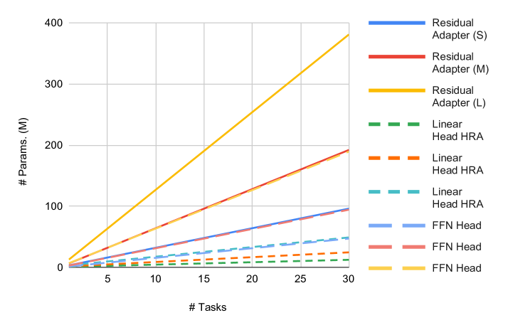

# 通过采用层级循环适配器，我们能够高效地调整大型语音模型，以应对多种任务的需求。

发布时间：2024年03月25日

`LLM理论` `自动语音识别` `模型适配`

> Hierarchical Recurrent Adapters for Efficient Multi-Task Adaptation of Large Speech Models

# 摘要

> 为了解决大型预训练模型在面对众多下游任务时参数开销过高的问题，我们提出了一种高效的适配器模块。该模块采用分层设计，通过单一的共享控制网络和多个任务级适配器头，有效降低了每项任务的参数需求，同时保持了下游任务的性能不受影响。此外，适配器的循环特性使其参数能够在预训练模型的各层中重复利用。在自动语音识别任务的测试中，我们的分层循环适配器（HRA）不仅超越了以往的适配器技术，也优于全面模型微调的基准，无论是在单一任务还是多任务适应场景中均表现出色。

> Parameter efficient adaptation methods have become a key mechanism to train large pre-trained models for downstream tasks. However, their per-task parameter overhead is considered still high when the number of downstream tasks to adapt for is large. We introduce an adapter module that has a better efficiency in large scale multi-task adaptation scenario. Our adapter is hierarchical in terms of how the adapter parameters are allocated. The adapter consists of a single shared controller network and multiple task-level adapter heads to reduce the per-task parameter overhead without performance regression on downstream tasks. The adapter is also recurrent so the entire adapter parameters are reused across different layers of the pre-trained model. Our Hierarchical Recurrent Adapter (HRA) outperforms the previous adapter-based approaches as well as full model fine-tuning baseline in both single and multi-task adaptation settings when evaluated on automatic speech recognition tasks.

[Arxiv](https://arxiv.org/abs/2403.19709)