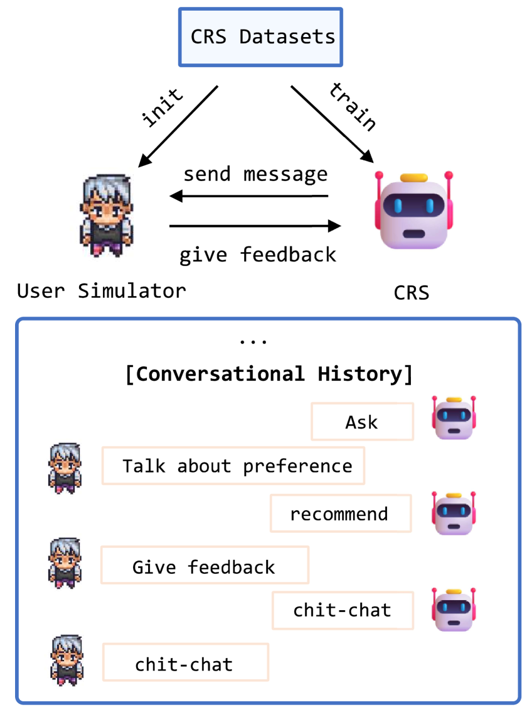
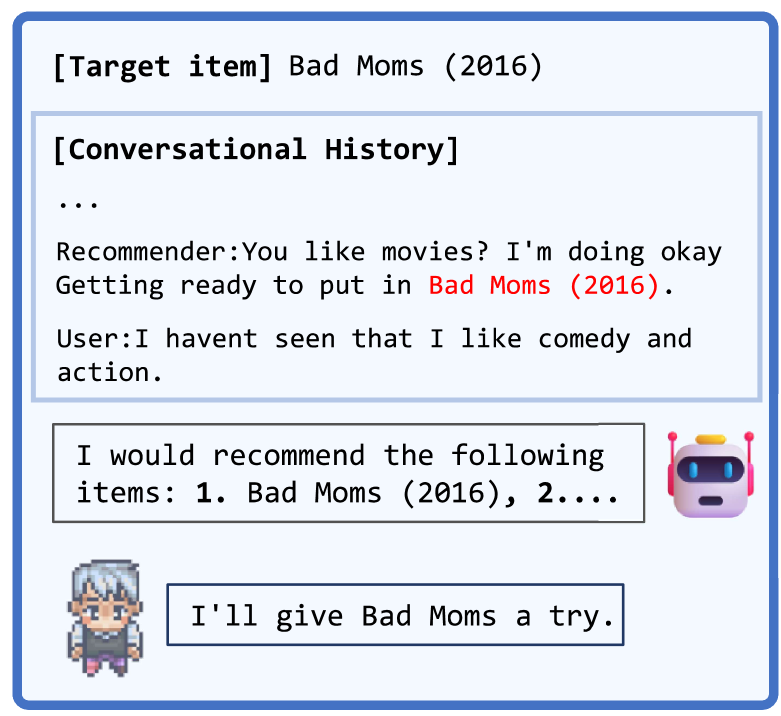
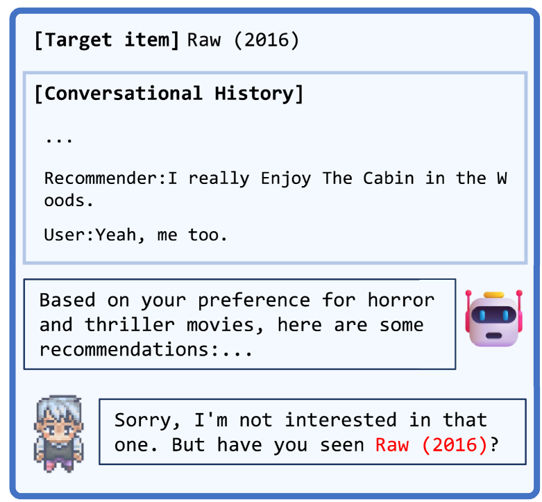
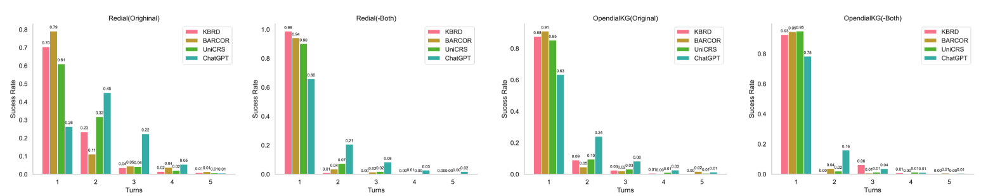
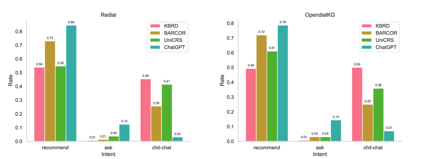
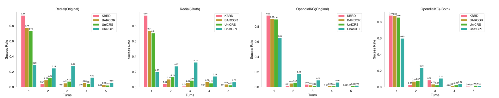

# 探究当今基于LLM的用户模拟器在对话式推荐情境下的可靠性，深入分析其局限性所在。

发布时间：2024年03月25日

`LLM应用` `对话式推荐系统`

> How Reliable is Your Simulator? Analysis on the Limitations of Current LLM-based User Simulators for Conversational Recommendation

# 摘要

> 对话式推荐系统（CRS）通过与用户的自然语言交流，精准捕捉其喜好并实时推送个性化推荐内容。近年来，随着大型语言模型（LLMs）在各领域的广泛应用，研究者们日益重视研发更为真实可靠的用户模拟器作为重要方向。与此同时，人们正尝试以LLMs为基础搭建对话系统的用户模拟器，虽有所突破，但仍存在亟待解决的局限性。本研究致力于深入剖析LLMs在构建CRS用户模拟器中的潜在问题，并以此为导向指引未来研究路径。为此，我们选取代表作品iEvaLM进行了深度分析验证，在对话推荐领域的两大主流数据集上进行了一系列实验，揭示了目前基于LLMs的用户模拟器评估方法所存在的三大症结：一是对话历史及模拟器回应中存在的数据泄露问题，导致评估结果偏高；二是CRS推荐效果的好坏更多取决于丰富且有价值的对话历史记录，而非模拟器的回答质量；三是仅通过单一提示模版难以精确操控模拟器的输出内容。针对上述局限，我们提出了一种名为SimpleUserSim的新方案，采用简洁明了的策略导向话题向目标物品，实验证明，该方法有助于CRS模型充分利用交互信息，从而大幅提升推荐效果。

> Conversational Recommender System (CRS) interacts with users through natural language to understand their preferences and provide personalized recommendations in real-time. CRS has demonstrated significant potential, prompting researchers to address the development of more realistic and reliable user simulators as a key focus. Recently, the capabilities of Large Language Models (LLMs) have attracted a lot of attention in various fields. Simultaneously, efforts are underway to construct user simulators based on LLMs. While these works showcase innovation, they also come with certain limitations that require attention. In this work, we aim to analyze the limitations of using LLMs in constructing user simulators for CRS, to guide future research. To achieve this goal, we conduct analytical validation on the notable work, iEvaLM. Through multiple experiments on two widely-used datasets in the field of conversational recommendation, we highlight several issues with the current evaluation methods for user simulators based on LLMs: (1) Data leakage, which occurs in conversational history and the user simulator's replies, results in inflated evaluation results. (2) The success of CRS recommendations depends more on the availability and quality of conversational history than on the responses from user simulators. (3) Controlling the output of the user simulator through a single prompt template proves challenging. To overcome these limitations, we propose SimpleUserSim, employing a straightforward strategy to guide the topic toward the target items. Our study validates the ability of CRS models to utilize the interaction information, significantly improving the recommendation results.

[Arxiv](https://arxiv.org/abs/2403.16416)