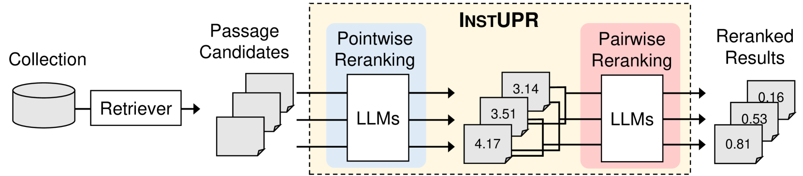
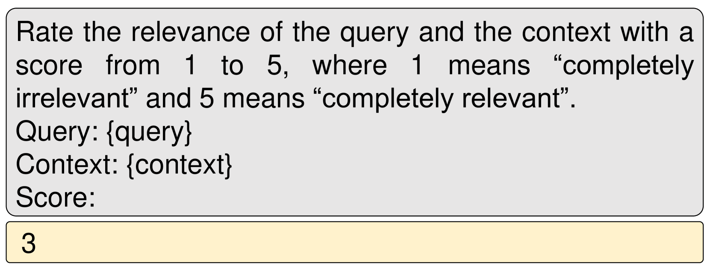
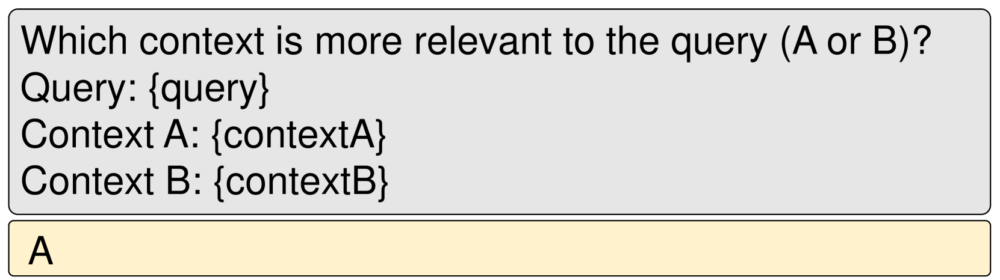

# InstUPR 是一种创新的无监督段落重排序技术，通过利用大型语言模型的力量，仅依赖于指令信息就能有效提升排序效果。

发布时间：2024年03月25日

`LLM应用` `文档重排`

> InstUPR : Instruction-based Unsupervised Passage Reranking with Large Language Models

> 本文推出的 InstUPR 是一款创新的无监督段落重排工具，它基于大型语言模型（LLMs），无需额外微调就能发挥强大功能。不同于依赖大量配对数据训练的传统方法，InstUPR 利用指令优化 LLMS 执行指令的能力，通过新颖的软得分聚合技术和成对重排序策略实现无监督段落重排序。实验证明，在 BEIR 基准测试中，InstUPR 不仅超越了无监督基准方法，而且优于已调整指令的重排器，充分彰显出其实效性和卓越性。所有实验的源代码已在 GitHub（https://github.com/MiuLab/InstUPR）开源共享。

> This paper introduces InstUPR, an unsupervised passage reranking method based on large language models (LLMs). Different from existing approaches that rely on extensive training with query-document pairs or retrieval-specific instructions, our method leverages the instruction-following capabilities of instruction-tuned LLMs for passage reranking without any additional fine-tuning. To achieve this, we introduce a soft score aggregation technique and employ pairwise reranking for unsupervised passage reranking. Experiments on the BEIR benchmark demonstrate that InstUPR outperforms unsupervised baselines as well as an instruction-tuned reranker, highlighting its effectiveness and superiority. Source code to reproduce all experiments is open-sourced at https://github.com/MiuLab/InstUPR

[Arxiv](https://arxiv.org/abs/2403.16435)