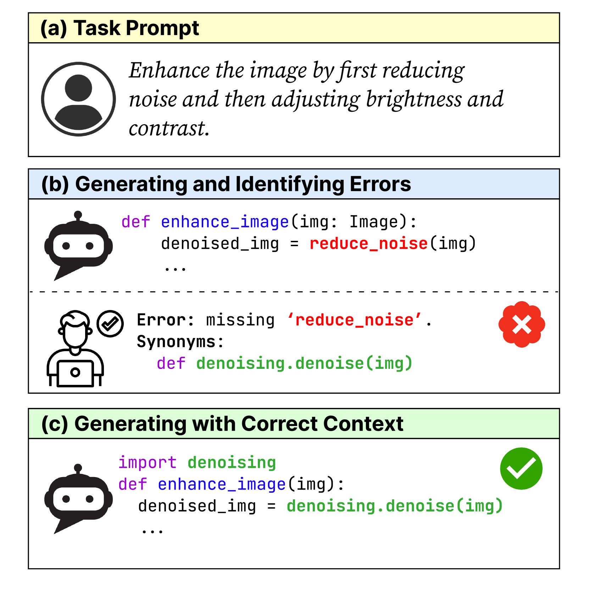
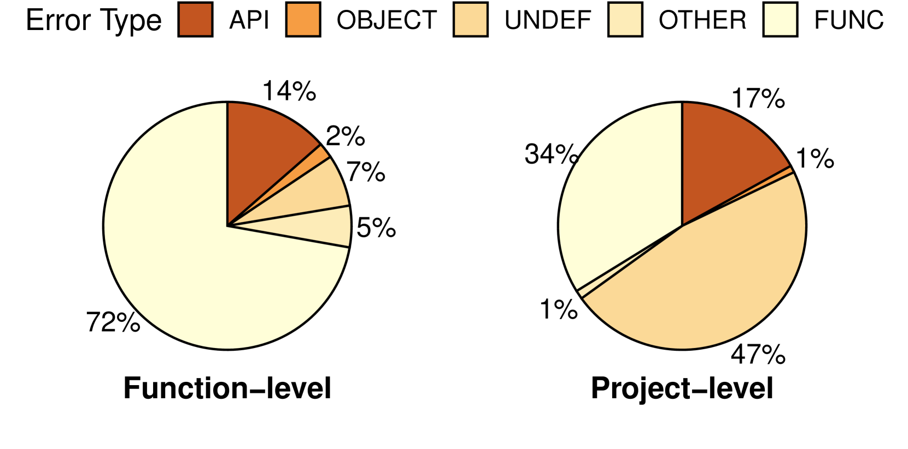
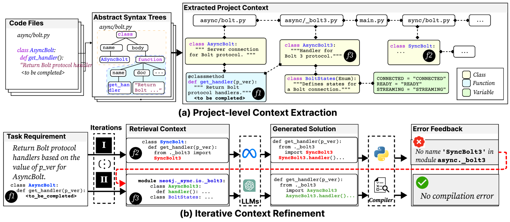
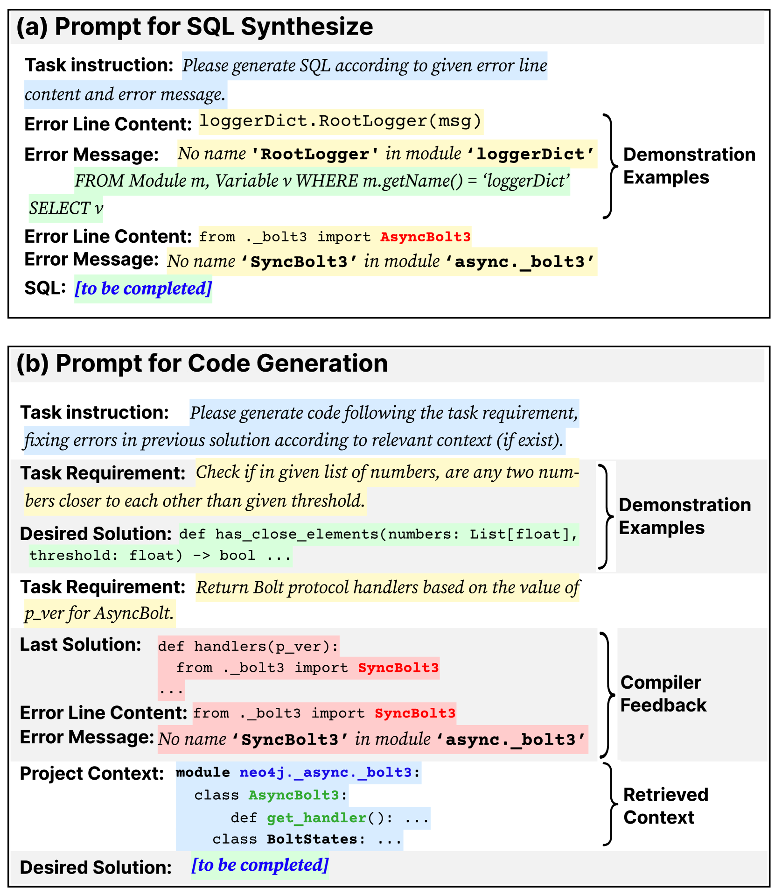
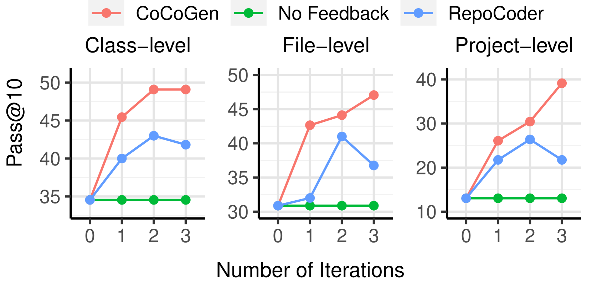
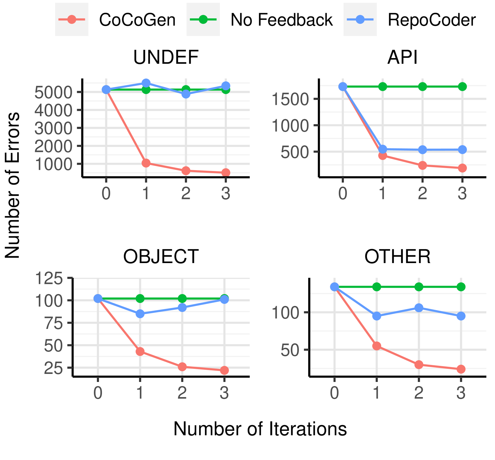
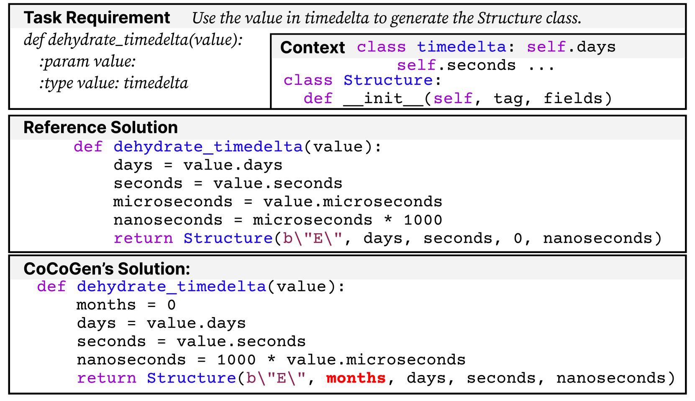
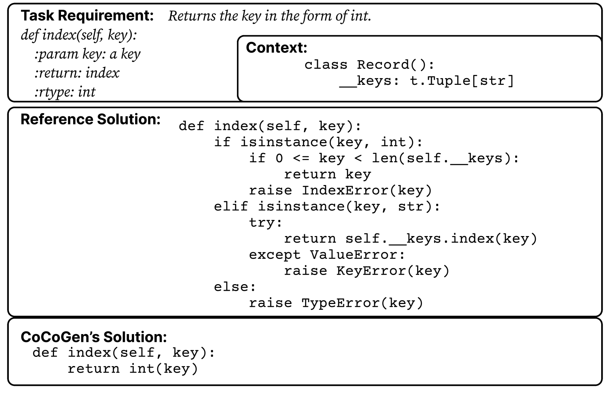
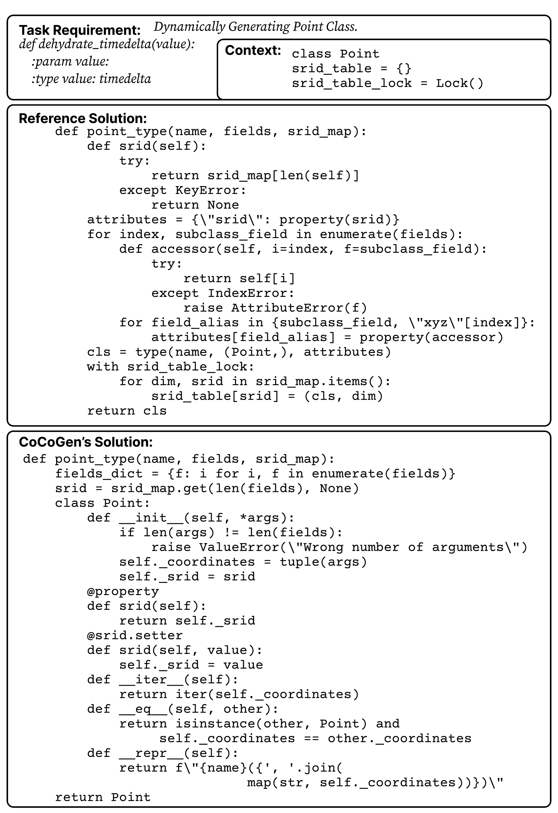

# 利用编译器反馈，在项目级别的代码上下文中进行迭代优化，以提高代码生成的精准度。

发布时间：2024年03月25日

`LLM应用` `软件开发` `自动化代码生成`

> Iterative Refinement of Project-Level Code Context for Precise Code Generation with Compiler Feedback

> 尽管LLMs在自动化代码生成上展现出了非凡成果，但要将其应用于实际软件开发却面临挑战，因其生成的代码可能出现API使用不当、类结构、数据结构错误以及缺乏项目特有信息等问题。鉴于LLMs无法完整捕获项目特定的上下文，亟需找到方法让模型深入探究项目级代码环境。为此，本文引入了一项名为ProCoder的新颖方案，该方案借助编译器反馈循环校正项目级代码上下文，从而精准生成代码。具体来说，ProCoder先运用编译器技术揭示生成代码与项目上下文间的矛盾，继而通过挖掘代码仓库中的信息，逐步修正并完善这些错误。我们将ProCoder与两款颇具代表性的LLMs（GPT-3.5-Turbo及13B参数的Code Llama）整合，并将其应用在Python代码生成任务上。实验证明，ProCoder显著提高了LLMs在生成依赖项目上下文代码时的表现，提升幅度超过80%，且始终优于现有的基于检索的代码生成基线方法。

> Large language models (LLMs) have shown remarkable progress in automated code generation. Yet, incorporating LLM-based code generation into real-life software projects poses challenges, as the generated code may contain errors in API usage, class, data structure, or missing project-specific information. As much of this project-specific context cannot fit into the prompts of LLMs, we must find ways to allow the model to explore the project-level code context. To this end, this paper puts forward a novel approach, termed ProCoder, which iteratively refines the project-level code context for precise code generation, guided by the compiler feedback. In particular, ProCoder first leverages compiler techniques to identify a mismatch between the generated code and the project's context. It then iteratively aligns and fixes the identified errors using information extracted from the code repository. We integrate ProCoder with two representative LLMs, i.e., GPT-3.5-Turbo and Code Llama (13B), and apply it to Python code generation. Experimental results show that ProCoder significantly improves the vanilla LLMs by over 80% in generating code dependent on project context, and consistently outperforms the existing retrieval-based code generation baselines.

[Arxiv](https://arxiv.org/abs/2403.16792)