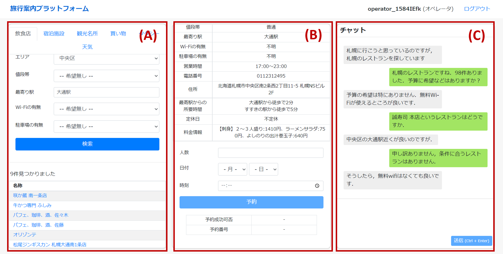
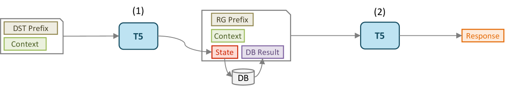
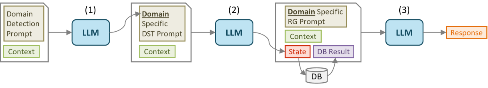
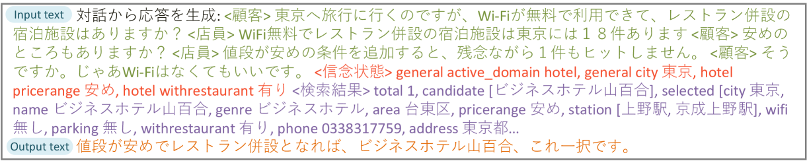
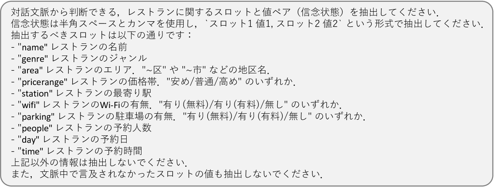
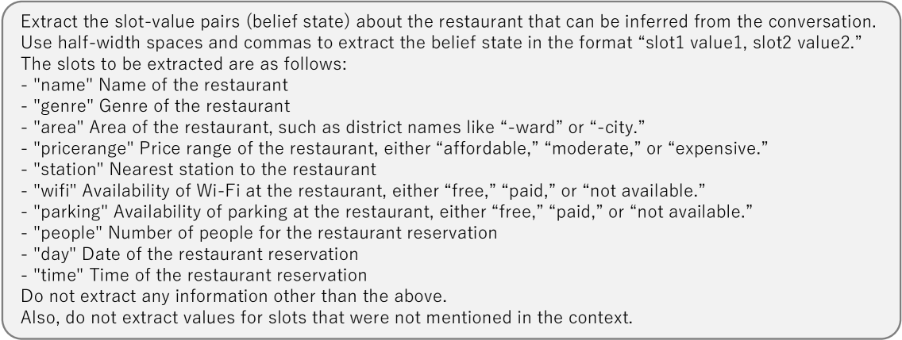

# JMultiWOZ：涵盖多个领域的大规模日语任务导向对话数据集

发布时间：2024年03月25日

`LLM应用` `对话系统`

> JMultiWOZ: A Large-Scale Japanese Multi-Domain Task-Oriented Dialogue Dataset

# 摘要

> 对话数据集对于深度学习驱动的任务导向型对话系统研究极为关键。尽管英语多领域任务导向型对话数据集层出不穷，推动了相关系统的快速发展，但日语领域却鲜有这样的资源，研究进展也相对滞后。本研究中，我们为促进日语任务导向型对话系统的发展，首次创建了大规模多领域任务导向型对话数据集 JMultiWOZ。通过 JMultiWOZ，我们对现有英语主要基准数据集 MultiWOZ2.2 以及最新基于大型语言模型（LLM）的方法进行了对话状态跟踪和响应生成能力的评估。评估结果显示，JMultiWOZ 成为了与 MultiWOZ2.2 齐名的基准。更进一步，通过与模型和真人的互动对话评估实验，我们揭示了 LLM 在完成日语任务方面的不足之处。

> Dialogue datasets are crucial for deep learning-based task-oriented dialogue system research. While numerous English language multi-domain task-oriented dialogue datasets have been developed and contributed to significant advancements in task-oriented dialogue systems, such a dataset does not exist in Japanese, and research in this area is limited compared to that in English. In this study, towards the advancement of research and development of task-oriented dialogue systems in Japanese, we constructed JMultiWOZ, the first Japanese language large-scale multi-domain task-oriented dialogue dataset. Using JMultiWOZ, we evaluated the dialogue state tracking and response generation capabilities of the state-of-the-art methods on the existing major English benchmark dataset MultiWOZ2.2 and the latest large language model (LLM)-based methods. Our evaluation results demonstrated that JMultiWOZ provides a benchmark that is on par with MultiWOZ2.2. In addition, through evaluation experiments of interactive dialogues with the models and human participants, we identified limitations in the task completion capabilities of LLMs in Japanese.

[Arxiv](https://arxiv.org/abs/2403.17319)