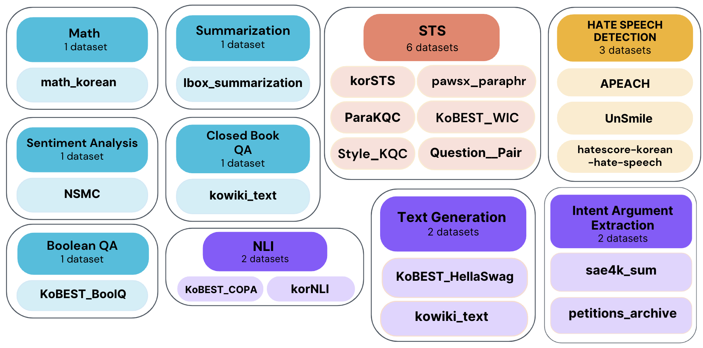

# KIT-19 是一套综合性的工具包，专注于通过19项任务对韩国大型语言模型进行精细调整训练，提供全方位的韩语文本处理支持。

发布时间：2024年03月25日

`LLM应用` `韩语文本生成`

> KIT-19: A Comprehensive Korean Instruction Toolkit on 19 Tasks for Fine-Tuning Korean Large Language Models

> 指令调优是让大型语言模型在特定任务中表现出色的关键步骤，尤其在英语等主流语言领域，已有多项公开的指令式数据集被构建和分享。然而，在韩语场景下，当前公开的模型与数据集皆依赖于ChatGPT的输出或是从英语数据集翻译而来。为此，本文推出了专为韩语大型语言模型优化设计的指令数据集——\textit{KIT-19}，它整合了19个面向韩语NLP任务的开源数据集，并采用指令格式构建而成。我们利用\textit{KIT-19}训练了一个韩语预训练大型语言模型，并通过实验验证了其高效性。实验结果显示，经过\textit{KIT-19}调优后的模型明显优于现有韩语大型语言模型。鉴于\textit{KIT-19}的质量优势及实际效果，本文认为其有望在未来对提升韩语大型语言模型的整体性能产生重要推动作用。

> Instruction Tuning on Large Language Models is an essential process for model to function well and achieve high performance in specific tasks. Accordingly, in mainstream languages such as English, instruction-based datasets are being constructed and made publicly available. In the case of Korean, publicly available models and datasets all rely on using the output of ChatGPT or translating datasets built in English. In this paper, We introduce \textit{KIT-19} as an instruction dataset for the development of LLM in Korean. \textit{KIT-19} is a dataset created in an instruction format, comprising 19 existing open-source datasets for Korean NLP tasks. In this paper, we train a Korean Pretrained LLM using \textit{KIT-19} to demonstrate its effectiveness. The experimental results show that the model trained on \textit{KIT-19} significantly outperforms existing Korean LLMs. Based on the its quality and empirical results, this paper proposes that \textit{KIT-19} has the potential to make a substantial contribution to the future improvement of Korean LLMs' performance.

[Arxiv](https://arxiv.org/abs/2403.16444)