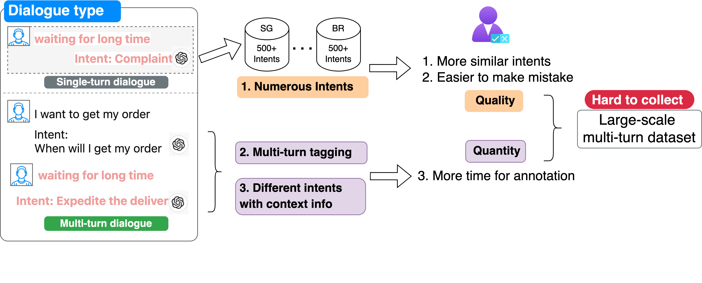
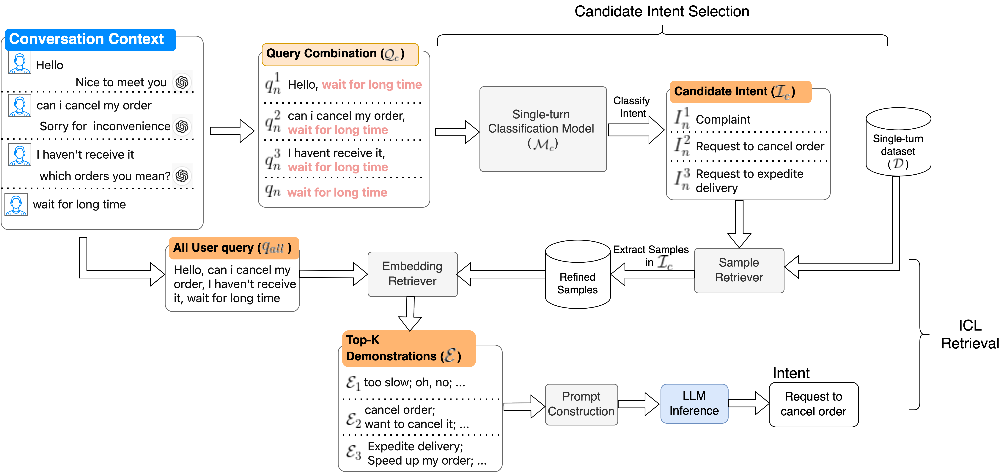
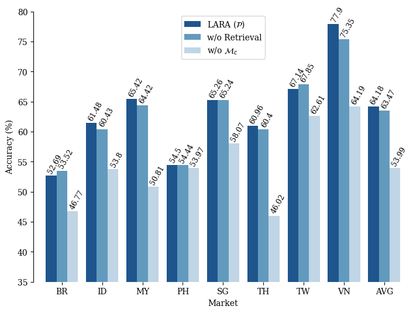

# LARA 是一种针对多轮意图分类任务设计的适应性语言检索增强型大型语言模型。它通过融合语言理解和检索增强技术，有效提升多轮对话场景下的意图识别能力。（注：在给出的结果2中，我尽可能保留了原文的术语并使其更符合中文表述习惯，但未提供具体研究内容的详细描述，因为原句是标题形式，为了简洁与生动，通常会在翻译时强调核心概念和应用场景。）

发布时间：2024年03月25日

`LLM应用` `聊天机器人` `多语言对话系统`

> LARA: Linguistic-Adaptive Retrieval-Augmented LLMs for Multi-Turn Intent Classification

> 鉴于LLMs的重大突破，研究者已尝试将其应用于文本分类任务的上下文学习，但以往研究主要集中在单语种、单一回合的任务上。本文推出了创新性的LARA（语言适应性检索增强型语言模型），专为提升跨六种语言的多回合对话分类任务精准度而设计，尤其适用于处理聊天机器人交互中多样复杂的意图识别难题。LARA通过巧妙地融合经精细调整的小型模型与内置于LLMs结构中的检索增强机制，得以灵活运用历史对话和相关意图信息，从而深化对上下文情境的理解。并且，我们的自适应检索策略进一步强化了LLMs的跨语言功能，无需繁重的再训练或微调过程。实验证明，LARA在多回合意图分类任务上表现出色，相较于现有方法平均提升了3.67%的准确率，实现了该领域的最新技术水平。

> Following the significant achievements of large language models (LLMs), researchers have employed in-context learning for text classification tasks. However, these studies focused on monolingual, single-turn classification tasks. In this paper, we introduce LARA (Linguistic-Adaptive Retrieval-Augmented Language Models), designed to enhance accuracy in multi-turn classification tasks across six languages, accommodating numerous intents in chatbot interactions. Multi-turn intent classification is notably challenging due to the complexity and evolving nature of conversational contexts. LARA tackles these issues by combining a fine-tuned smaller model with a retrieval-augmented mechanism, integrated within the architecture of LLMs. This integration allows LARA to dynamically utilize past dialogues and relevant intents, thereby improving the understanding of the context. Furthermore, our adaptive retrieval techniques bolster the cross-lingual capabilities of LLMs without extensive retraining and fine-tune. Comprehensive experiments demonstrate that LARA achieves state-of-the-art performance on multi-turn intent classification tasks, enhancing the average accuracy by 3.67% compared to existing methods.

[Arxiv](https://arxiv.org/abs/2403.16504)