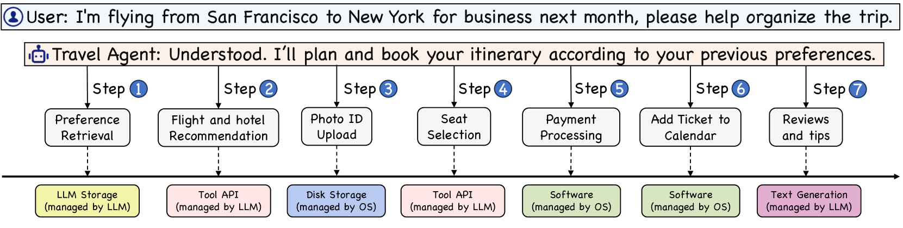
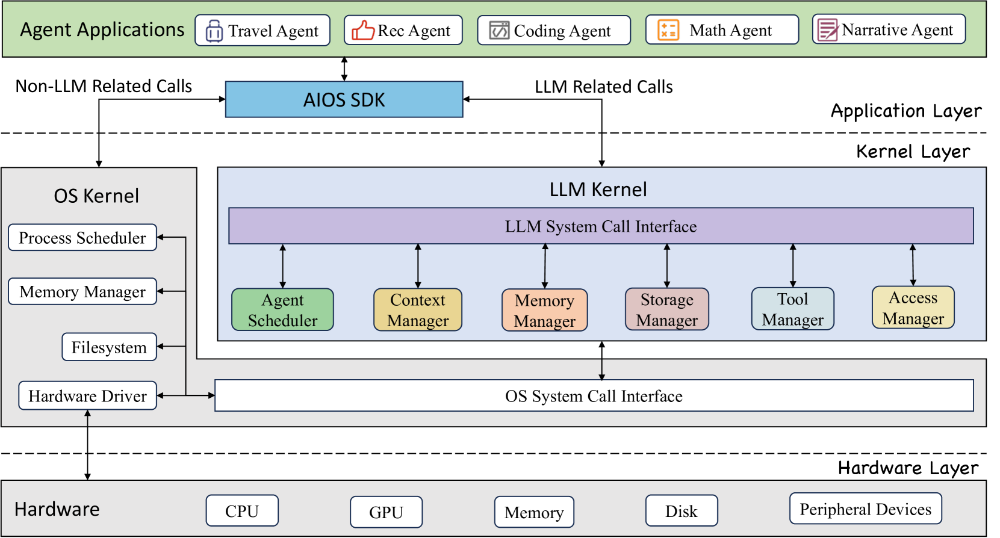
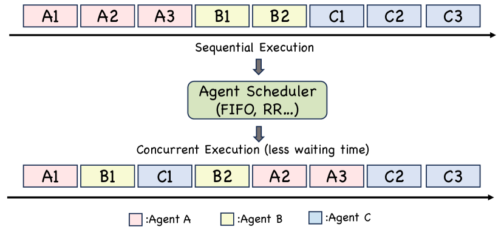
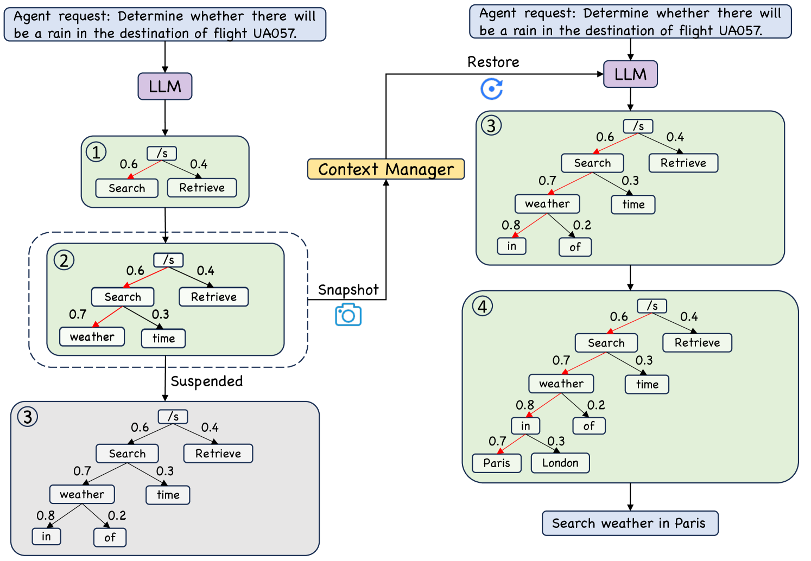

# LLM 智能体操作系统是指专为大型语言模型设计的操作系统，它能够支持和管理 LLM 的运行环境与功能，以实现高效的交互和控制。进一步优化： LLMAgentOS（大型语言模型智能体操作系统）是针对 LLM 系统量身打造的操作系统，致力于优化其功能管理和运行环境，从而在各类应用场景下提供更为流畅、智能的交互体验。

发布时间：2024年03月25日

`Agent` `人工智能` `操作系统`

> LLM Agent Operating System

> 在部署和集成基于LLM的智能代理时，面临的诸多挑战严重制约了其效能和效率，如对LLM资源分配和调度的不合理，交互过程中的上下文保持难题，以及整合具备不同能力和专长的异构代理所固有的复杂性。随着代理数量和复杂度的增长，这些问题越发突出，往往导致资源利用率低下和系统瓶颈。因此，我们推出了AIOS——一款将大型语言模型融入操作系统核心的LLM代理操作系统。AIOS特别设计以优化资源分配，简化跨代理上下文切换，支持代理并行执行，提供工具服务功能，并确保对代理的有效访问控制。本文详述了该操作系统的架构设计，明确了要解决的核心问题，并初步展示了AIOS的设计与实现方案。通过实验证明，AIOS模块在处理多代理并发执行时表现出良好的可靠性和高效性。我们的目标不仅是提升LLM代理的性能和效率，更是要为未来构建和完善AIOS生态系统树立典范。目前该项目已在GitHub开源，地址为https://github.com/agiresearch/AIOS。

> The integration and deployment of large language model (LLM)-based intelligent agents have been fraught with challenges that compromise their efficiency and efficacy. Among these issues are sub-optimal scheduling and resource allocation of agent requests over the LLM, the difficulties in maintaining context during interactions between agent and LLM, and the complexities inherent in integrating heterogeneous agents with different capabilities and specializations. The rapid increase of agent quantity and complexity further exacerbates these issues, often leading to bottlenecks and sub-optimal utilization of resources. Inspired by these challenges, this paper presents AIOS, an LLM agent operating system, which embeds large language model into operating systems (OS). Specifically, AIOS is designed to optimize resource allocation, facilitate context switch across agents, enable concurrent execution of agents, provide tool service for agents, and maintain access control for agents. We present the architecture of such an operating system, outline the core challenges it aims to resolve, and provide the basic design and implementation of the AIOS. Our experiments on concurrent execution of multiple agents demonstrate the reliability and efficiency of our AIOS modules. Through this, we aim to not only improve the performance and efficiency of LLM agents but also to pioneer for better development and deployment of the AIOS ecosystem in the future. The project is open-source at https://github.com/agiresearch/AIOS.

[Arxiv](https://arxiv.org/abs/2403.16971)