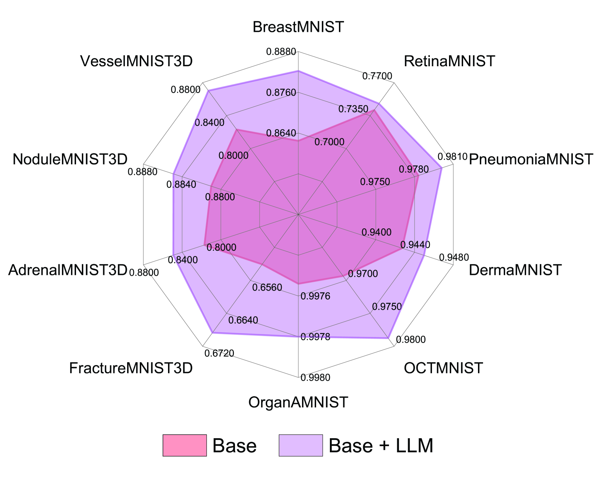
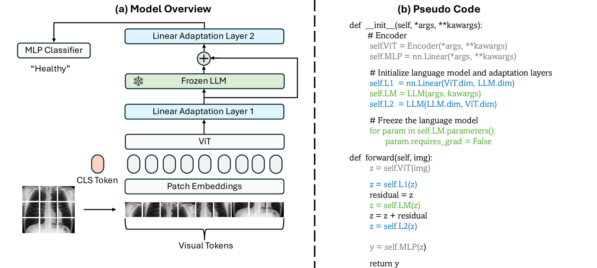

# 语言模型为生物医学成像任务提供了免费的加速支持。

发布时间：2024年03月25日

`LLM应用` `生物医学成像` `人工智能`

> Language Models are Free Boosters for Biomedical Imaging Tasks

> 本研究意外发现，基于残差的大型语言模型（LLMs）在生物医学成像任务中表现出色，这在传统上缺乏语言或文本数据的领域中尤为突出。我们采用了一种新颖的方法，直接利用预训练LLMs中的冻结transformer块作为编码器层，处理视觉标记，打破了传统的多模态视觉-语言框架的常规。这些LLMs不仅提升了包括2D和3D视觉分类在内的多种生物医学成像应用的性能，还能作为即插即用的助推器。更引人注目的是，我们的框架在MedMNIST-2D和3D的标准化数据集上取得了突破性成果，树立了新的行业标杆。我们的目标是探索LLMs在生物医学成像领域的新应用，并深化对其在这一专业领域潜力的认识。

> In this study, we uncover the unexpected efficacy of residual-based large language models (LLMs) as part of encoders for biomedical imaging tasks, a domain traditionally devoid of language or textual data. The approach diverges from established methodologies by utilizing a frozen transformer block, extracted from pre-trained LLMs, as an innovative encoder layer for the direct processing of visual tokens. This strategy represents a significant departure from the standard multi-modal vision-language frameworks, which typically hinge on language-driven prompts and inputs. We found that these LLMs could boost performance across a spectrum of biomedical imaging applications, including both 2D and 3D visual classification tasks, serving as plug-and-play boosters. More interestingly, as a byproduct, we found that the proposed framework achieved superior performance, setting new state-of-the-art results on extensive, standardized datasets in MedMNIST-2D and 3D. Through this work, we aim to open new avenues for employing LLMs in biomedical imaging and enriching the understanding of their potential in this specialized domain.

[Arxiv](https://arxiv.org/abs/2403.17343)