# 运用CRISPE框架及大型语言模型的力量，创新性地生成一种新的元启发式算法

发布时间：2024年03月25日

`LLM应用` `优化算法` `自然计算`

> Leveraging Large Language Model to Generate a Novel Metaheuristic Algorithm with CRISPE Framework

# 摘要

> 本文借助强大的LLM ChatGPT-3.5，仅凭少量输入就能迅速自动生成一种新型元启发式算法——动物搜寻优化（ZSO）。该算法灵感源自动物群体行为策略，专门针对连续优化问题，巧妙融合捕食者-猎物互动和社交聚群两种搜索机制实现探索与利用的均衡。同时，采用标准提示设计框架CRISPE精心构造具体提示信息。我们还微调并设计了四种ZSO变体算法。实验证明，在CEC2014、CEC2022两大基准测试及六个工程优化问题上，ZSO系列算法展现出卓越性能，超越了包括20种主流先进MA在内的竞争对手。实验结果和统计分析有力证明了ZSO算法的有效性和高效性。最后，我们展望了LLM时代元启发式领域广阔的发展前景。

> In this paper, we borrow the large language model (LLM) ChatGPT-3.5 to automatically and quickly design a new metaheuristic algorithm (MA) with only a small amount of input. The novel animal-inspired MA named zoological search optimization (ZSO) draws inspiration from the collective behaviors of animals for solving continuous optimization problems. Specifically, the basic ZSO algorithm involves two search operators: the prey-predator interaction operator and the social flocking operator to balance exploration and exploitation well. Besides, the standard prompt engineering framework CRISPE (i.e., Capacity and Role, Insight, Statement, Personality, and Experiment) is responsible for the specific prompt design. Furthermore, we designed four variants of the ZSO algorithm with slight human-interacted adjustment. In numerical experiments, we comprehensively investigate the performance of ZSO-derived algorithms on CEC2014 benchmark functions, CEC2022 benchmark functions, and six engineering optimization problems. 20 popular and state-of-the-art MAs are employed as competitors. The experimental results and statistical analysis confirm the efficiency and effectiveness of ZSO-derived algorithms. At the end of this paper, we explore the prospects for the development of the metaheuristics community under the LLM era.

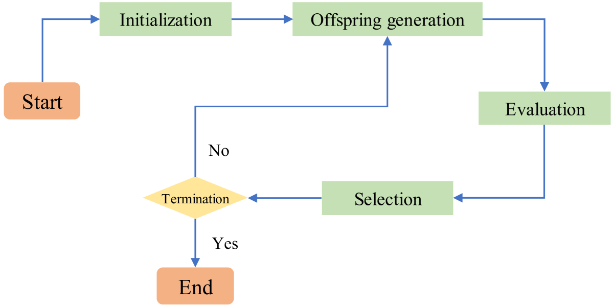

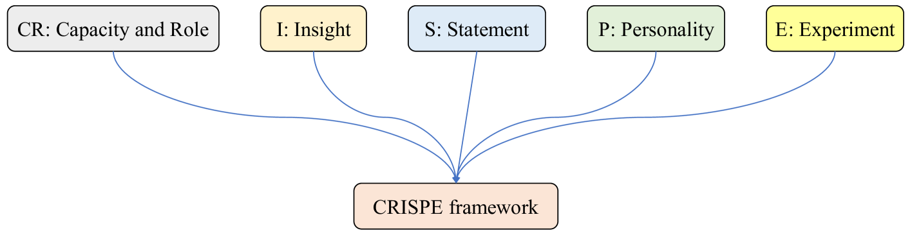

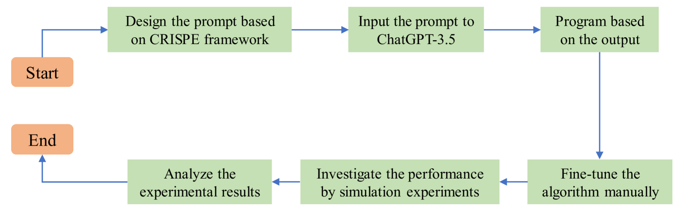

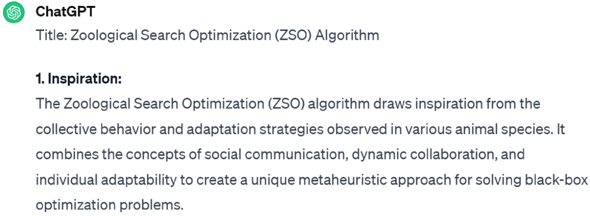

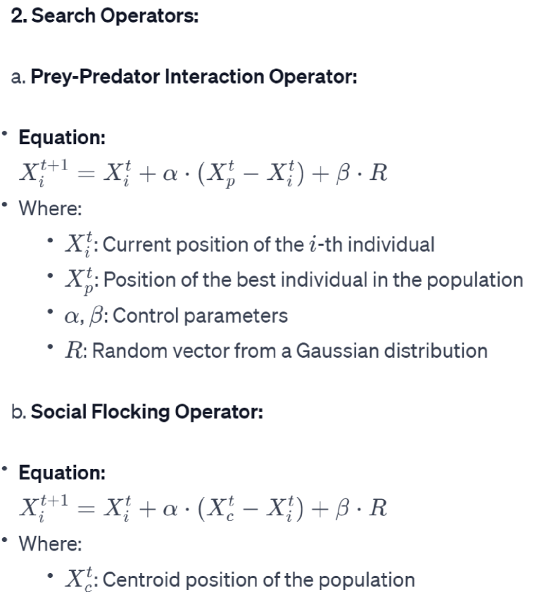

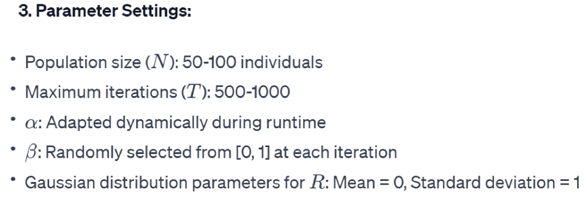

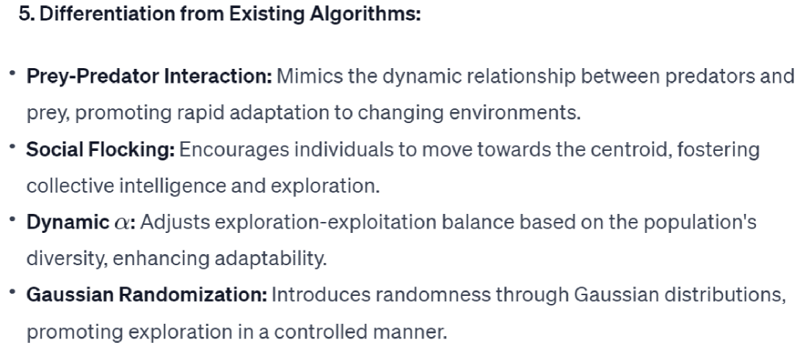

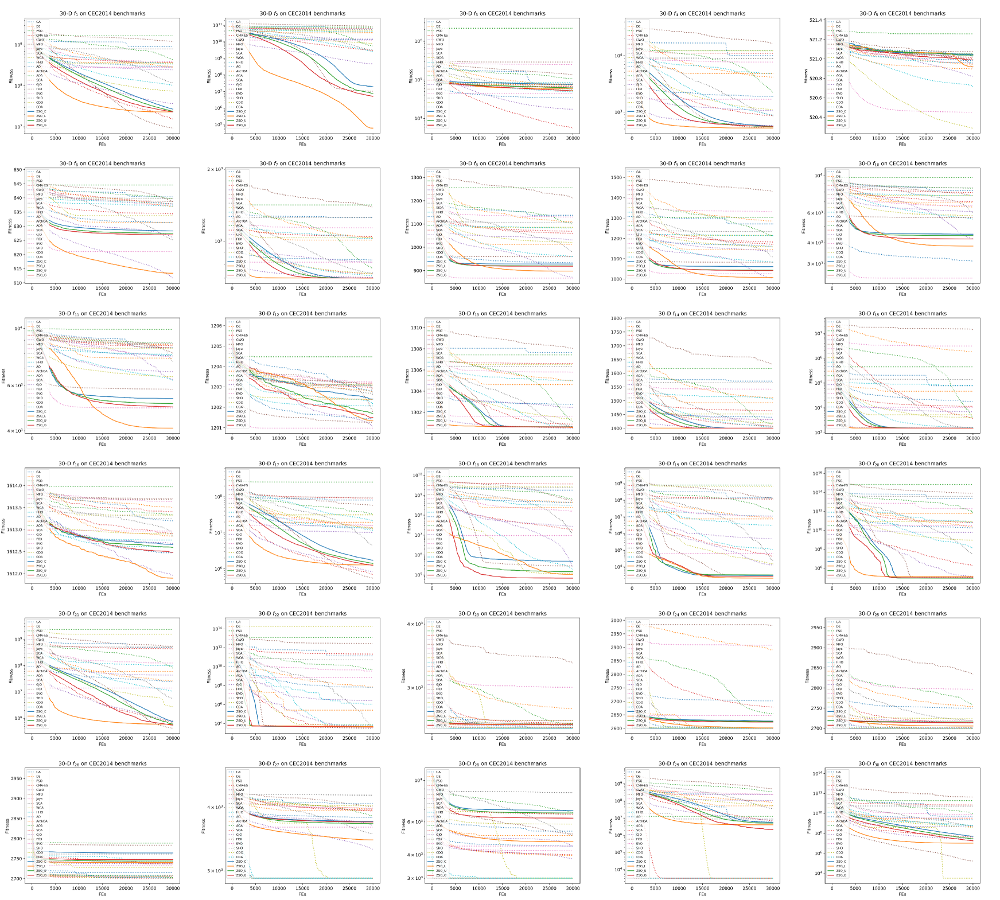

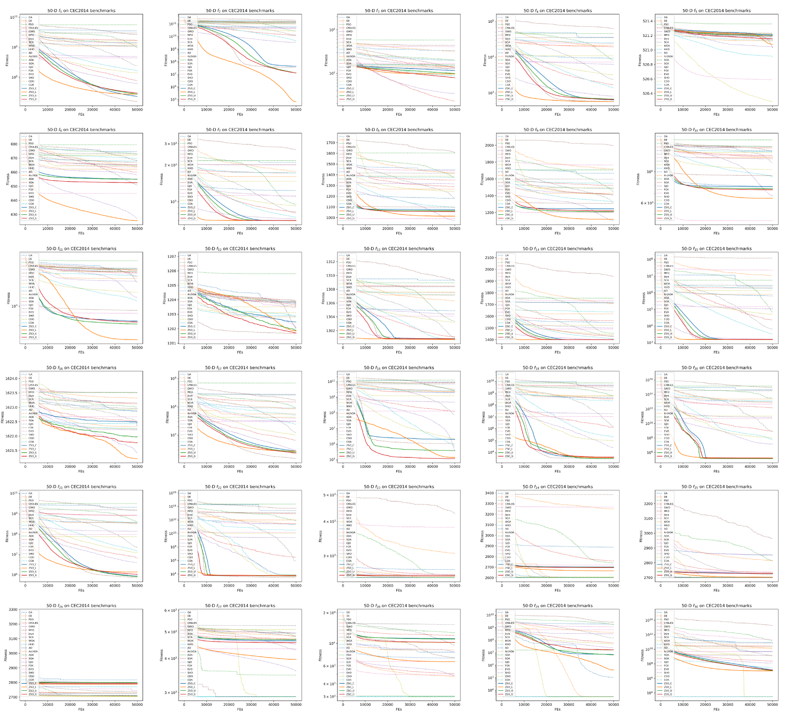

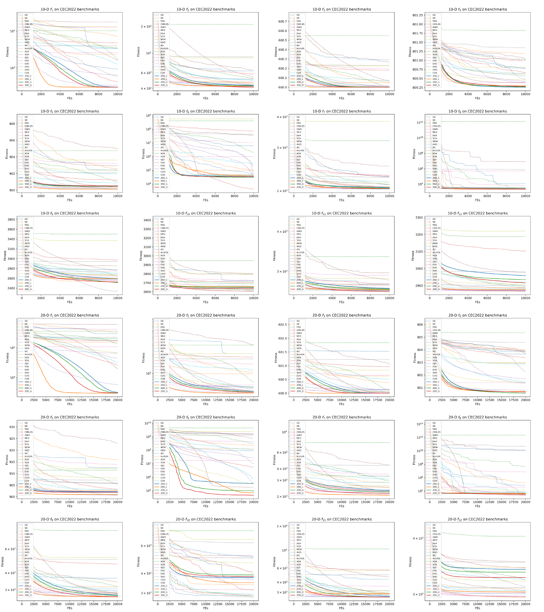

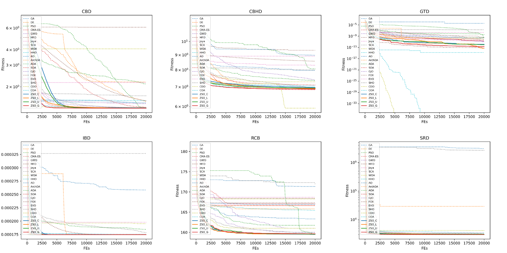

[Arxiv](https://arxiv.org/abs/2403.16417)