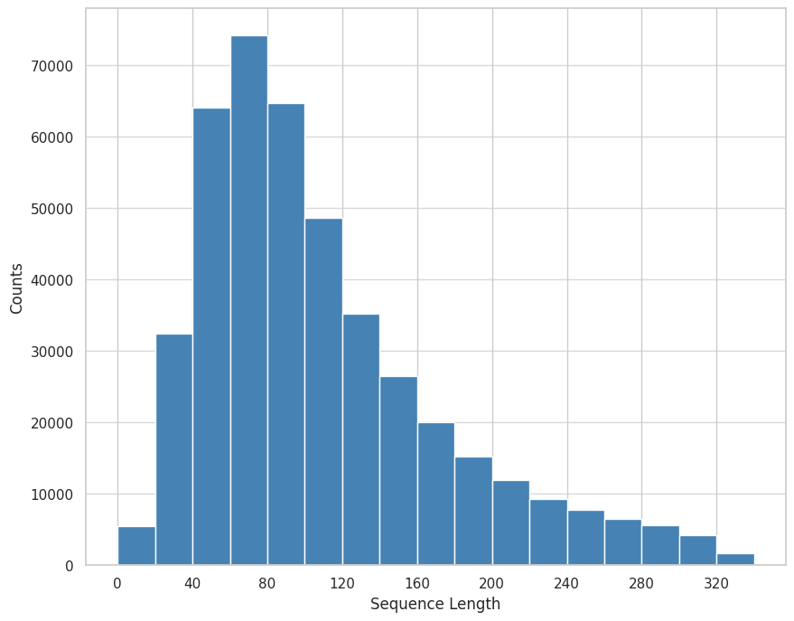
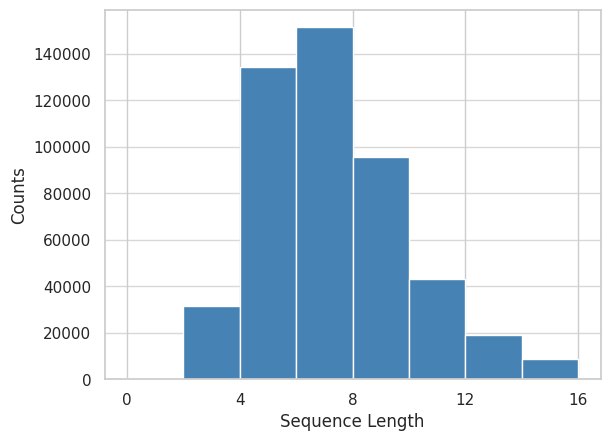

# NSINA 是一个专门针对僧伽罗语新闻领域的语料库，旨在为该语言的研究与应用提供丰富的新闻文本资源。

发布时间：2024年03月25日

`LLM应用` `低资源语言` `新闻语料库`

> NSINA: A News Corpus for Sinhala

# 摘要

> 随着LLMs的出现，NLP技术得以显著跃升，但其效果很大程度上取决于预训练资源的支持，这一现象在僧伽罗语等低资源语言中尤为突出，这些语言面临着训练数据匮乏与基准测试集有限的双重困境。有鉴于此，本研究构建了NSINA——一个包含超50万篇来自主流僧伽罗语新闻网站文章的综合新闻语料库，并配套设计了新闻来源鉴别、新闻类别预测及新闻标题生成三项NLP任务。NSINA的发布致力于解决LLMs应用于僧伽罗语时所面临的难题，为改善僧伽罗语NLP提供宝贵的数据资源和基准参考，迄今为止，NSINA已成为最大规模的僧伽罗语新闻语料库。

> The introduction of large language models (LLMs) has advanced natural language processing (NLP), but their effectiveness is largely dependent on pre-training resources. This is especially evident in low-resource languages, such as Sinhala, which face two primary challenges: the lack of substantial training data and limited benchmarking datasets. In response, this study introduces NSINA, a comprehensive news corpus of over 500,000 articles from popular Sinhala news websites, along with three NLP tasks: news media identification, news category prediction, and news headline generation. The release of NSINA aims to provide a solution to challenges in adapting LLMs to Sinhala, offering valuable resources and benchmarks for improving NLP in the Sinhala language. NSINA is the largest news corpus for Sinhala, available up to date.

[Arxiv](https://arxiv.org/abs/2403.16571)