# 新颖意图发现技术引入了“吸引与分散原型”方法，旨在有效探索并揭示潜在的新意图。

发布时间：2024年03月25日

`LLM应用` `意图识别`

> New Intent Discovery with Attracting and Dispersing Prototype

> 新意图发现（NID）致力于利用少量标注数据与大量未标注数据识别既有及挖掘新的意图类别。目前将此任务视为特征聚类问题，尽管已有研究尝试通过增强实例表征以求突破，但现有方法仍难以找到利于聚类的有效表示，即在调控簇内紧凑性和簇间分离度上显得乏力。因此，我们针对NID问题特别提出了一个名为鲁棒自适应原型学习（RAP）的框架，旨在为已知和新出现的意图类别设定清晰区分的决策边界。其中，我们精心设计了一种鲁棒原型吸引学习（RPAL）策略，让每个实例更紧密地向其对应原型靠拢，从而大幅提升簇内紧凑性；同时，创新引入了自适应原型扩散学习（APDL）方法，从原型间的视角出发最大限度拉开簇间距离。实验证明，在CLINC、BANKING和StackOverflow这三个颇具挑战性的基准数据集上，运用RAP后，由于改进了聚类友好的表示方式，我们相较于当前最先进方法（包括大型语言模型）取得了显著的进步，平均提升幅度达到了+5.5%。

> New Intent Discovery (NID) aims to recognize known and infer new intent categories with the help of limited labeled and large-scale unlabeled data. The task is addressed as a feature-clustering problem and recent studies augment instance representation. However, existing methods fail to capture cluster-friendly representations, since they show less capability to effectively control and coordinate within-cluster and between-cluster distances. Tailored to the NID problem, we propose a Robust and Adaptive Prototypical learning (RAP) framework for globally distinct decision boundaries for both known and new intent categories. Specifically, a robust prototypical attracting learning (RPAL) method is designed to compel instances to gravitate toward their corresponding prototype, achieving greater within-cluster compactness. To attain larger between-cluster separation, another adaptive prototypical dispersing learning (APDL) method is devised to maximize the between-cluster distance from the prototype-to-prototype perspective. Experimental results evaluated on three challenging benchmarks (CLINC, BANKING, and StackOverflow) of our method with better cluster-friendly representation demonstrate that RAP brings in substantial improvements over the current state-of-the-art methods (even large language model) by a large margin (average +5.5% improvement).

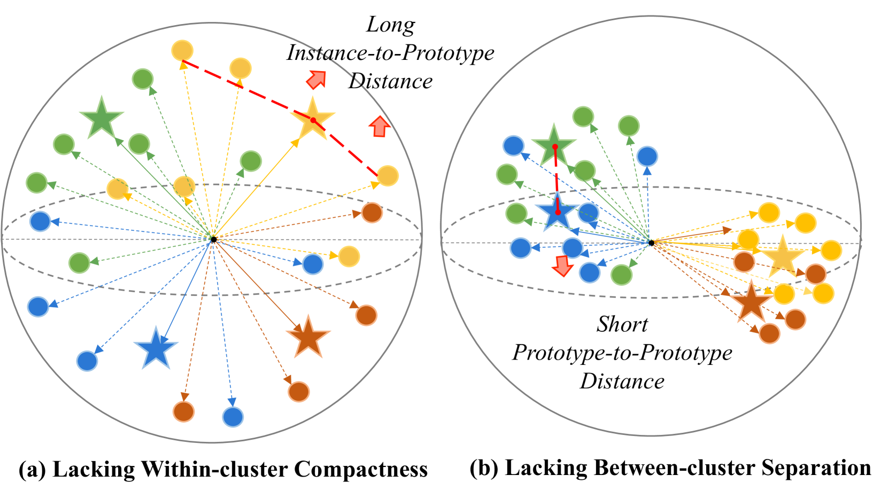

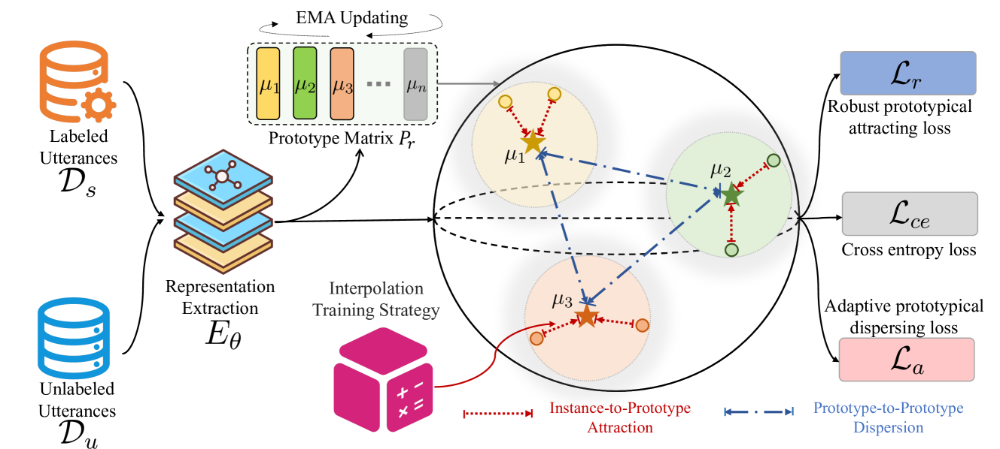

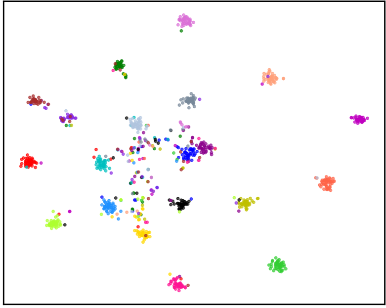

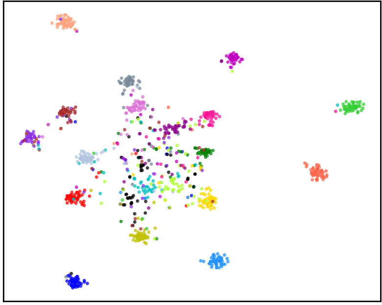

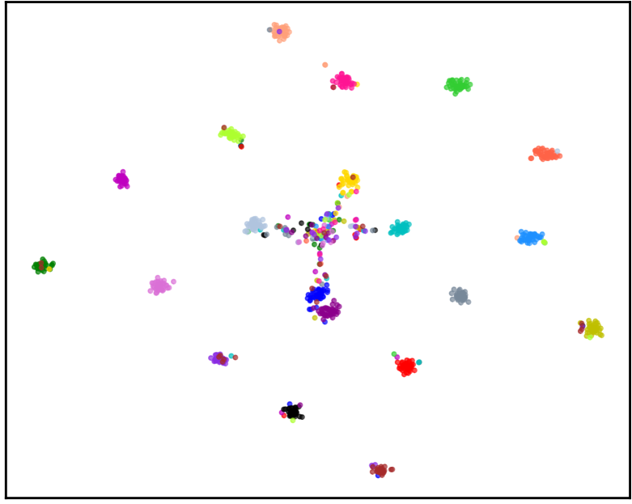

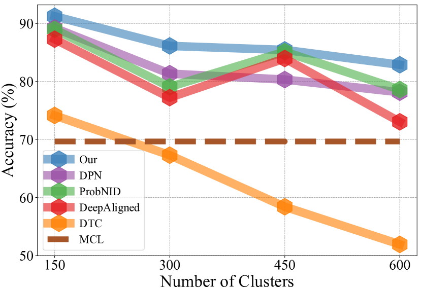

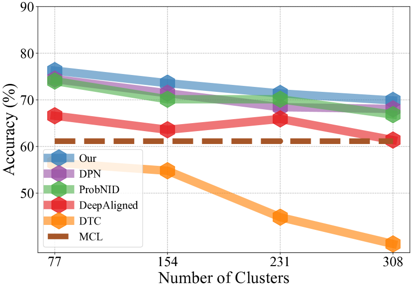

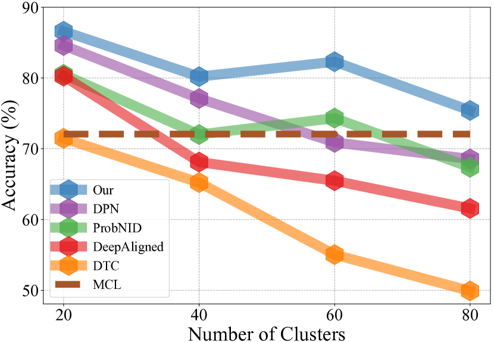

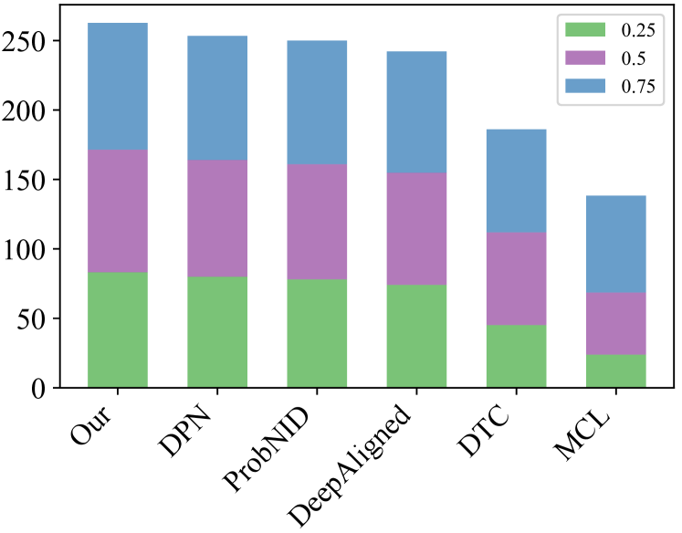

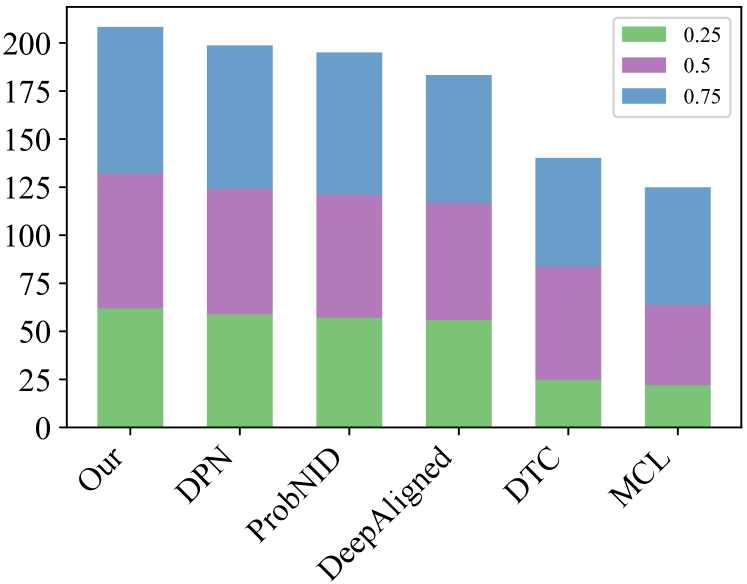

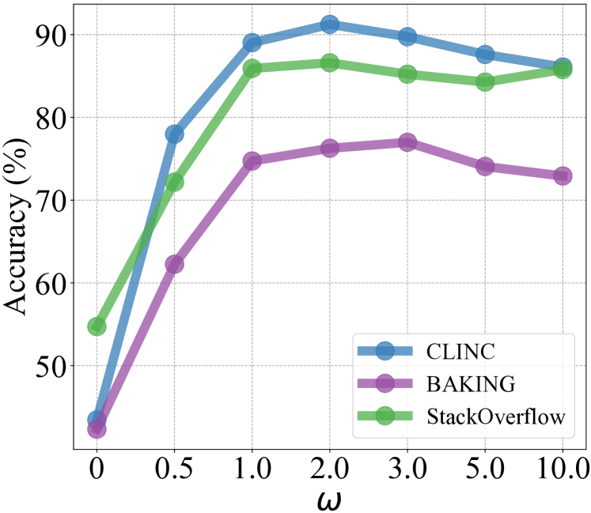

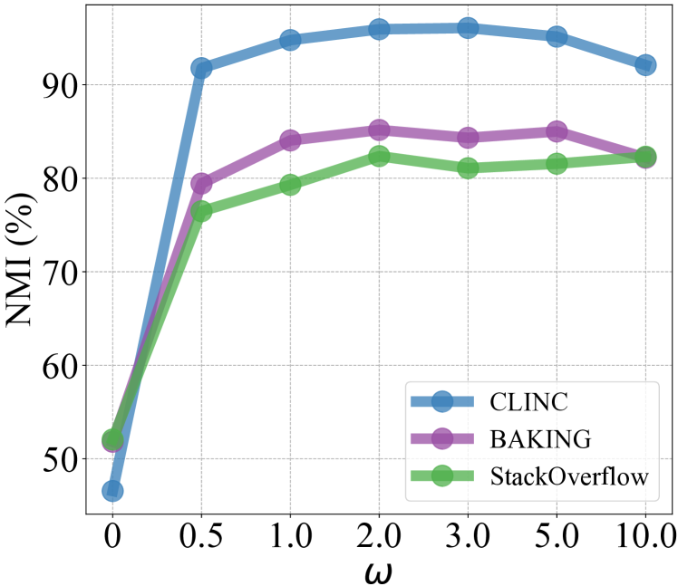

[Arxiv](https://arxiv.org/abs/2403.16913)