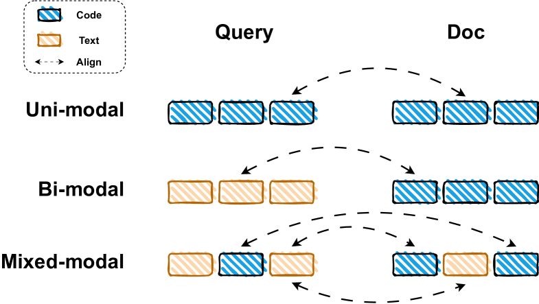
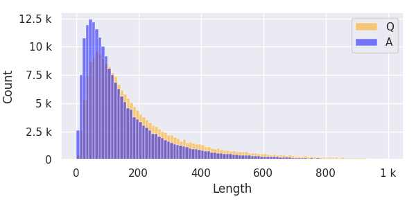
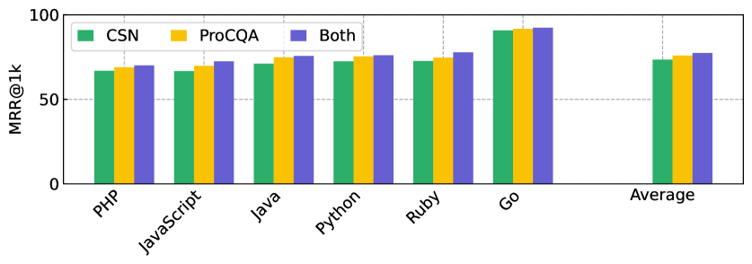

# ProCQA 是一个面向代码搜索的大规模社区编程问答数据集，涵盖了丰富的编程问题与解答资源。

发布时间：2024年03月25日

`Agent

这篇论文介绍了ProCQA数据集以及提出的跨模态对比性预训练策略在检索式代码问答技术方面的应用，这一技术可以视为智能Agent的一种，因为它能够理解用户（程序员）的自然语言查询，并在大量代码库中找到相应的代码片段作为回应，实现了人机交互和自然语言处理技术在编程领域的智能化应用。` `问答系统`

> ProCQA: A Large-scale Community-based Programming Question Answering Dataset for Code Search

# 摘要

> 检索式代码问答技术致力于将用户的自然语言查询与恰当的代码片段相匹配。此前的研究大多利用手工制作的双模态和单模态数据集预先训练模型，以整合文本与代码的表达方式。本文推出ProCQA，一个源自StackOverflow社区、规模庞大的编程问答数据集，它提供自然构建的混合模态问答对。为了证明其价值，我们提出一种跨模态的对比性预训练策略，旨在改进当前代码语言模型在文本与代码表示上的融合程度。相较于那些主要依赖CodeSearchNet提取的双模态和单模态对进行预训练的先前模型，我们的模型在各种代码检索基准测试中展现出显著的性能飞跃。

> Retrieval-based code question answering seeks to match user queries in natural language to relevant code snippets. Previous approaches typically rely on pretraining models using crafted bi-modal and uni-modal datasets to align text and code representations. In this paper, we introduce ProCQA, a large-scale programming question answering dataset extracted from the StackOverflow community, offering naturally structured mixed-modal QA pairs. To validate its effectiveness, we propose a modality-agnostic contrastive pre-training approach to improve the alignment of text and code representations of current code language models. Compared to previous models that primarily employ bimodal and unimodal pairs extracted from CodeSearchNet for pre-training, our model exhibits significant performance improvements across a wide range of code retrieval benchmarks.

[Arxiv](https://arxiv.org/abs/2403.16702)