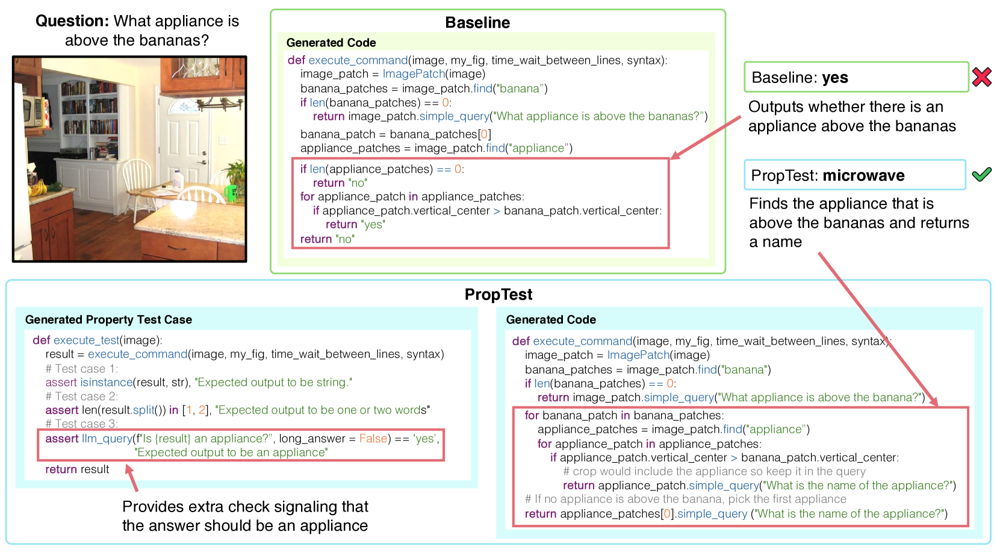
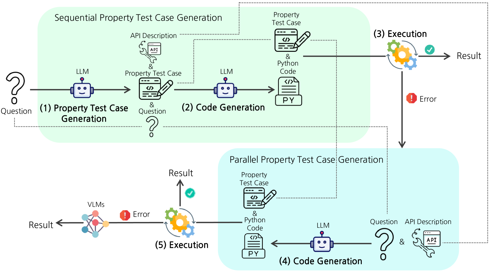
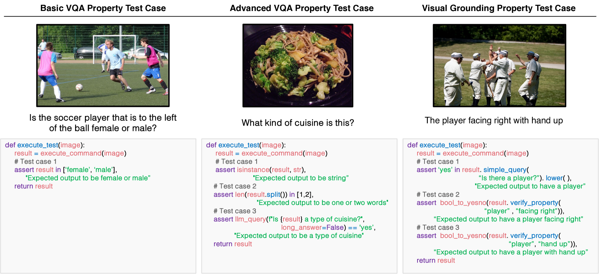
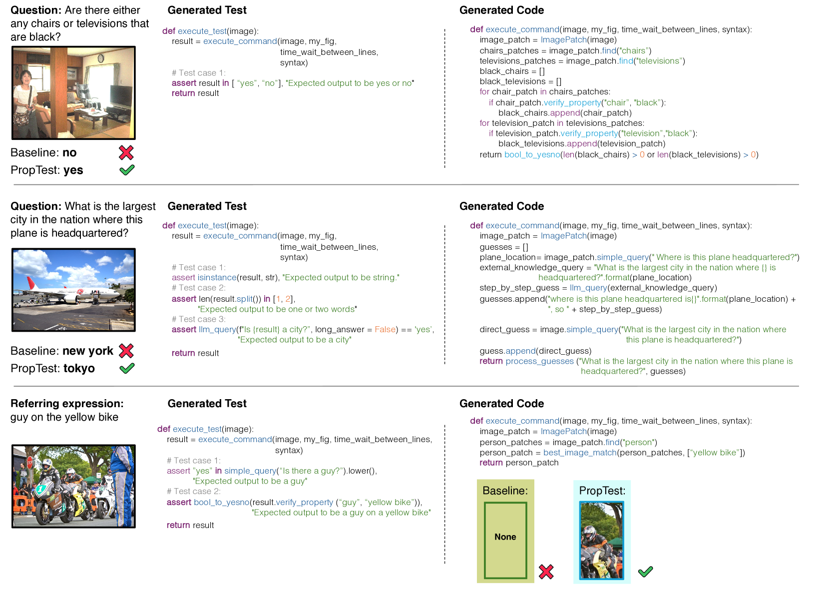
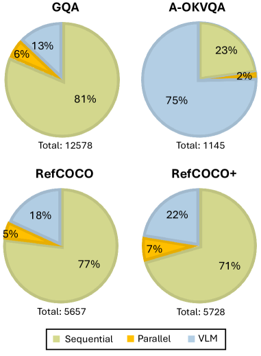
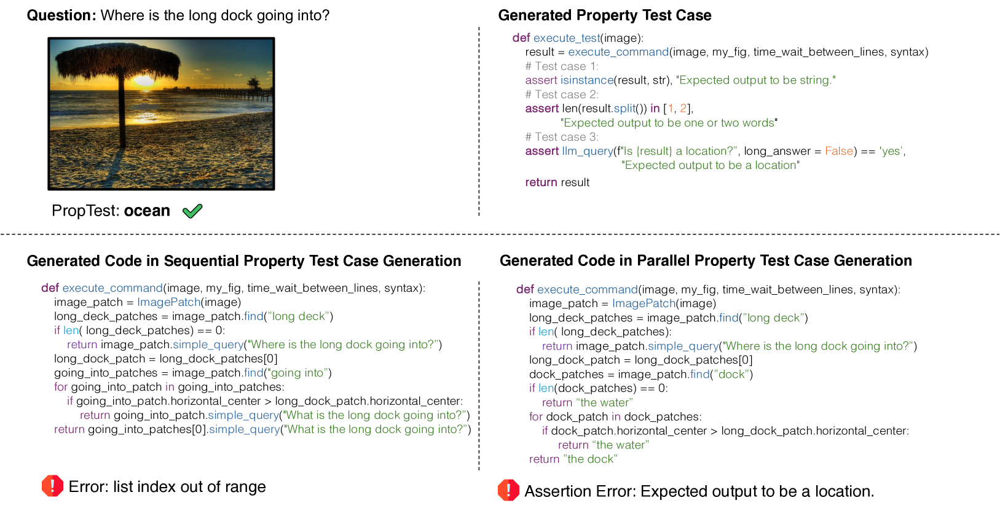
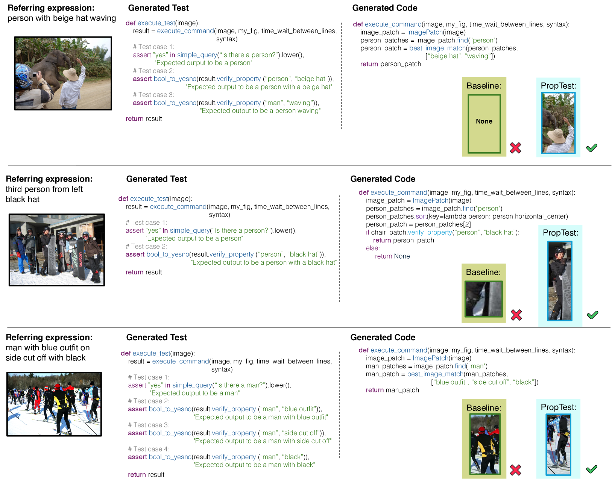

# PropTest 是一种自动属性测试工具，旨在提升视觉编程体验。它通过自动化检测和验证程序属性，助力优化视觉编程过程。

发布时间：2024年03月25日

`LLM应用` `视觉问答`

> PropTest: Automatic Property Testing for Improved Visual Programming

# 摘要

> 视觉编程作为一种替代方案应运而生，它利用LLMs拆解问题并生成可执行程序代码，为理解和解释推理过程提供了新的可能，且无需针对特定任务对模型进行微调。我们创新提出的PropTest策略，是在原有基础上进一步运用LLM生成代码，用于检测初始解决方案中的视觉属性，尤其关注数据类型一致性和生成解决方案的句法、语义特性。实验表明，该策略在使用较小且公开的LLMs（例如CodeLlama-7B和WizardCoder-15B）时，不仅超越了基础方法，在视觉问答和指示性表达理解等多项基准测试上也达到了与最先进水平相当的结果。特别是在A-OKVQA基准测试中，PropTest使ViperGPT的准确率提升了8.3%，达到48.66%，而在RefCOCO+基准上则提升了3.3%，达到52.8%，充分证明了此方法在提升视觉推理任务效果和泛化能力方面的优越性。

> Visual Programming has emerged as an alternative to end-to-end black-box visual reasoning models. This type of methods leverage Large Language Models (LLMs) to decompose a problem and generate the source code for an executable computer program. This strategy has the advantage of offering an interpretable reasoning path and does not require finetuning a model with task-specific data. We propose PropTest, a general strategy that improves visual programming by further using an LLM to generate code that tests for visual properties in an initial round of proposed solutions. Particularly, our method tests for data-type consistency, as well as syntactic and semantic properties in the generated solutions. Our proposed solution outperforms baselines and achieves comparable results to state-of-the-art methods while using smaller and publicly available LLMs (CodeLlama-7B and WizardCoder-15B). This is demonstrated across different benchmarks on visual question answering and referring expression comprehension, showing the efficacy of our approach in enhancing the performance and generalization of visual reasoning tasks. Specifically, PropTest improves ViperGPT by obtaining 48.66% accuracy (+8.3%) on the A-OKVQA benchmark and 52.8% (+3.3%) on the RefCOCO+ benchmark using CodeLlama-7B.

[Arxiv](https://arxiv.org/abs/2403.16921)