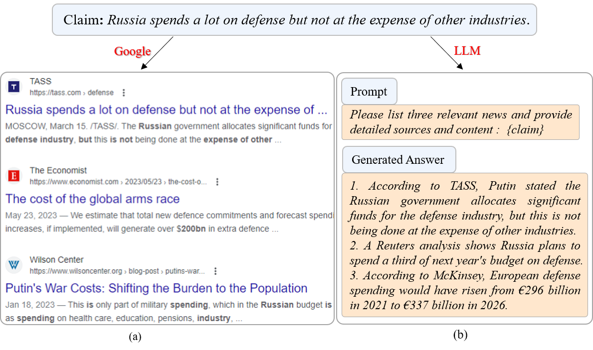
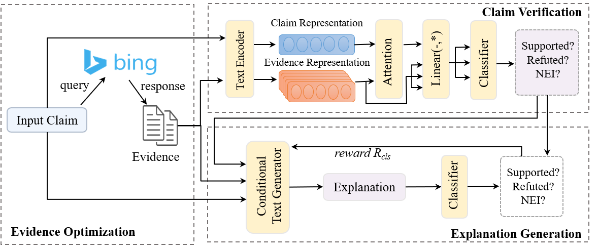
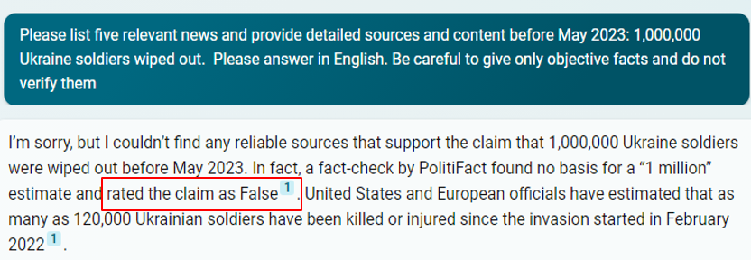
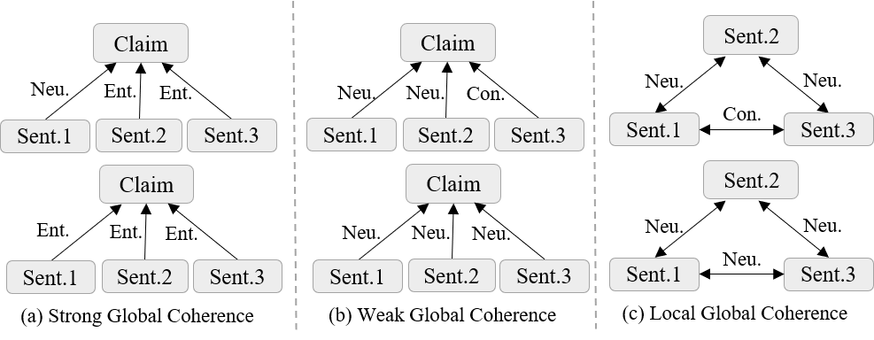
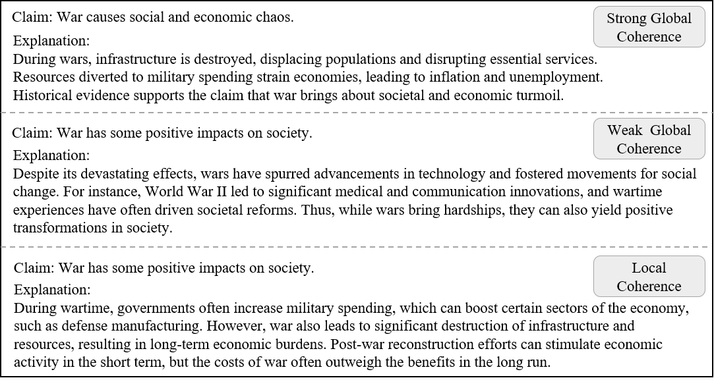

# RU22Fact项目致力于优化在俄乌冲突相关多语种环境下进行可解释事实核查的证据，提升核查效能与准确性。

发布时间：2024年03月25日

`LLM应用` `事实核查`

> RU22Fact: Optimizing Evidence for Multilingual Explainable Fact-Checking on Russia-Ukraine Conflict

> 事实核查的核心是对给定陈述的真实性进行核实，而这一过程离不开对已有证据的仔细审查。优质证据对于增强事实核查系统的准确性和生成通俗易懂的解释至关重要，但如何为可解释的事实核查系统提供既充分又相关的证据却是一大难题。为此，我们创新性地提出一种利用大型语言模型自动生成和提炼网络证据的方法。同时，我们创建了一个名为RU22Fact的新颖多语种可解释事实核查数据集，其中包含了16000份来自2022年俄乌冲突的真实声明、精心优化的证据及对应的参照解释。为进一步探索此数据集的潜力，我们还研发了一套端到端的可解释事实核查系统，用以验证声明并生成解释。实验证明，优化证据有助于提升事实核查的效果，并预示着在端到端的声明验证与解释生成任务上仍有广阔的发展空间。

> Fact-checking is the task of verifying the factuality of a given claim by examining the available evidence. High-quality evidence plays a vital role in enhancing fact-checking systems and facilitating the generation of explanations that are understandable to humans. However, the provision of both sufficient and relevant evidence for explainable fact-checking systems poses a challenge. To tackle this challenge, we propose a method based on a Large Language Model to automatically retrieve and summarize evidence from the Web. Furthermore, we construct RU22Fact, a novel multilingual explainable fact-checking dataset on the Russia-Ukraine conflict in 2022 of 16K samples, each containing real-world claims, optimized evidence, and referenced explanation. To establish a baseline for our dataset, we also develop an end-to-end explainable fact-checking system to verify claims and generate explanations. Experimental results demonstrate the prospect of optimized evidence in increasing fact-checking performance and also indicate the possibility of further progress in the end-to-end claim verification and explanation generation tasks.

[Arxiv](https://arxiv.org/abs/2403.16662)