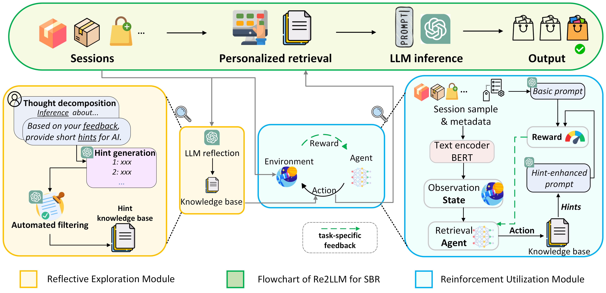
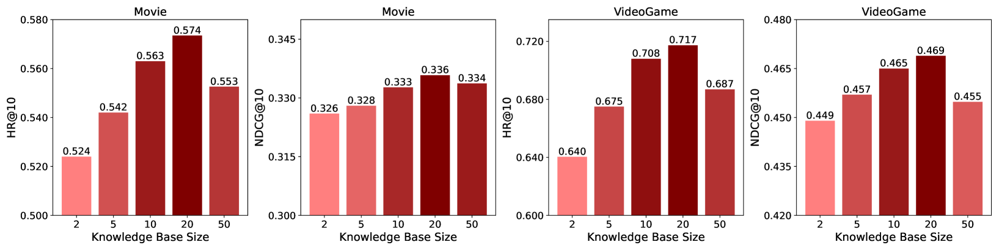
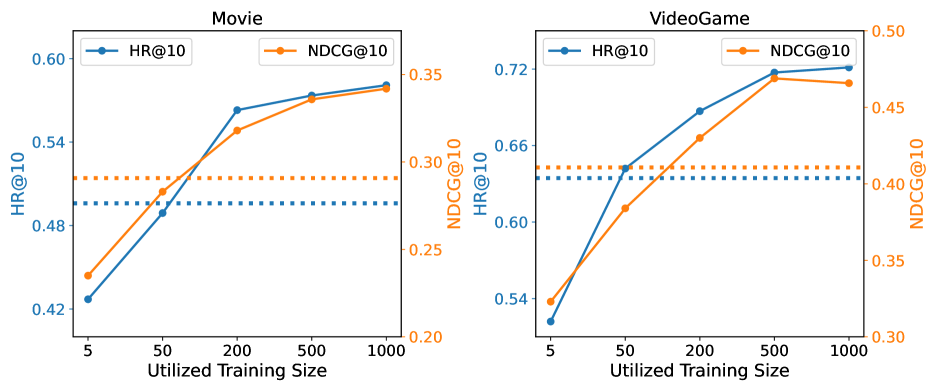

# Re2LLM 是一种专为基于会话的推荐场景设计的反射强化大型语言模型。通过结合强化学习与大型语言模型的优势，Re2LLM 实现了在会话过程中动态理解和优化推荐效果的能力。

发布时间：2024年03月25日

`Agent` `会话式推荐系统`

> Re2LLM: Reflective Reinforcement Large Language Model for Session-based Recommendation

# 摘要

> 随着LLMs逐渐崭露头角，它们正成为提升基于会话推荐（SBR）效能的有力手段。当前既有深入探索基于提示与微调方法来调整LLMs以适应SBR，但前者受限于缺少针对性反馈，难以找到最佳提示触发LLMs的合理推理，从而导致推荐效果不佳；而后者虽尝试结合领域专业知识对LLMs进行微调，却又面临高计算成本及对开源框架过度依赖等问题。因此，我们创新提出了适用于SBR场景的\underline{反思强化大型语言模型}（Re2LLM），旨在高效引导LLMs聚焦关键的专业知识以实现更精准的推荐。具体来说，我们首先精心打造了一个“反思探索模块”，巧妙地挖掘易于LLMs理解吸收的知识内容，通过让LLMs自省其推荐错误并构建一个包含纠错线索的知识库（KB）。为进一步激发LLMs的精确推理能力，我们进一步设计了“强化运用模块”，训练出一个轻巧的检索代理，该代理可以根据特定任务反馈从已构建的知识库中精选提示信息，用以指导LLMs修正推理过程，从而提高推荐质量。实验证明，在多个真实数据集上，我们的方法持续超越现有最先进方法。

> Large Language Models (LLMs) are emerging as promising approaches to enhance session-based recommendation (SBR), where both prompt-based and fine-tuning-based methods have been widely investigated to align LLMs with SBR.
  However, the former methods struggle with optimal prompts to elicit the correct reasoning of LLMs due to the lack of task-specific feedback, leading to unsatisfactory recommendations.
  Although the latter methods attempt to fine-tune LLMs with domain-specific knowledge, they face limitations such as high computational costs and reliance on open-source backbones.
  To address such issues, we propose a \underline{Re}flective \underline{Re}inforcement \underline{L}arge \underline{L}anguage \underline{M}odel (Re2LLM) for SBR, guiding LLMs to focus on specialized knowledge essential for more accurate recommendations effectively and efficiently.
  In particular, we first design the Reflective Exploration Module to effectively extract knowledge that is readily understandable and digestible by LLMs.
  To be specific, we direct LLMs to examine recommendation errors through self-reflection and construct a knowledge base (KB) comprising hints capable of rectifying these errors.
  To efficiently elicit the correct reasoning of LLMs, we further devise the Reinforcement Utilization Module to train a lightweight retrieval agent.
  It learns to select hints from the constructed KB based on the task-specific feedback, where the hints can serve as guidance to help correct LLMs reasoning for better recommendations. Extensive experiments on multiple real-world datasets demonstrate that our method consistently outperforms state-of-the-art methods.

[Arxiv](https://arxiv.org/abs/2403.16427)