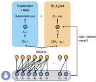
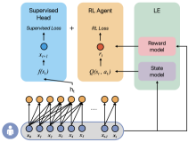
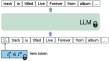
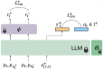
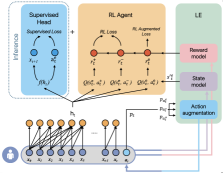
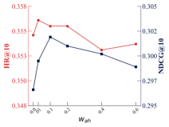
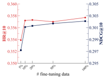
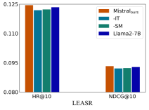

# 运用大型语言模型实现强化学习推荐系统，以精准模拟状态奖励及动作策略，提升系统智能性和个性化推荐效果。

发布时间：2024年03月25日

`Agent` `推荐系统`

> Reinforcement Learning-based Recommender Systems with Large Language Models for State Reward and Action Modeling

> RL驱动的推荐系统凭借其从历史交互中精准预测下一项推荐的能力，在满足用户需求方面展现出了巨大潜力。然而，现有基于离线RL的序列推荐技术仍面临如何有效捕获用户反馈这一难题，尤其是在构建精准的用户状态模型和制定合适的推荐奖励机制上。为此，本文引入语言理解技术，并将大型语言模型（LLMs）改造为模拟环境（LE），以提升RL推荐器的效果。LE仅需少量用户-项目交互数据即可习得用户行为模式，并能据此为离线数据智能模拟用户反馈——既可通过高质量的状态模型丰富用户画像，又能借助精确的奖励模型深入理解用户对各种推荐动作的微妙喜好。不仅如此，LE还能生成更多正向动作实例，有效补充有限的离线训练数据。我们提出的LE增强（LEA）方法，巧妙地联合优化了监督学习组件和RL策略，利用增强后的动作及历史用户信号，以进一步提升推荐性能。实验表明，在两个公开数据集上，结合LEA、先进状态模型和奖励模型的RL推荐器取得了显著成效。

> Reinforcement Learning (RL)-based recommender systems have demonstrated promising performance in meeting user expectations by learning to make accurate next-item recommendations from historical user-item interactions. However, existing offline RL-based sequential recommendation methods face the challenge of obtaining effective user feedback from the environment. Effectively modeling the user state and shaping an appropriate reward for recommendation remains a challenge. In this paper, we leverage language understanding capabilities and adapt large language models (LLMs) as an environment (LE) to enhance RL-based recommenders. The LE is learned from a subset of user-item interaction data, thus reducing the need for large training data, and can synthesise user feedback for offline data by: (i) acting as a state model that produces high quality states that enrich the user representation, and (ii) functioning as a reward model to accurately capture nuanced user preferences on actions. Moreover, the LE allows to generate positive actions that augment the limited offline training data. We propose a LE Augmentation (LEA) method to further improve recommendation performance by optimising jointly the supervised component and the RL policy, using the augmented actions and historical user signals. We use LEA, the state and reward models in conjunction with state-of-the-art RL recommenders and report experimental results on two publicly available datasets.

[Arxiv](https://arxiv.org/abs/2403.16948)