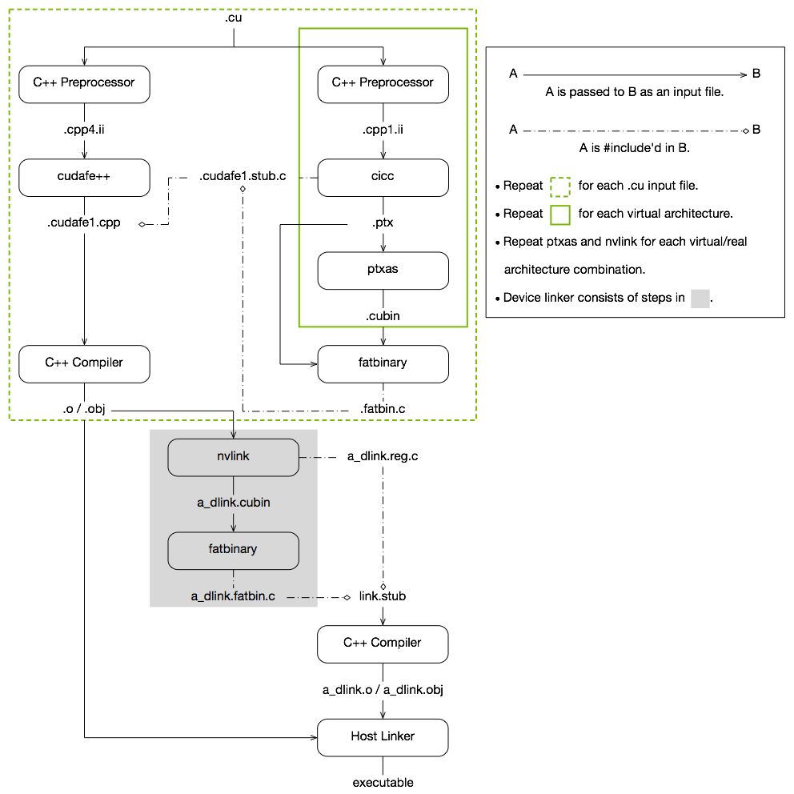
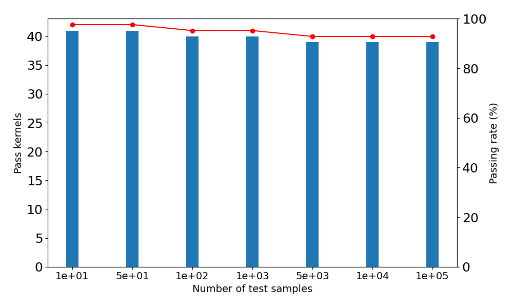

# SIP 方法提出通过随机指令扰动技术实现 GPU 本地调度方案的自动化调优。进一步精炼：

发布时间：2024年03月25日

`LLM 理论` `机器学习` `高性能计算`

> SIP: Autotuning GPU Native Schedules via Stochastic Instruction Perturbation

> 自面世以来，LLMs 成为了一个举足轻重的计算负载，但因其包含数十亿参数及需海量数据训练，其计算开销巨大。近期研究为此专门研发了针对 LLM 训练与推理的 CUDA 内核，以替代编译器生成的内核，力求最大化利用硬件资源。本研究则深入探索运用 GPU 本机指令优化技术，将 CUDA 内核推向极限性能的新高度。我们另辟蹊径，采用自动化优化策略，首先划定GPU本机指令调度的搜索范围，随后运用随机搜索方法进行优化。实验证明，SIP 通过自动寻找更佳的 GPU 本机指令调度方案，有效提升了 CUDA 内核的处理能力，且优化后的调度策略经由1000万份测试样本检验得以验证。

> Large language models (LLMs) have become a significant workload since their appearance. However, they are also computationally expensive as they have billions of parameters and are trained with massive amounts of data. Thus, recent works have developed dedicated CUDA kernels for LLM training and inference instead of relying on compilergenerated ones, so that hardware resources are as fully utilized as possible. In this work, we explore the possibility of GPU native instruction optimization to further push the CUDA kernels to extreme performance. Contrary to prior works, we adopt an automatic optimization approach by defining a search space of possible GPU native instruction schedules, and then we apply stochastic search to perform optimization. Experiments show that SIP can further improve CUDA kernel throughput by automatically discovering better GPU native instruction schedules and the optimized schedules are tested by 10 million test samples.

[Arxiv](https://arxiv.org/abs/2403.16863)