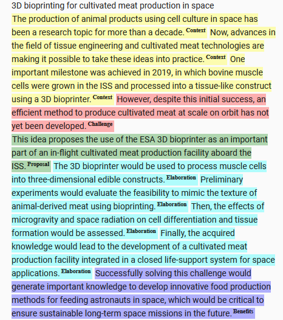
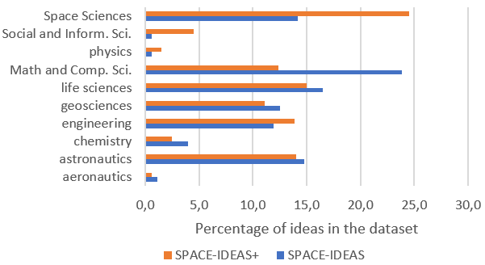

# SPACE-IDEAS 数据集：专为探索太空创新领域内关键信息检测而设计。

发布时间：2024年03月25日

`LLM应用`

> SPACE-IDEAS: A Dataset for Salient Information Detection in Space Innovation

# 摘要

> 面对信息过载问题，利用自然语言处理技术识别文本中的关键信息已广泛应用，但当前相关数据集多源自学术文献。为此，我们推出了 SPACE-IDEAS 数据集，专注于从太空领域的创新想法文本中抽取出重要信息。该数据集文本类型丰富多样，涵盖了非正式、技术、学术及商务等各类文体。我们不仅提供了人工标注的数据集，还发布了基于大型生成语言模型进一步扩展的标注版本。通过训练多种单句与连续句分类器，我们证实了借助多任务学习方式可充分利用自动标注的 SPACE-IDEAS 数据集，从而提升分类器的性能。

> Detecting salient parts in text using natural language processing has been widely used to mitigate the effects of information overflow. Nevertheless, most of the datasets available for this task are derived mainly from academic publications. We introduce SPACE-IDEAS, a dataset for salient information detection from innovation ideas related to the Space domain. The text in SPACE-IDEAS varies greatly and includes informal, technical, academic and business-oriented writing styles. In addition to a manually annotated dataset we release an extended version that is annotated using a large generative language model. We train different sentence and sequential sentence classifiers, and show that the automatically annotated dataset can be leveraged using multitask learning to train better classifiers.

[Arxiv](https://arxiv.org/abs/2403.16941)